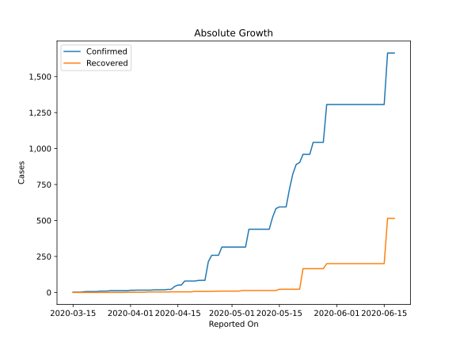
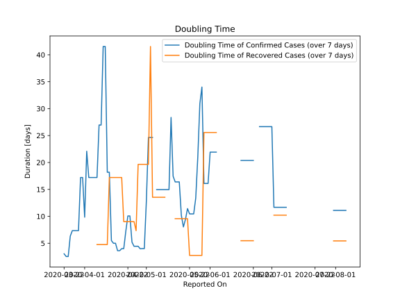

# Country Figures: Doubling Time of Infections for EquatorialGuinea 

The doubling time below are calculated based on
* an exponential growth assumption
* for time difference of past seven (7) days.
The doubling time's unit is "days".

The first doubling time indicates the increase of confirmed (infected)
cases. There, the *higher* the number is, the better is to take control
of the disease.

The second doubling time indicates the increase of recovered (healed)
cases. There, the *lower* the number is, the better it is to take
control of the disease.

| Reported On | Confirmed | Doubling Time (Confirmed) | Recovered | Doubling Time (Recovered) |
|-------------|-----------|---------------------------|-----------|---------------------------|
| 2020-04-28 | 315 |  4.0 days  | 9 |  19.7 days  | 
| 2020-04-27 | 258 |  4.4 days  | 9 |  19.7 days  | 
| 2020-04-26 | 258 |  4.4 days  | 8 |  7.3 days  | 
| 2020-04-25 | 258 |  4.4 days  | 7 |  9.0 days  | 
| 2020-04-24 | 214 |  5.2 days  | 7 |  9.0 days  | 
| 2020-04-23 | 84 |  10.1 days  | 7 |  9.0 days  | 
| 2020-04-22 | 84 |  10.1 days  | 7 |  9.0 days  | 
| 2020-04-21 | 83 |  7.2 days  | 7 |  9.0 days  | 
| 2020-04-20 | 79 |  4.0 days  | 7 |  9.0 days  | 
| 2020-04-19 | 79 |  4.0 days  | 4 |  17.2 days  | 
| 2020-04-18 | 79 |  3.6 days  | 4 |  17.2 days  | 
| 2020-04-17 | 79 |  3.6 days  | 4 |  17.2 days  | 
| 2020-04-16 | 51 |  5.0 days  | 4 |  17.2 days  | 
| 2020-04-15 | 51 |  5.0 days  | 4 |  17.2 days  | 
| 2020-04-14 | 41 |  5.5 days  | 4 |  17.2 days  | 
| 2020-04-13 | 21 |  18.2 days  | 4 |  17.2 days  | 
| 2020-04-12 | 21 |  18.2 days  | 3 |  4.8 days  | 
| 2020-04-11 | 18 |  41.5 days  | 3 |  4.8 days  | 
| 2020-04-10 | 18 |  41.5 days  | 3 |  4.8 days  | 
| 2020-04-09 | 18 |  27.0 days  | 3 |  4.8 days  | 
| 2020-04-08 | 18 |  27.0 days  | 3 |  4.8 days  | 
| 2020-04-07 | 16 |  17.2 days  | 3 |  4.8 days  | 
| 2020-04-06 | 16 |  17.2 days  | 3 |  None  | 
| 2020-04-05 | 16 |  17.2 days  | 1 |  None  | 
| 2020-04-04 | 16 |  17.2 days  | 1 |  None  | 
| 2020-04-03 | 16 |  17.2 days  | 1 |  None  | 
| 2020-04-02 | 15 |  22.1 days  | 1 |  None  | 
| 2020-04-01 | 15 |  9.8 days  | 1 |  None  | 
| 2020-03-31 | 12 |  17.2 days  | 1 |  None  | 
| 2020-03-30 | 12 |  17.2 days  | 0 |  None  | 
| 2020-03-29 | 12 |  7.3 days  | 0 |  None  | 
| 2020-03-28 | 12 |  7.3 days  | 0 |  None  | 
| 2020-03-27 | 12 |  7.3 days  | 0 |  None  | 
| 2020-03-26 | 12 |  7.3 days  | 0 |  None  | 
| 2020-03-25 | 9 |  6.3 days  | 0 |  None  | 
| 2020-03-24 | 9 |  2.5 days  | 0 |  None  | 
| 2020-03-23 | 9 |  2.5 days  | 0 |  None  | 
| 2020-03-22 | 6 |  3.0 days  | 0 |  None  | 
| 2020-03-21 | 6 |  None  | 0 |  None  | 
| 2020-03-20 | 6 |  None  | 0 |  None  | 
| 2020-03-19 | 6 |  None  | 0 |  None  | 
| 2020-03-18 | 4 |  None  | 0 |  None  | 
| 2020-03-17 | 1 |  None  | 0 |  None  | 
| 2020-03-16 | 1 |  None  | 0 |  None  | 
| 2020-03-15 | 1 |  None  | 0 |  None  | 

