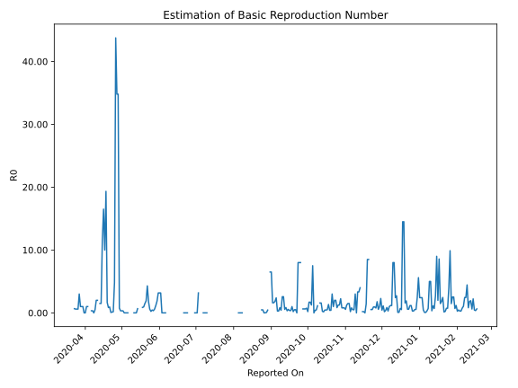

# Country Figures: Time Series for Basic Reproduction Number of EquatorialGuinea 

| Reported On | &Delta; Confirmed | Total &Delta; Confirmed First Interval | Total &Delta; Confirmed Second Interval | Estimated Basic Reproduction Number R0 | 
|-------------|-------------------|----------------------------------------|-----------------------------------------|---------------------------------------------------|
| 2020-04-30 | 0 |  57  |  175  |  0.33  | 
| 2020-04-29 | 0 |  101  |  135  |  0.75  | 
| 2020-04-28 | 57 |  174  |  5  |  34.80  | 
| 2020-04-27 | 0 |  174  |  5  |  34.80  | 
| 2020-04-26 | 0 |  175  |  4  |  43.75  | 
| 2020-04-25 | 44 |  135  |  28  |  4.82  | 
| 2020-04-24 | 130 |  5  |  28  |  0.18  | 
| 2020-04-23 | 0 |  5  |  38  |  0.13  | 
| 2020-04-22 | 1 |  4  |  58  |  0.07  | 
| 2020-04-21 | 4 |  28  |  30  |  0.93  | 
| 2020-04-20 | 0 |  28  |  33  |  0.85  | 
| 2020-04-19 | 0 |  38  |  23  |  1.65  | 
| 2020-04-18 | 0 |  58  |  3  |  19.33  | 
| 2020-04-17 | 28 |  30  |  3  |  10.00  | 
| 2020-04-16 | 0 |  33  |  2  |  16.50  | 
| 2020-04-15 | 10 |  23  |  2  |  11.50  | 
| 2020-04-14 | 20 |  3  |  2  |  1.50  | 
| 2020-04-13 | 0 |  3  |  2  |  1.50  | 
| 2020-04-12 | 3 |  2  |  None  |  None  | 
| 2020-04-11 | 0 |  2  |  1  |  2.00  | 
| 2020-04-10 | 0 |  2  |  1  |  2.00  | 
| 2020-04-09 | 0 |  2  |  4  |  0.50  | 
| 2020-04-08 | 2 |  None  |  4  |  None  | 
| 2020-04-07 | 0 |  1  |  3  |  0.33  | 
| 2020-04-06 | 0 |  1  |  3  |  0.33  | 
| 2020-04-05 | 0 |  4  |  None  |  None  | 
| 2020-04-04 | 0 |  4  |  None  |  None  | 
| 2020-04-03 | 1 |  3  |  3  |  1.00  | 
| 2020-04-02 | 0 |  3  |  3  |  1.00  | 
| 2020-04-01 | 3 |  None  |  3  |  None  | 
| 2020-03-31 | 0 |  None  |  6  |  None  | 
| 2020-03-30 | 0 |  3  |  3  |  1.00  | 
| 2020-03-29 | 0 |  3  |  3  |  1.00  | 
| 2020-03-28 | 0 |  3  |  3  |  1.00  | 
| 2020-03-27 | 0 |  6  |  2  |  3.00  | 
| 2020-03-26 | 3 |  3  |  5  |  0.60  | 
| 2020-03-25 | 0 |  3  |  5  |  0.60  | 
| 2020-03-24 | 0 |  3  |  5  |  0.60  | 
| 2020-03-23 | 3 |  2  |  3  |  0.67  | 
| 2020-03-22 | 0 |  5  |  None  |  None  | 
| 2020-03-21 | 0 |  5  |  None  |  None  | 
| 2020-03-20 | 0 |  5  |  None  |  None  | 
| 2020-03-19 | 2 |  3  |  None  |  None  | 
| 2020-03-18 | 3 |  None  |  None  |  None  | 
| 2020-03-17 | 0 |  None  |  None  |  None  | 
| 2020-03-16 | 0 |  None  |  None  |  None  | 
| 2020-03-15 | None |  None  |  None  |  None  | 

