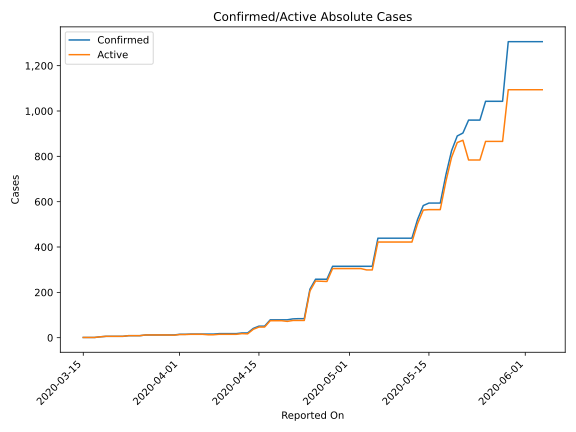
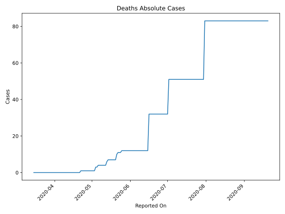
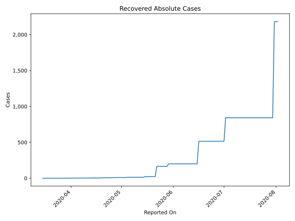
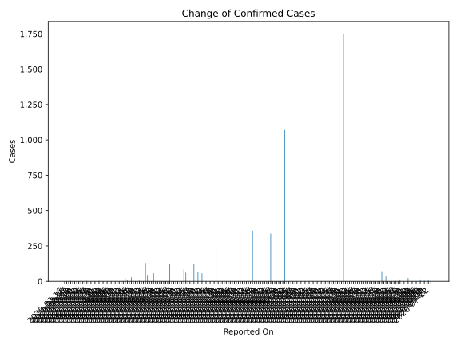
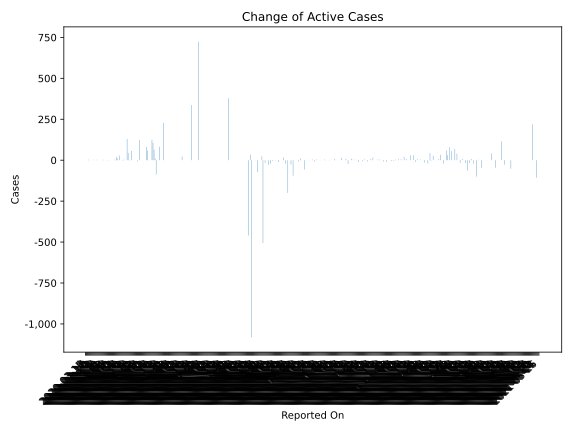
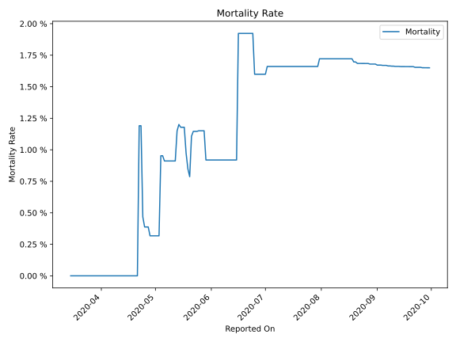

# Country Figures: Time Series for EquatorialGuinea 

| Reported On | Confirmed | Deaths | Recovered | Active | Mortality | &Delta; Confirmed | &Delta; Deaths | &Delta; Recovered | &Delta; Active | % Active of Population |
|-------------|-----------|--------|-----------|--------|-----------|-------------------|----------------|-------------------|----------------|------------------------|
| 2020-04-27 | 258 | 1 | 9 | 248 |  0.39 %  | 0 | 0 | 1 | -1 |  0.019 %  | 
| 2020-04-26 | 258 | 1 | 8 | 249 |  0.39 %  | 0 | 0 | 1 | -1 |  0.019 %  | 
| 2020-04-25 | 258 | 1 | 7 | 250 |  0.39 %  | 44 | 0 | 0 | 44 |  0.019 %  | 
| 2020-04-24 | 214 | 1 | 7 | 206 |  0.47 %  | 130 | 0 | 0 | 130 |  0.016 %  | 
| 2020-04-23 | 84 | 1 | 7 | 76 |  1.19 %  | 0 | 0 | 0 | 0 |  0.006 %  | 
| 2020-04-22 | 84 | 1 | 7 | 76 |  1.19 %  | 1 | 1 | 0 | 0 |  0.006 %  | 
| 2020-04-21 | 83 | 0 | 7 | 76 |  None  | 4 | 0 | 0 | 4 |  0.006 %  | 
| 2020-04-20 | 79 | 0 | 7 | 72 |  None  | 0 | 0 | 3 | -3 |  0.006 %  | 
| 2020-04-19 | 79 | 0 | 4 | 75 |  None  | 0 | 0 | 0 | 0 |  0.006 %  | 
| 2020-04-18 | 79 | 0 | 4 | 75 |  None  | 0 | 0 | 0 | 0 |  0.006 %  | 
| 2020-04-17 | 79 | 0 | 4 | 75 |  None  | 28 | 0 | 0 | 28 |  0.006 %  | 
| 2020-04-16 | 51 | 0 | 4 | 47 |  None  | 0 | 0 | 0 | 0 |  0.004 %  | 
| 2020-04-15 | 51 | 0 | 4 | 47 |  None  | 10 | 0 | 0 | 10 |  0.004 %  | 
| 2020-04-14 | 41 | 0 | 4 | 37 |  None  | 20 | 0 | 0 | 20 |  0.003 %  | 
| 2020-04-13 | 21 | 0 | 4 | 17 |  None  | 0 | 0 | 1 | -1 |  0.001 %  | 
| 2020-04-12 | 21 | 0 | 3 | 18 |  None  | 3 | 0 | 0 | 3 |  0.001 %  | 
| 2020-04-11 | 18 | 0 | 3 | 15 |  None  | 0 | 0 | 0 | 0 |  0.001 %  | 
| 2020-04-10 | 18 | 0 | 3 | 15 |  None  | 0 | 0 | 0 | 0 |  0.001 %  | 
| 2020-04-09 | 18 | 0 | 3 | 15 |  None  | 0 | 0 | 0 | 0 |  0.001 %  | 
| 2020-04-08 | 18 | 0 | 3 | 15 |  None  | 2 | 0 | 0 | 2 |  0.001 %  | 
| 2020-04-07 | 16 | 0 | 3 | 13 |  None  | 0 | 0 | 0 | 0 |  0.001 %  | 
| 2020-04-06 | 16 | 0 | 3 | 13 |  None  | 0 | 0 | 2 | -2 |  0.001 %  | 
| 2020-04-05 | 16 | 0 | 1 | 15 |  None  | 0 | 0 | 0 | 0 |  0.001 %  | 
| 2020-04-04 | 16 | 0 | 1 | 15 |  None  | 0 | 0 | 0 | 0 |  0.001 %  | 
| 2020-04-03 | 16 | 0 | 1 | 15 |  None  | 1 | 0 | 0 | 1 |  0.001 %  | 
| 2020-04-02 | 15 | 0 | 1 | 14 |  None  | 0 | 0 | 0 | 0 |  0.001 %  | 
| 2020-04-01 | 15 | 0 | 1 | 14 |  None  | 3 | 0 | 0 | 3 |  0.001 %  | 
| 2020-03-31 | 12 | 0 | 1 | 11 |  None  | 0 | 0 | 1 | -1 |  0.001 %  | 
| 2020-03-30 | 12 | 0 | 0 | 12 |  None  | 0 | 0 | 0 | 0 |  0.001 %  | 
| 2020-03-29 | 12 | 0 | 0 | 12 |  None  | 0 | 0 | 0 | 0 |  0.001 %  | 
| 2020-03-28 | 12 | 0 | 0 | 12 |  None  | 0 | 0 | 0 | 0 |  0.001 %  | 
| 2020-03-27 | 12 | 0 | 0 | 12 |  None  | 0 | 0 | 0 | 0 |  0.001 %  | 
| 2020-03-26 | 12 | 0 | 0 | 12 |  None  | 3 | 0 | 0 | 3 |  0.001 %  | 
| 2020-03-25 | 9 | 0 | 0 | 9 |  None  | 0 | 0 | 0 | 0 |  0.001 %  | 
| 2020-03-24 | 9 | 0 | 0 | 9 |  None  | 0 | 0 | 0 | 0 |  0.001 %  | 
| 2020-03-23 | 9 | 0 | 0 | 9 |  None  | 3 | 0 | 0 | 3 |  0.001 %  | 
| 2020-03-22 | 6 | 0 | 0 | 6 |  None  | 0 | 0 | 0 | 0 |  0.000 %  | 
| 2020-03-21 | 6 | 0 | 0 | 6 |  None  | 0 | 0 | 0 | 0 |  0.000 %  | 
| 2020-03-20 | 6 | 0 | 0 | 6 |  None  | 0 | 0 | 0 | 0 |  0.000 %  | 
| 2020-03-19 | 6 | 0 | 0 | 6 |  None  | 2 | 0 | 0 | 2 |  0.000 %  | 
| 2020-03-18 | 4 | 0 | 0 | 4 |  None  | 3 | 0 | 0 | 3 |  0.000 %  | 
| 2020-03-17 | 1 | 0 | 0 | 1 |  None  | 0 | 0 | 0 | 0 |  0.000 %  | 
| 2020-03-16 | 1 | 0 | 0 | 1 |  None  | 0 | 0 | 0 | 0 |  0.000 %  | 
| 2020-03-15 | 1 | 0 | 0 | 1 |  None  | None | None | None | None |  0.000 %  | 

