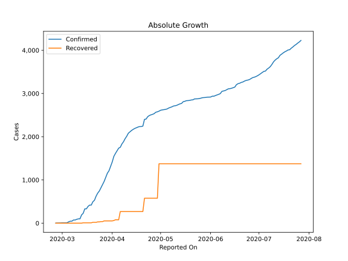
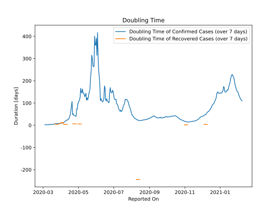

# Country Figures: Doubling Time of Infections for Greece 

The doubling time below are calculated based on
* an exponential growth assumption
* for time difference of past seven (7) days.
The doubling time's unit is "days".

The first doubling time indicates the increase of confirmed (infected)
cases. There, the *higher* the number is, the better is to take control
of the disease.

The second doubling time indicates the increase of recovered (healed)
cases. There, the *lower* the number is, the better it is to take
control of the disease.

| Reported On | Confirmed | Doubling Time (Confirmed) | Recovered | Doubling Time (Recovered) |
|-------------|-----------|---------------------------|-----------|---------------------------|
| 2020-05-07 | 2678 |  147.3 days  | 1374 |  None  | 
| 2020-05-06 | 2663 |  146.4 days  | 1374 |  5.9 days  | 
| 2020-05-05 | 2642 |  166.6 days  | 1374 |  5.9 days  | 
| 2020-05-04 | 2632 |  128.2 days  | 1374 |  5.9 days  | 
| 2020-05-03 | 2626 |  114.8 days  | 1374 |  5.9 days  | 
| 2020-05-02 | 2620 |  109.4 days  | 1374 |  5.9 days  | 
| 2020-05-01 | 2612 |  101.8 days  | 1374 |  5.9 days  | 
| 2020-04-30 | 2591 |  96.1 days  | 1374 |  5.9 days  | 
| 2020-04-29 | 2576 |  72.3 days  | 577 |  None  | 
| 2020-04-28 | 2566 |  73.3 days  | 577 |  None  | 
| 2020-04-27 | 2534 |  40.4 days  | 577 |  6.7 days  | 
| 2020-04-26 | 2517 |  41.2 days  | 577 |  6.7 days  | 
| 2020-04-25 | 2506 |  42.7 days  | 577 |  6.7 days  | 
| 2020-04-24 | 2490 |  43.3 days  | 577 |  6.7 days  | 
| 2020-04-23 | 2463 |  44.6 days  | 577 |  6.7 days  | 
| 2020-04-22 | 2408 |  52.0 days  | 577 |  6.7 days  | 
| 2020-04-21 | 2401 |  48.3 days  | 577 |  6.7 days  | 
| 2020-04-20 | 2245 |  106.8 days  | 269 |  None  | 
| 2020-04-19 | 2235 |  87.5 days  | 269 |  None  | 
| 2020-04-18 | 2235 |  68.3 days  | 269 |  None  | 
| 2020-04-17 | 2224 |  48.5 days  | 269 |  None  | 
| 2020-04-16 | 2207 |  40.4 days  | 269 |  None  | 
| 2020-04-15 | 2192 |  32.4 days  | 269 |  None  | 
| 2020-04-14 | 2170 |  29.0 days  | 269 |  None  | 
| 2020-04-13 | 2145 |  24.5 days  | 269 |  None  | 
| 2020-04-12 | 2114 |  24.9 days  | 269 |  4.3 days  | 
| 2020-04-11 | 2081 |  22.6 days  | 269 |  4.3 days  | 
| 2020-04-10 | 2011 |  22.3 days  | 269 |  4.3 days  | 
| 2020-04-09 | 1955 |  20.9 days  | 269 |  3.6 days  | 
| 2020-04-08 | 1884 |  17.3 days  | 269 |  3.3 days  | 
| 2020-04-07 | 1832 |  14.9 days  | 269 |  3.3 days  | 
| 2020-04-06 | 1755 |  13.5 days  | 269 |  3.3 days  | 
| 2020-04-05 | 1735 |  12.3 days  | 78 |  12.3 days  | 
| 2020-04-04 | 1673 |  11.0 days  | 78 |  12.3 days  | 
| 2020-04-03 | 1613 |  9.8 days  | 78 |  12.3 days  | 
| 2020-04-02 | 1544 |  9.2 days  | 61 |  9.5 days  | 
| 2020-04-01 | 1415 |  9.3 days  | 52 |  13.5 days  | 
| 2020-03-31 | 1314 |  8.9 days  | 52 |  8.7 days  | 
| 2020-03-30 | 1212 |  9.1 days  | 52 |  8.7 days  | 
| 2020-03-29 | 1156 |  8.2 days  | 52 |  5.2 days  | 
| 2020-03-28 | 1061 |  7.3 days  | 52 |  5.2 days  | 
| 2020-03-27 | 966 |  7.6 days  | 52 |  5.2 days  | 
| 2020-03-26 | 892 |  6.7 days  | 36 |  3.6 days  | 
| 2020-03-25 | 821 |  7.5 days  | 36 |  3.6 days  | 
| 2020-03-24 | 743 |  7.8 days  | 29 |  4.1 days  | 
| 2020-03-23 | 695 |  6.9 days  | 29 |  4.1 days  | 
| 2020-03-22 | 624 |  8.0 days  | 19 |  5.9 days  | 
| 2020-03-21 | 530 |  6.1 days  | 19 |  5.9 days  | 
| 2020-03-20 | 495 |  5.4 days  | 19 |  None  | 
| 2020-03-19 | 418 |  3.7 days  | 8 |  None  | 
| 2020-03-18 | 418 |  3.7 days  | 8 |  None  | 
| 2020-03-17 | 387 |  3.6 days  | 8 |  None  | 
| 2020-03-16 | 331 |  3.5 days  | 8 |  None  | 
| 2020-03-15 | 331 |  3.5 days  | 8 |  None  | 
| 2020-03-14 | 228 |  3.4 days  | 8 |  None  | 
| 2020-03-13 | 190 |  3.7 days  | 0 |  None  | 
| 2020-03-12 | 99 |  4.5 days  | 0 |  None  | 
| 2020-03-11 | 99 |  2.4 days  | 0 |  None  | 
| 2020-03-10 | 89 |  2.2 days  | 0 |  None  | 
| 2020-03-09 | 73 |  2.4 days  | 0 |  None  | 
| 2020-03-08 | 73 |  2.4 days  | 0 |  None  | 
| 2020-03-07 | 46 |  2.3 days  | 0 |  None  | 
| 2020-03-06 | 45 |  2.3 days  | 0 |  None  | 
| 2020-03-05 | 31 |  2.4 days  | 0 |  None  | 
| 2020-03-04 | 9 |  2.5 days  | 0 |  None  | 
| 2020-03-03 | 7 |  None  | 0 |  None  | 
| 2020-03-02 | 7 |  None  | 0 |  None  | 
| 2020-03-01 | 7 |  None  | 0 |  None  | 
| 2020-02-29 | 4 |  None  | 0 |  None  | 
| 2020-02-28 | 4 |  None  | 0 |  None  | 
| 2020-02-27 | 3 |  None  | 0 |  None  | 
| 2020-02-26 | 1 |  None  | 0 |  None  | 

