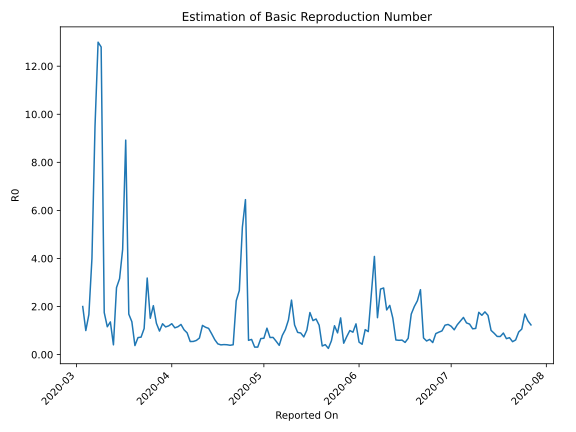

# Country Figures: Time Series for Basic Reproduction Number of Greece 

| Reported On | &Delta; Confirmed | Total &Delta; Confirmed First Interval | Total &Delta; Confirmed Second Interval | Estimated Basic Reproduction Number R0 | 
|-------------|-------------------|----------------------------------------|-----------------------------------------|---------------------------------------------------|
| 2020-05-09 | 19 |  59  |  41  |  1.44  | 
| 2020-05-08 | 13 |  52  |  50  |  1.04  | 
| 2020-05-07 | 15 |  43  |  54  |  0.80  | 
| 2020-05-06 | 21 |  30  |  78  |  0.38  | 
| 2020-05-05 | 10 |  41  |  74  |  0.55  | 
| 2020-05-04 | 6 |  50  |  70  |  0.71  | 
| 2020-05-03 | 6 |  54  |  76  |  0.71  | 
| 2020-05-02 | 8 |  78  |  71  |  1.10  | 
| 2020-05-01 | 21 |  74  |  109  |  0.68  | 
| 2020-04-30 | 15 |  70  |  105  |  0.67  | 
| 2020-04-29 | 10 |  76  |  245  |  0.31  | 
| 2020-04-28 | 32 |  71  |  228  |  0.31  | 
| 2020-04-27 | 17 |  109  |  173  |  0.63  | 
| 2020-04-26 | 11 |  105  |  177  |  0.59  | 
| 2020-04-25 | 16 |  245  |  38  |  6.45  | 
| 2020-04-24 | 27 |  228  |  43  |  5.30  | 
| 2020-04-23 | 55 |  173  |  65  |  2.66  | 
| 2020-04-22 | 7 |  177  |  79  |  2.24  | 
| 2020-04-21 | 156 |  38  |  93  |  0.41  | 
| 2020-04-20 | 10 |  43  |  111  |  0.39  | 
| 2020-04-19 | 0 |  65  |  159  |  0.41  | 
| 2020-04-18 | 11 |  79  |  190  |  0.42  | 
| 2020-04-17 | 17 |  93  |  230  |  0.40  | 
| 2020-04-16 | 15 |  111  |  249  |  0.45  | 
| 2020-04-15 | 22 |  159  |  256  |  0.62  | 
| 2020-04-14 | 25 |  190  |  220  |  0.86  | 
| 2020-04-13 | 31 |  230  |  211  |  1.09  | 
| 2020-04-12 | 33 |  249  |  219  |  1.14  | 
| 2020-04-11 | 70 |  256  |  211  |  1.21  | 
| 2020-04-10 | 56 |  220  |  320  |  0.69  | 
| 2020-04-09 | 71 |  211  |  359  |  0.59  | 
| 2020-04-08 | 52 |  219  |  401  |  0.55  | 
| 2020-04-07 | 77 |  211  |  388  |  0.54  | 
| 2020-04-06 | 20 |  320  |  354  |  0.90  | 
| 2020-04-05 | 62 |  359  |  348  |  1.03  | 
| 2020-04-04 | 60 |  401  |  320  |  1.25  | 
| 2020-04-03 | 69 |  388  |  335  |  1.16  | 
| 2020-04-02 | 129 |  354  |  318  |  1.11  | 
| 2020-04-01 | 101 |  348  |  271  |  1.28  | 
| 2020-03-31 | 102 |  320  |  268  |  1.19  | 
| 2020-03-30 | 56 |  335  |  291  |  1.15  | 
| 2020-03-29 | 95 |  318  |  248  |  1.28  | 
| 2020-03-28 | 95 |  271  |  277  |  0.98  | 
| 2020-03-27 | 74 |  268  |  206  |  1.30  | 
| 2020-03-26 | 71 |  291  |  143  |  2.03  | 
| 2020-03-25 | 78 |  248  |  164  |  1.51  | 
| 2020-03-24 | 48 |  277  |  87  |  3.18  | 
| 2020-03-23 | 71 |  206  |  190  |  1.08  | 
| 2020-03-22 | 94 |  143  |  197  |  0.73  | 
| 2020-03-21 | 35 |  164  |  232  |  0.71  | 
| 2020-03-20 | 77 |  87  |  232  |  0.38  | 
| 2020-03-19 | 0 |  190  |  139  |  1.37  | 
| 2020-03-18 | 31 |  197  |  117  |  1.68  | 
| 2020-03-17 | 56 |  232  |  26  |  8.92  | 
| 2020-03-16 | 0 |  232  |  53  |  4.38  | 
| 2020-03-15 | 103 |  139  |  44  |  3.16  | 
| 2020-03-14 | 38 |  117  |  42  |  2.79  | 
| 2020-03-13 | 91 |  26  |  64  |  0.41  | 
| 2020-03-12 | 0 |  53  |  39  |  1.36  | 
| 2020-03-11 | 10 |  44  |  38  |  1.16  | 
| 2020-03-10 | 16 |  42  |  24  |  1.75  | 
| 2020-03-09 | 0 |  64  |  5  |  12.80  | 
| 2020-03-08 | 27 |  39  |  3  |  13.00  | 
| 2020-03-07 | 1 |  38  |  4  |  9.50  | 
| 2020-03-06 | 14 |  24  |  6  |  4.00  | 
| 2020-03-05 | 22 |  5  |  3  |  1.67  | 
| 2020-03-04 | 2 |  3  |  3  |  1.00  | 
| 2020-03-03 | 0 |  4  |  2  |  2.00  | 
| 2020-03-02 | 0 |  6  |  None  |  None  | 
| 2020-03-01 | 3 |  3  |  None  |  None  | 
| 2020-02-29 | 0 |  3  |  None  |  None  | 
| 2020-02-28 | 1 |  2  |  None  |  None  | 
| 2020-02-27 | 2 |  None  |  None  |  None  | 
| 2020-02-26 | None |  None  |  None  |  None  | 

