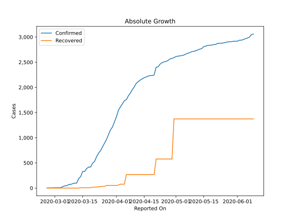
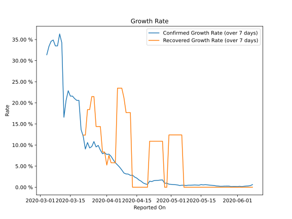

# Country Figures: Growth Rate for Greece 

The growth rates below are calculated based on
* an exponential growth assumption
* for time difference of past seven (7) days.

The first growth rate indicates the increase of confirmed (infected) cases.

The second growth rate indicates the increase of recovered (healed) cases.

| Reported On | Confirmed | Growth Rate (Confirmed) | Recovered | Growth Rate (Recovered) |
|-------------|-----------|-------------------------|-----------|-------------------------|
| 2020-03-22 | 624 |  9.06 %  | 19 |  12.357 %  | 
| 2020-03-21 | 530 |  12.05 %  | 19 |  12.357 %  | 
| 2020-03-20 | 495 |  13.68 %  | 19 |  None  | 
| 2020-03-19 | 418 |  20.58 %  | 8 |  None  | 
| 2020-03-18 | 418 |  20.58 %  | 8 |  None  | 
| 2020-03-17 | 387 |  21.00 %  | 8 |  None  | 
| 2020-03-16 | 331 |  21.60 %  | 8 |  None  | 
| 2020-03-15 | 331 |  21.60 %  | 8 |  None  | 
| 2020-03-14 | 228 |  22.87 %  | 8 |  None  | 
| 2020-03-13 | 190 |  20.58 %  | 0 |  None  | 
| 2020-03-12 | 99 |  16.59 %  | 0 |  None  | 
| 2020-03-11 | 99 |  34.26 %  | 0 |  None  | 
| 2020-03-10 | 89 |  36.32 %  | 0 |  None  | 
| 2020-03-09 | 73 |  33.49 %  | 0 |  None  | 
| 2020-03-08 | 73 |  33.49 %  | 0 |  None  | 
| 2020-03-07 | 46 |  34.89 %  | 0 |  None  | 
| 2020-03-06 | 45 |  34.58 %  | 0 |  None  | 
| 2020-03-05 | 31 |  33.36 %  | 0 |  None  | 
| 2020-03-04 | 9 |  None  | 0 |  None  | 
| 2020-03-03 | 7 |  None  | 0 |  None  | 
| 2020-03-02 | 7 |  None  | 0 |  None  | 
| 2020-03-01 | 7 |  None  | 0 |  None  | 
| 2020-02-29 | 4 |  None  | 0 |  None  | 
| 2020-02-28 | 4 |  None  | 0 |  None  | 
| 2020-02-27 | 3 |  None  | 0 |  None  | 
| 2020-02-26 | 1 |  None  | 0 |  None  | 

