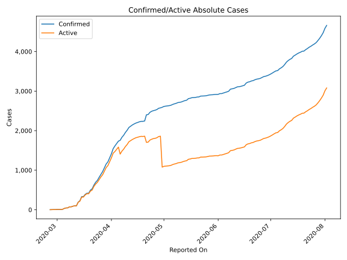
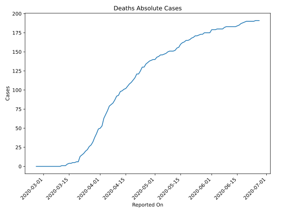
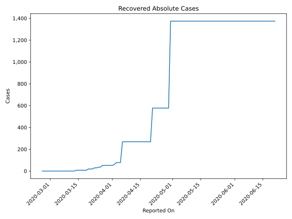
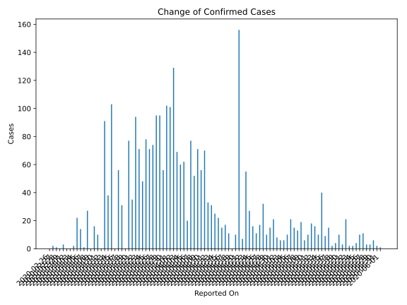
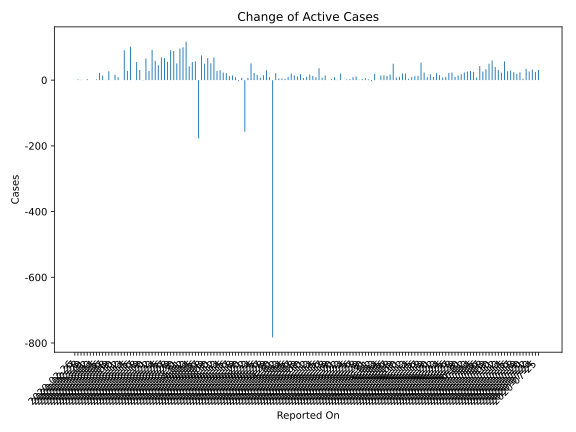
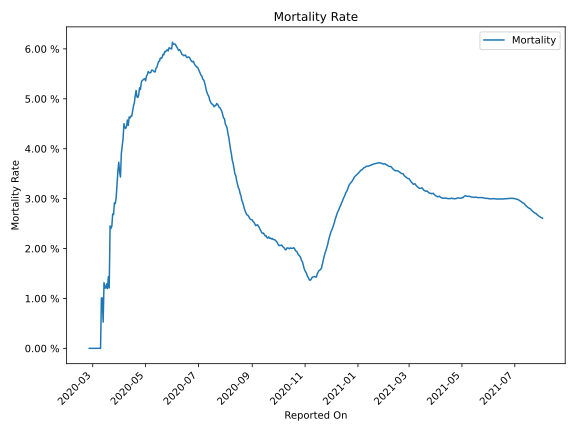

# Country Figures: Time Series for Greece 

| Reported On | Confirmed | Deaths | Recovered | Active | Mortality | &Delta; Confirmed | &Delta; Deaths | &Delta; Recovered | &Delta; Active | % Active of Population |
|-------------|-----------|--------|-----------|--------|-----------|-------------------|----------------|-------------------|----------------|------------------------|
| 2020-04-13 | 2145 | 99 | 269 | 1777 |  4.62 %  | 31 | 1 | 0 | 30 |  0.017 %  | 
| 2020-04-12 | 2114 | 98 | 269 | 1747 |  4.64 %  | 33 | 5 | 0 | 28 |  0.016 %  | 
| 2020-04-11 | 2081 | 93 | 269 | 1719 |  4.47 %  | 70 | 1 | 0 | 69 |  0.016 %  | 
| 2020-04-10 | 2011 | 92 | 269 | 1650 |  4.57 %  | 56 | 5 | 0 | 51 |  0.015 %  | 
| 2020-04-09 | 1955 | 87 | 269 | 1599 |  4.45 %  | 71 | 4 | 0 | 67 |  0.015 %  | 
| 2020-04-08 | 1884 | 83 | 269 | 1532 |  4.41 %  | 52 | 2 | 0 | 50 |  0.014 %  | 
| 2020-04-07 | 1832 | 81 | 269 | 1482 |  4.42 %  | 77 | 2 | 0 | 75 |  0.014 %  | 
| 2020-04-06 | 1755 | 79 | 269 | 1407 |  4.50 %  | 20 | 6 | 191 | -177 |  0.013 %  | 
| 2020-04-05 | 1735 | 73 | 78 | 1584 |  4.21 %  | 62 | 5 | 0 | 57 |  0.015 %  | 
| 2020-04-04 | 1673 | 68 | 78 | 1527 |  4.06 %  | 60 | 5 | 0 | 55 |  0.014 %  | 
| 2020-04-03 | 1613 | 63 | 78 | 1472 |  3.91 %  | 69 | 10 | 17 | 42 |  0.014 %  | 
| 2020-04-02 | 1544 | 53 | 61 | 1430 |  3.43 %  | 129 | 3 | 9 | 117 |  0.013 %  | 
| 2020-04-01 | 1415 | 50 | 52 | 1313 |  3.53 %  | 101 | 1 | 0 | 100 |  0.012 %  | 
| 2020-03-31 | 1314 | 49 | 52 | 1213 |  3.73 %  | 102 | 6 | 0 | 96 |  0.011 %  | 
| 2020-03-30 | 1212 | 43 | 52 | 1117 |  3.55 %  | 56 | 5 | 0 | 51 |  0.010 %  | 
| 2020-03-29 | 1156 | 38 | 52 | 1066 |  3.29 %  | 95 | 6 | 0 | 89 |  0.010 %  | 
| 2020-03-28 | 1061 | 32 | 52 | 977 |  3.02 %  | 95 | 4 | 0 | 91 |  0.009 %  | 
| 2020-03-27 | 966 | 28 | 52 | 886 |  2.90 %  | 74 | 2 | 16 | 56 |  0.008 %  | 
| 2020-03-26 | 892 | 26 | 36 | 830 |  2.91 %  | 71 | 4 | 0 | 67 |  0.008 %  | 
| 2020-03-25 | 821 | 22 | 36 | 763 |  2.68 %  | 78 | 2 | 7 | 69 |  0.007 %  | 
| 2020-03-24 | 743 | 20 | 29 | 694 |  2.69 %  | 48 | 3 | 0 | 45 |  0.006 %  | 
| 2020-03-23 | 695 | 17 | 29 | 649 |  2.45 %  | 71 | 2 | 10 | 59 |  0.006 %  | 
| 2020-03-22 | 624 | 15 | 19 | 590 |  2.40 %  | 94 | 2 | 0 | 92 |  0.005 %  | 
| 2020-03-21 | 530 | 13 | 19 | 498 |  2.45 %  | 35 | 7 | 0 | 28 |  0.005 %  | 
| 2020-03-20 | 495 | 6 | 19 | 470 |  1.21 %  | 77 | 0 | 11 | 66 |  0.004 %  | 
| 2020-03-19 | 418 | 6 | 8 | 404 |  1.44 %  | 0 | 1 | 0 | -1 |  0.004 %  | 
| 2020-03-18 | 418 | 5 | 8 | 405 |  1.20 %  | 31 | 0 | 0 | 31 |  0.004 %  | 
| 2020-03-17 | 387 | 5 | 8 | 374 |  1.29 %  | 56 | 1 | 0 | 55 |  0.003 %  | 
| 2020-03-16 | 331 | 4 | 8 | 319 |  1.21 %  | 0 | 0 | 0 | 0 |  0.003 %  | 
| 2020-03-15 | 331 | 4 | 8 | 319 |  1.21 %  | 103 | 1 | 0 | 102 |  0.003 %  | 
| 2020-03-14 | 228 | 3 | 8 | 217 |  1.32 %  | 38 | 2 | 8 | 28 |  0.002 %  | 
| 2020-03-13 | 190 | 1 | 0 | 189 |  0.53 %  | 91 | 0 | 0 | 91 |  0.002 %  | 
| 2020-03-12 | 99 | 1 | 0 | 98 |  1.01 %  | 0 | 0 | 0 | 0 |  0.001 %  | 
| 2020-03-11 | 99 | 1 | 0 | 98 |  1.01 %  | 10 | 1 | 0 | 9 |  0.001 %  | 
| 2020-03-10 | 89 | 0 | 0 | 89 |  None  | 16 | 0 | 0 | 16 |  0.001 %  | 
| 2020-03-09 | 73 | 0 | 0 | 73 |  None  | 0 | 0 | 0 | 0 |  0.001 %  | 
| 2020-03-08 | 73 | 0 | 0 | 73 |  None  | 27 | 0 | 0 | 27 |  0.001 %  | 
| 2020-03-07 | 46 | 0 | 0 | 46 |  None  | 1 | 0 | 0 | 1 |  0.000 %  | 
| 2020-03-06 | 45 | 0 | 0 | 45 |  None  | 14 | 0 | 0 | 14 |  0.000 %  | 
| 2020-03-05 | 31 | 0 | 0 | 31 |  None  | 22 | 0 | 0 | 22 |  0.000 %  | 
| 2020-03-04 | 9 | 0 | 0 | 9 |  None  | 2 | 0 | 0 | 2 |  0.000 %  | 
| 2020-03-03 | 7 | 0 | 0 | 7 |  None  | 0 | 0 | 0 | 0 |  0.000 %  | 
| 2020-03-02 | 7 | 0 | 0 | 7 |  None  | 0 | 0 | 0 | 0 |  0.000 %  | 
| 2020-03-01 | 7 | 0 | 0 | 7 |  None  | 3 | 0 | 0 | 3 |  0.000 %  | 
| 2020-02-29 | 4 | 0 | 0 | 4 |  None  | 0 | 0 | 0 | 0 |  0.000 %  | 
| 2020-02-28 | 4 | 0 | 0 | 4 |  None  | 1 | 0 | 0 | 1 |  0.000 %  | 
| 2020-02-27 | 3 | 0 | 0 | 3 |  None  | 2 | 0 | 0 | 2 |  0.000 %  | 
| 2020-02-26 | 1 | 0 | 0 | 1 |  None  | None | None | None | None |  0.000 %  | 

