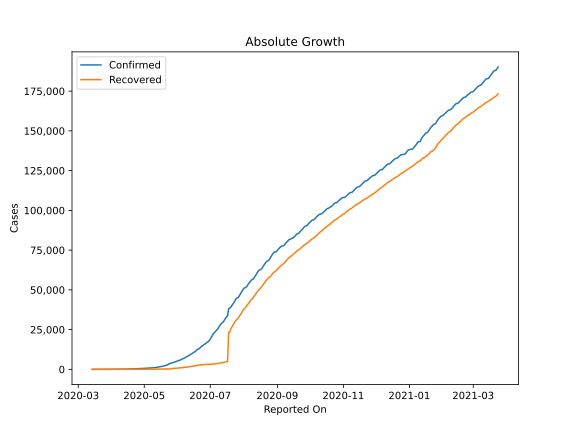
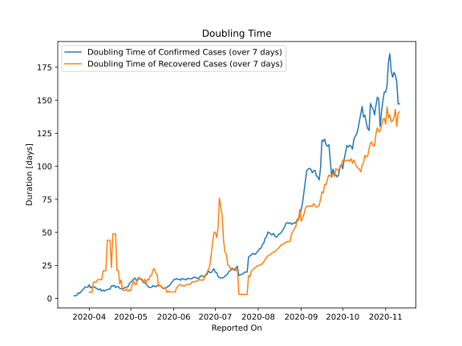

# Country Figures: Doubling Time of Infections for Guatemala 

The doubling time below are calculated based on
* an exponential growth assumption
* for time difference of past seven (7) days.
The doubling time's unit is "days".

The first doubling time indicates the increase of confirmed (infected)
cases. There, the *higher* the number is, the better is to take control
of the disease.

The second doubling time indicates the increase of recovered (healed)
cases. There, the *lower* the number is, the better it is to take
control of the disease.

| Reported On | Confirmed | Doubling Time (Confirmed) | Recovered | Doubling Time (Recovered) |
|-------------|-----------|---------------------------|-----------|---------------------------|
| 2020-04-17 | 214 |  9.5 days  | 21 |  23.3 days  | 
| 2020-04-16 | 196 |  7.0 days  | 19 |  44.0 days  | 
| 2020-04-15 | 180 |  7.0 days  | 19 |  44.0 days  | 
| 2020-04-14 | 167 |  6.6 days  | 19 |  44.0 days  | 
| 2020-04-13 | 156 |  6.4 days  | 19 |  20.9 days  | 
| 2020-04-12 | 155 |  5.5 days  | 19 |  20.9 days  | 
| 2020-04-11 | 137 |  6.3 days  | 19 |  20.9 days  | 
| 2020-04-10 | 126 |  5.6 days  | 17 |  14.3 days  | 
| 2020-04-09 | 95 |  7.2 days  | 17 |  14.3 days  | 
| 2020-04-08 | 87 |  6.4 days  | 17 |  14.3 days  | 
| 2020-04-07 | 77 |  7.2 days  | 17 |  14.3 days  | 
| 2020-04-06 | 70 |  7.6 days  | 15 |  12.3 days  | 
| 2020-04-05 | 61 |  8.6 days  | 15 |  12.3 days  | 
| 2020-04-04 | 61 |  8.6 days  | 15 |  12.3 days  | 
| 2020-04-03 | 50 |  8.7 days  | 12 |  4.8 days  | 
| 2020-04-02 | 47 |  8.0 days  | 12 |  4.8 days  | 
| 2020-04-01 | 39 |  10.3 days  | 12 |  4.8 days  | 
| 2020-03-31 | 38 |  8.5 days  | 12 |  None  | 
| 2020-03-30 | 36 |  8.6 days  | 10 |  None  | 
| 2020-03-29 | 34 |  8.7 days  | 10 |  None  | 
| 2020-03-28 | 34 |  7.3 days  | 10 |  None  | 
| 2020-03-27 | 28 |  6.1 days  | 4 |  None  | 
| 2020-03-26 | 25 |  5.1 days  | 4 |  None  | 
| 2020-03-25 | 24 |  3.8 days  | 4 |  None  | 
| 2020-03-24 | 21 |  4.2 days  | 0 |  None  | 
| 2020-03-23 | 20 |  2.4 days  | 0 |  None  | 
| 2020-03-22 | 19 |  2.0 days  | 0 |  None  | 
| 2020-03-21 | 17 |  2.0 days  | 0 |  None  | 
| 2020-03-20 | 12 |  None  | 0 |  None  | 
| 2020-03-19 | 9 |  None  | 0 |  None  | 
| 2020-03-18 | 6 |  None  | 0 |  None  | 
| 2020-03-17 | 6 |  None  | 0 |  None  | 
| 2020-03-16 | 2 |  None  | 0 |  None  | 
| 2020-03-15 | 1 |  None  | 0 |  None  | 
| 2020-03-14 | 1 |  None  | 0 |  None  | 

