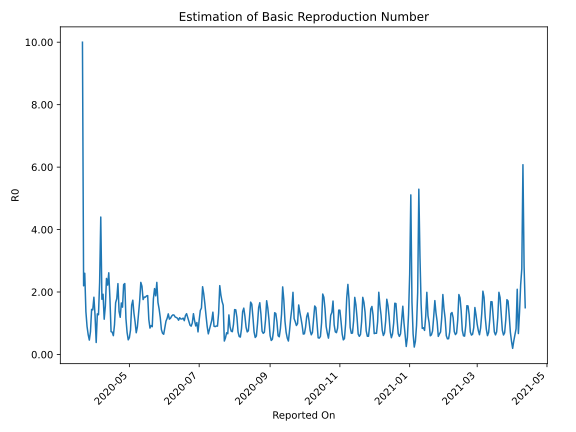

# Country Figures: Time Series for Basic Reproduction Number of Guatemala 

| Reported On | &Delta; Confirmed | Total &Delta; Confirmed First Interval | Total &Delta; Confirmed Second Interval | Estimated Basic Reproduction Number R0 | 
|-------------|-------------------|----------------------------------------|-----------------------------------------|---------------------------------------------------|
| 2020-04-29 | 27 |  100  |  141  |  0.71  | 
| 2020-04-28 | 0 |  146  |  127  |  1.15  | 
| 2020-04-27 | 30 |  184  |  81  |  2.27  | 
| 2020-04-26 | 27 |  179  |  80  |  2.24  | 
| 2020-04-25 | 43 |  141  |  93  |  1.52  | 
| 2020-04-24 | 46 |  127  |  77  |  1.65  | 
| 2020-04-23 | 68 |  81  |  68  |  1.19  | 
| 2020-04-22 | 22 |  80  |  58  |  1.38  | 
| 2020-04-21 | 5 |  93  |  41  |  2.27  | 
| 2020-04-20 | 32 |  77  |  43  |  1.79  | 
| 2020-04-19 | 22 |  68  |  41  |  1.66  | 
| 2020-04-18 | 21 |  58  |  61  |  0.95  | 
| 2020-04-17 | 18 |  41  |  68  |  0.60  | 
| 2020-04-16 | 16 |  43  |  60  |  0.72  | 
| 2020-04-15 | 13 |  41  |  56  |  0.73  | 
| 2020-04-14 | 11 |  61  |  34  |  1.79  | 
| 2020-04-13 | 1 |  68  |  26  |  2.62  | 
| 2020-04-12 | 18 |  60  |  27  |  2.22  | 
| 2020-04-11 | 11 |  56  |  23  |  2.43  | 
| 2020-04-10 | 31 |  34  |  22  |  1.55  | 
| 2020-04-09 | 8 |  26  |  23  |  1.13  | 
| 2020-04-08 | 10 |  27  |  14  |  1.93  | 
| 2020-04-07 | 7 |  23  |  13  |  1.77  | 
| 2020-04-06 | 9 |  22  |  5  |  4.40  | 
| 2020-04-05 | 0 |  23  |  10  |  2.30  | 
| 2020-04-04 | 11 |  14  |  11  |  1.27  | 
| 2020-04-03 | 3 |  13  |  10  |  1.30  | 
| 2020-04-02 | 8 |  5  |  13  |  0.38  | 
| 2020-04-01 | 1 |  10  |  8  |  1.25  | 
| 2020-03-31 | 2 |  11  |  6  |  1.83  | 
| 2020-03-30 | 2 |  10  |  7  |  1.43  | 
| 2020-03-29 | 0 |  13  |  9  |  1.44  | 
| 2020-03-28 | 6 |  8  |  11  |  0.73  | 
| 2020-03-27 | 3 |  6  |  13  |  0.46  | 
| 2020-03-26 | 1 |  7  |  11  |  0.64  | 
| 2020-03-25 | 3 |  9  |  10  |  0.90  | 
| 2020-03-24 | 1 |  11  |  8  |  1.38  | 
| 2020-03-23 | 1 |  13  |  5  |  2.60  | 
| 2020-03-22 | 2 |  11  |  5  |  2.20  | 
| 2020-03-21 | 5 |  10  |  1  |  10.00  | 
| 2020-03-20 | 3 |  8  |  None  |  None  | 
| 2020-03-19 | 3 |  5  |  None  |  None  | 
| 2020-03-18 | 0 |  5  |  None  |  None  | 
| 2020-03-17 | 4 |  1  |  None  |  None  | 
| 2020-03-16 | 1 |  None  |  None  |  None  | 
| 2020-03-15 | 0 |  None  |  None  |  None  | 
| 2020-03-14 | None |  None  |  None  |  None  | 

