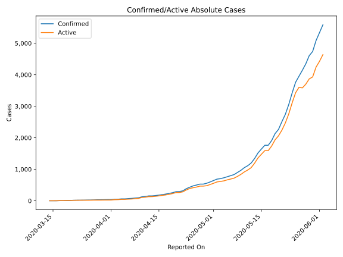
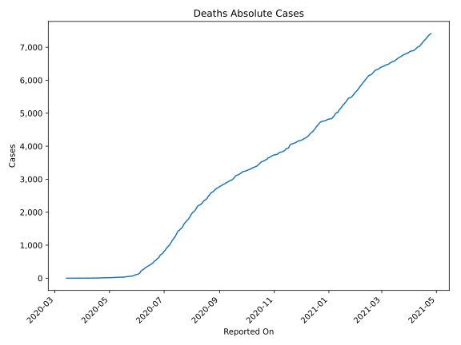
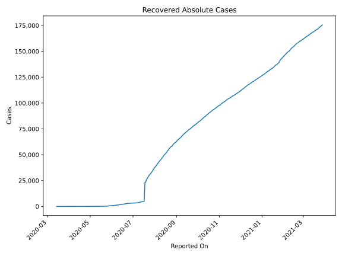
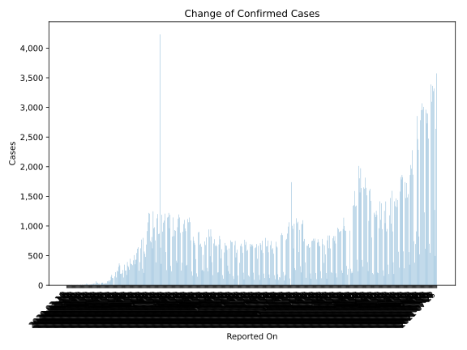
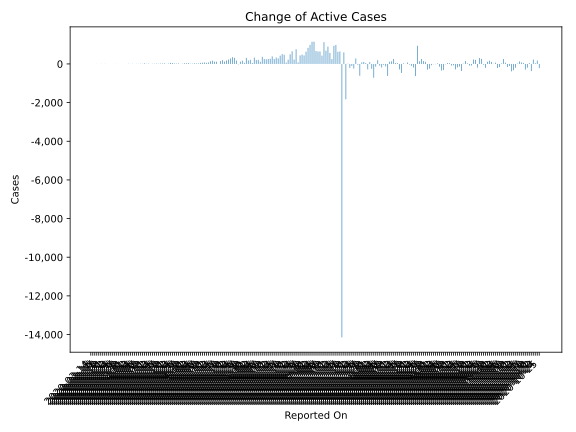
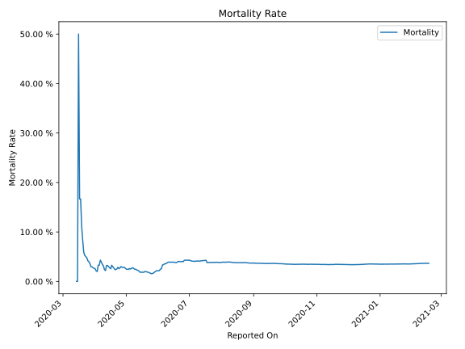

# Country Figures: Time Series for Guatemala 

| Reported On | Confirmed | Deaths | Recovered | Active | Mortality | &Delta; Confirmed | &Delta; Deaths | &Delta; Recovered | &Delta; Active | % Active of Population |
|-------------|-----------|--------|-----------|--------|-----------|-------------------|----------------|-------------------|----------------|------------------------|
| 2020-04-13 | 156 | 5 | 19 | 132 |  3.21 %  | 1 | 0 | 0 | 1 |  0.001 %  | 
| 2020-04-12 | 155 | 5 | 19 | 131 |  3.23 %  | 18 | 2 | 0 | 16 |  0.001 %  | 
| 2020-04-11 | 137 | 3 | 19 | 115 |  2.19 %  | 11 | 0 | 2 | 9 |  0.001 %  | 
| 2020-04-10 | 126 | 3 | 17 | 106 |  2.38 %  | 31 | 0 | 0 | 31 |  0.001 %  | 
| 2020-04-09 | 95 | 3 | 17 | 75 |  3.16 %  | 8 | 0 | 0 | 8 |  0.000 %  | 
| 2020-04-08 | 87 | 3 | 17 | 67 |  3.45 %  | 10 | 0 | 0 | 10 |  0.000 %  | 
| 2020-04-07 | 77 | 3 | 17 | 57 |  3.90 %  | 7 | 0 | 2 | 5 |  0.000 %  | 
| 2020-04-06 | 70 | 3 | 15 | 52 |  4.29 %  | 9 | 1 | 0 | 8 |  0.000 %  | 
| 2020-04-05 | 61 | 2 | 15 | 44 |  3.28 %  | 0 | 0 | 0 | 0 |  0.000 %  | 
| 2020-04-04 | 61 | 2 | 15 | 44 |  3.28 %  | 11 | 1 | 3 | 7 |  0.000 %  | 
| 2020-04-03 | 50 | 1 | 12 | 37 |  2.00 %  | 3 | 0 | 0 | 3 |  0.000 %  | 
| 2020-04-02 | 47 | 1 | 12 | 34 |  2.13 %  | 8 | 0 | 0 | 8 |  0.000 %  | 
| 2020-04-01 | 39 | 1 | 12 | 26 |  2.56 %  | 1 | 0 | 0 | 1 |  0.000 %  | 
| 2020-03-31 | 38 | 1 | 12 | 25 |  2.63 %  | 2 | 0 | 2 | 0 |  0.000 %  | 
| 2020-03-30 | 36 | 1 | 10 | 25 |  2.78 %  | 2 | 0 | 0 | 2 |  0.000 %  | 
| 2020-03-29 | 34 | 1 | 10 | 23 |  2.94 %  | 0 | 0 | 0 | 0 |  0.000 %  | 
| 2020-03-28 | 34 | 1 | 10 | 23 |  2.94 %  | 6 | 0 | 6 | 0 |  0.000 %  | 
| 2020-03-27 | 28 | 1 | 4 | 23 |  3.57 %  | 3 | 0 | 0 | 3 |  0.000 %  | 
| 2020-03-26 | 25 | 1 | 4 | 20 |  4.00 %  | 1 | 0 | 0 | 1 |  0.000 %  | 
| 2020-03-25 | 24 | 1 | 4 | 19 |  4.17 %  | 3 | 0 | 4 | -1 |  0.000 %  | 
| 2020-03-24 | 21 | 1 | 0 | 20 |  4.76 %  | 1 | 0 | 0 | 1 |  0.000 %  | 
| 2020-03-23 | 20 | 1 | 0 | 19 |  5.00 %  | 1 | 0 | 0 | 1 |  0.000 %  | 
| 2020-03-22 | 19 | 1 | 0 | 18 |  5.26 %  | 2 | 0 | 0 | 2 |  0.000 %  | 
| 2020-03-21 | 17 | 1 | 0 | 16 |  5.88 %  | 5 | 0 | 0 | 5 |  0.000 %  | 
| 2020-03-20 | 12 | 1 | 0 | 11 |  8.33 %  | 3 | 0 | 0 | 3 |  0.000 %  | 
| 2020-03-19 | 9 | 1 | 0 | 8 |  11.11 %  | 3 | 0 | 0 | 3 |  0.000 %  | 
| 2020-03-18 | 6 | 1 | 0 | 5 |  16.67 %  | 0 | 0 | 0 | 0 |  0.000 %  | 
| 2020-03-17 | 6 | 1 | 0 | 5 |  16.67 %  | 4 | 0 | 0 | 4 |  0.000 %  | 
| 2020-03-16 | 2 | 1 | 0 | 1 |  50.00 %  | 1 | 1 | 0 | 0 |  0.000 %  | 
| 2020-03-15 | 1 | 0 | 0 | 1 |  None  | 0 | 0 | 0 | 0 |  0.000 %  | 
| 2020-03-14 | 1 | 0 | 0 | 1 |  None  | None | None | None | None |  0.000 %  | 

