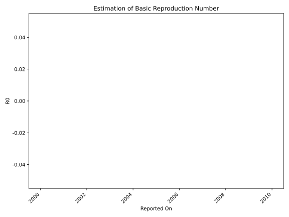

# Country Figures: Time Series for Basic Reproduction Number of Guam 

| Reported On | &Delta; Confirmed | Total &Delta; Confirmed First Interval | Total &Delta; Confirmed Second Interval | Estimated Basic Reproduction Number R0 | 
|-------------|-------------------|----------------------------------------|-----------------------------------------|---------------------------------------------------|
| 2020-03-21 | 0 |  -3  |  None  |  None  | 
| 2020-03-20 | 0 |  -3  |  None  |  None  | 
| 2020-03-19 | 0 |  -3  |  None  |  None  | 
| 2020-03-18 | -3 |  None  |  None  |  None  | 
| 2020-03-17 | 0 |  None  |  None  |  None  | 
| 2020-03-16 | None |  None  |  None  |  None  | 

