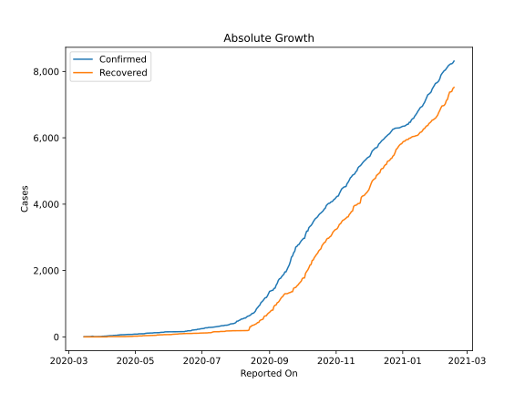
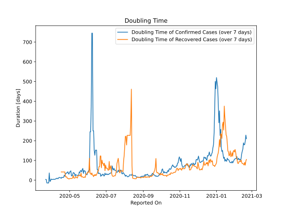

# Country Figures: Doubling Time of Infections for Guyana 

The doubling time below are calculated based on
* an exponential growth assumption
* for time difference of past seven (7) days.
The doubling time's unit is "days".

The first growth rate indicates the increase of confirmed (infected) cases.

The second growth rate indicates the increase of recovered (healed) cases.

| Reported On | Confirmed | Doubling Time (Confirmed) | Recovered | Doubling Time (Recovered) |
|-------------|-----------|---------------------------|-----------|---------------------------|
| 2020-04-03 | 23 |  3.5 days  | 0 |  None  | 
| 2020-04-02 | 19 |  4.0 days  | 0 |  None  | 
| 2020-04-01 | 19 |  4.0 days  | 0 |  None  | 
| 2020-03-31 | 12 |  5.9 days  | 0 |  None  | 
| 2020-03-30 | 8 |  -4.9 days  | 0 |  None  | 
| 2020-03-29 | 8 |  -5.6 days  | 0 |  None  | 
| 2020-03-28 | 8 |  36.7 days  | 0 |  None  | 
| 2020-03-27 | 5 |  -14.1 days  | 0 |  None  | 
| 2020-03-26 | 5 |  -14.1 days  | 0 |  None  | 
| 2020-03-25 | 5 |  -14.1 days  | 0 |  None  | 
| 2020-03-24 | 5 |  -14.1 days  | 0 |  None  | 
| 2020-03-23 | 20 |  3.3 days  | 0 |  None  | 
| 2020-03-22 | 18 |  3.6 days  | 0 |  None  | 
| 2020-03-21 | 7 |  None  | 0 |  None  | 
| 2020-03-20 | 7 |  None  | 0 |  None  | 
| 2020-03-19 | 7 |  None  | 0 |  None  | 
| 2020-03-18 | 7 |  None  | 0 |  None  | 
| 2020-03-17 | 7 |  None  | 0 |  None  | 
| 2020-03-16 | 4 |  None  | 0 |  None  | 
| 2020-03-15 | 4 |  None  | 0 |  None  | 

