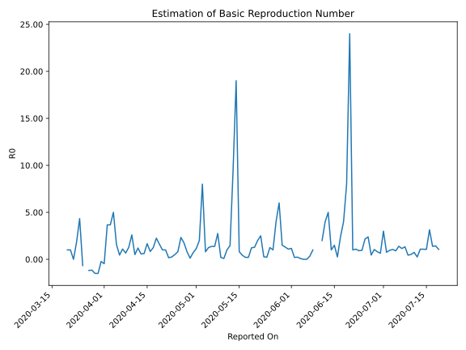

# Country Figures: Time Series for Basic Reproduction Number of Guyana 

| Reported On | &Delta; Confirmed | Total &Delta; Confirmed First Interval | Total &Delta; Confirmed Second Interval | Estimated Basic Reproduction Number R0 | 
|-------------|-------------------|----------------------------------------|-----------------------------------------|---------------------------------------------------|
| 2020-04-27 | 0 |  7  |  4  |  1.75  | 
| 2020-04-26 | 1 |  7  |  3  |  2.33  | 
| 2020-04-25 | 0 |  8  |  10  |  0.80  | 
| 2020-04-24 | 3 |  5  |  10  |  0.50  | 
| 2020-04-23 | 3 |  4  |  16  |  0.25  | 
| 2020-04-22 | 1 |  3  |  18  |  0.17  | 
| 2020-04-21 | 1 |  10  |  10  |  1.00  | 
| 2020-04-20 | 0 |  10  |  10  |  1.00  | 
| 2020-04-19 | 2 |  16  |  10  |  1.60  | 
| 2020-04-18 | 0 |  18  |  8  |  2.25  | 
| 2020-04-17 | 8 |  10  |  8  |  1.25  | 
| 2020-04-16 | 0 |  10  |  12  |  0.83  | 
| 2020-04-15 | 8 |  10  |  6  |  1.67  | 
| 2020-04-14 | 2 |  8  |  13  |  0.62  | 
| 2020-04-13 | 0 |  8  |  14  |  0.57  | 
| 2020-04-12 | 0 |  12  |  10  |  1.20  | 
| 2020-04-11 | 8 |  6  |  12  |  0.50  | 
| 2020-04-10 | 0 |  13  |  5  |  2.60  | 
| 2020-04-09 | 0 |  14  |  11  |  1.27  | 
| 2020-04-08 | 4 |  10  |  15  |  0.67  | 
| 2020-04-07 | 2 |  12  |  11  |  1.09  | 
| 2020-04-06 | 7 |  5  |  11  |  0.45  | 
| 2020-04-05 | 1 |  11  |  7  |  1.57  | 
| 2020-04-04 | 0 |  15  |  3  |  5.00  | 
| 2020-04-03 | 4 |  11  |  3  |  3.67  | 
| 2020-04-02 | 0 |  11  |  3  |  3.67  | 
| 2020-04-01 | 7 |  7  |  -15  |  -0.47  | 
| 2020-03-31 | 4 |  3  |  -13  |  -0.23  | 
| 2020-03-30 | 0 |  3  |  -2  |  -1.50  | 
| 2020-03-29 | 0 |  3  |  -2  |  -1.50  | 
| 2020-03-28 | 3 |  -15  |  13  |  -1.15  | 
| 2020-03-27 | 0 |  -13  |  11  |  -1.18  | 
| 2020-03-26 | 0 |  -2  |  None  |  None  | 
| 2020-03-25 | 0 |  -2  |  3  |  -0.67  | 
| 2020-03-24 | -15 |  13  |  3  |  4.33  | 
| 2020-03-23 | 2 |  11  |  6  |  1.83  | 
| 2020-03-22 | 11 |  None  |  6  |  None  | 
| 2020-03-21 | 0 |  3  |  3  |  1.00  | 
| 2020-03-20 | 0 |  3  |  3  |  1.00  | 
| 2020-03-19 | 0 |  6  |  None  |  None  | 
| 2020-03-18 | 0 |  6  |  None  |  None  | 
| 2020-03-17 | 3 |  3  |  None  |  None  | 
| 2020-03-16 | 0 |  3  |  None  |  None  | 
| 2020-03-15 | 3 |  None  |  None  |  None  | 
| 2020-03-14 | 0 |  None  |  None  |  None  | 
| 2020-03-13 | 0 |  None  |  None  |  None  | 
| 2020-03-12 | None |  None  |  None  |  None  | 

