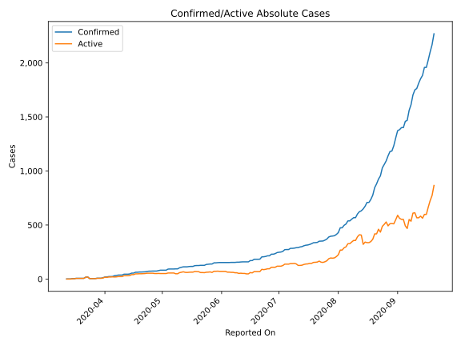
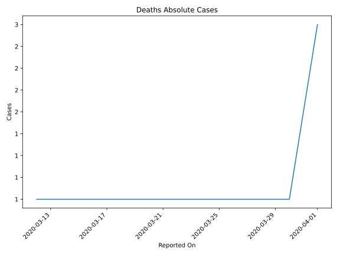
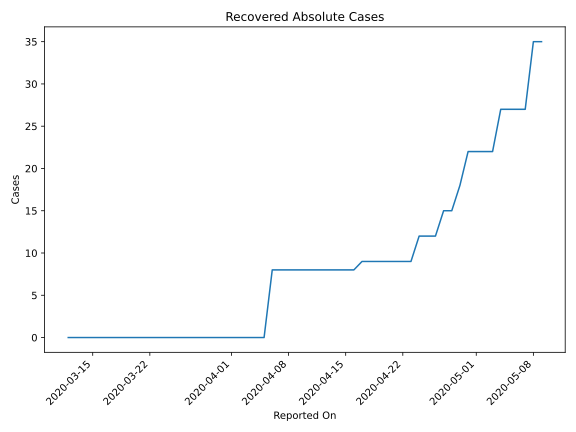
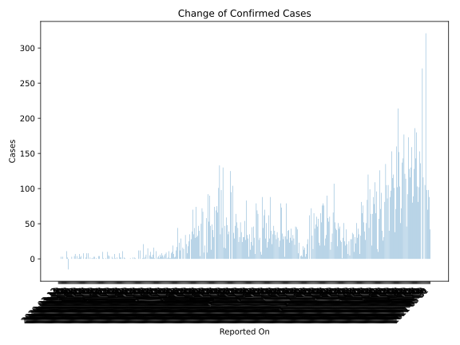
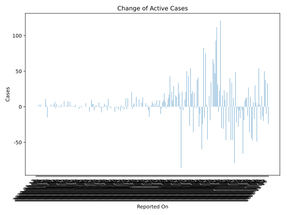
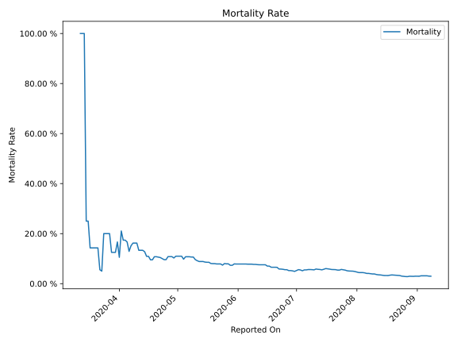

# Country Figures: Time Series for Guyana 

| Reported On | Confirmed | Deaths | Recovered | Active | Mortality | &Delta; Confirmed | &Delta; Deaths | &Delta; Active | % Active of Population |
|-------------|-----------|--------|-----------|--------|-----------|-------------------|----------------|----------------|------------------------|
| 2020-03-28 | 8 | 1 | 0 | 7 |  12.50 %  | 3 | 0 | 3 |  0.001 %  | 
| 2020-03-27 | 5 | 1 | 0 | 4 |  20.00 %  | 0 | 0 | 0 |  0.001 %  | 
| 2020-03-26 | 5 | 1 | 0 | 4 |  20.00 %  | 0 | 0 | 0 |  0.001 %  | 
| 2020-03-25 | 5 | 1 | 0 | 4 |  20.00 %  | 0 | 0 | 0 |  0.001 %  | 
| 2020-03-24 | 5 | 1 | 0 | 4 |  20.00 %  | -15 | 0 | -15 |  0.001 %  | 
| 2020-03-23 | 20 | 1 | 0 | 19 |  5.00 %  | 2 | 0 | 2 |  0.002 %  | 
| 2020-03-22 | 18 | 1 | 0 | 17 |  5.56 %  | 11 | 0 | 11 |  0.002 %  | 
| 2020-03-21 | 7 | 1 | 0 | 6 |  14.29 %  | 0 | 0 | 0 |  0.001 %  | 
| 2020-03-20 | 7 | 1 | 0 | 6 |  14.29 %  | 0 | 0 | 0 |  0.001 %  | 
| 2020-03-19 | 7 | 1 | 0 | 6 |  14.29 %  | 0 | 0 | 0 |  0.001 %  | 
| 2020-03-18 | 7 | 1 | 0 | 6 |  14.29 %  | 0 | 0 | 0 |  0.001 %  | 
| 2020-03-17 | 7 | 1 | 0 | 6 |  14.29 %  | 3 | 0 | 3 |  0.001 %  | 
| 2020-03-16 | 4 | 1 | 0 | 3 |  25.00 %  | 0 | 0 | 0 |  0.000 %  | 
| 2020-03-15 | 4 | 1 | 0 | 3 |  25.00 %  | 3 | 0 | 3 |  0.000 %  | 
| 2020-03-14 | 1 | 1 | 0 | 0 |  100.00 %  | 0 | 0 | 0 |  n/a  | 
| 2020-03-13 | 1 | 1 | 0 | 0 |  100.00 %  | 0 | 0 | 0 |  n/a  | 
| 2020-03-12 | 1 | 1 | 0 | 0 |  100.00 %  | None | None | None |  n/a  | 

