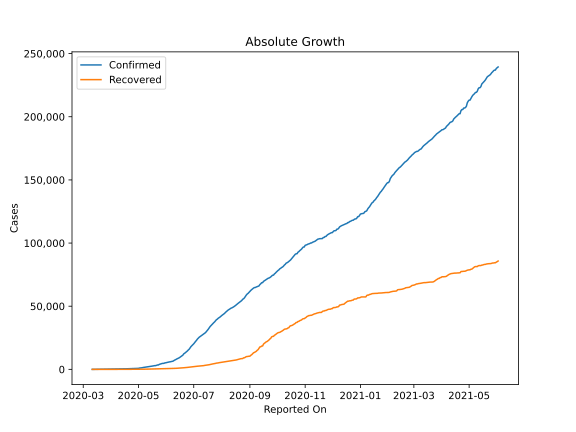
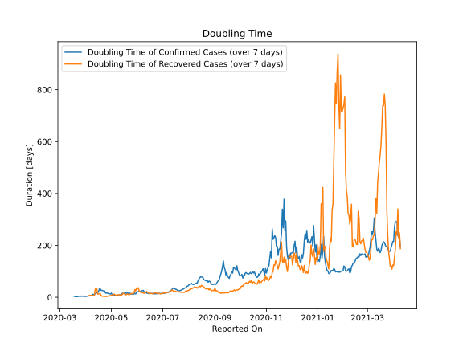

# Country Figures: Doubling Time of Infections for Honduras 

The doubling time below are calculated based on
* an exponential growth assumption
* for time difference of past seven (7) days.
The doubling time's unit is "days".

The first doubling time indicates the increase of confirmed (infected)
cases. There, the *higher* the number is, the better is to take control
of the disease.

The second doubling time indicates the increase of recovered (healed)
cases. There, the *lower* the number is, the better it is to take
control of the disease.

| Reported On | Confirmed | Doubling Time (Confirmed) | Recovered | Doubling Time (Recovered) |
|-------------|-----------|---------------------------|-----------|---------------------------|
| 2020-04-25 | 627 |  15.7 days  | 65 |  2.9 days  | 
| 2020-04-24 | 591 |  17.0 days  | 58 |  3.1 days  | 
| 2020-04-23 | 519 |  24.9 days  | 31 |  4.3 days  | 
| 2020-04-22 | 510 |  25.0 days  | 30 |  4.4 days  | 
| 2020-04-21 | 494 |  25.4 days  | 29 |  3.7 days  | 
| 2020-04-20 | 477 |  26.8 days  | 25 |  4.1 days  | 
| 2020-04-19 | 472 |  26.8 days  | 15 |  6.7 days  | 
| 2020-04-18 | 457 |  32.0 days  | 10 |  13.9 days  | 
| 2020-04-17 | 442 |  33.6 days  | 10 |  13.9 days  | 
| 2020-04-16 | 426 |  22.7 days  | 9 |  12.3 days  | 
| 2020-04-15 | 419 |  16.8 days  | 9 |  12.3 days  | 
| 2020-04-14 | 407 |  17.2 days  | 7 |  31.8 days  | 
| 2020-04-13 | 397 |  17.3 days  | 7 |  31.8 days  | 
| 2020-04-12 | 393 |  13.0 days  | 7 |  31.8 days  | 
| 2020-04-11 | 392 |  12.6 days  | 7 |  6.1 days  | 
| 2020-04-10 | 382 |  9.3 days  | 7 |  6.1 days  | 
| 2020-04-09 | 343 |  11.2 days  | 6 |  7.3 days  | 
| 2020-04-08 | 312 |  8.5 days  | 6 |  7.3 days  | 
| 2020-04-07 | 305 |  6.6 days  | 6 |  7.3 days  | 
| 2020-04-06 | 298 |  6.7 days  | 6 |  7.3 days  | 
| 2020-04-05 | 268 |  5.8 days  | 6 |  7.3 days  | 
| 2020-04-04 | 264 |  5.1 days  | 3 |  None  | 
| 2020-04-03 | 222 |  4.4 days  | 3 |  None  | 
| 2020-04-02 | 219 |  3.7 days  | 3 |  None  | 
| 2020-04-01 | 172 |  3.4 days  | 3 |  None  | 
| 2020-03-31 | 141 |  3.5 days  | 3 |  None  | 
| 2020-03-30 | 139 |  3.3 days  | 3 |  None  | 
| 2020-03-29 | 110 |  3.7 days  | 3 |  None  | 
| 2020-03-28 | 95 |  3.9 days  | 3 |  None  | 
| 2020-03-27 | 68 |  5.0 days  | 0 |  None  | 
| 2020-03-26 | 52 |  3.6 days  | 0 |  None  | 
| 2020-03-25 | 36 |  3.8 days  | 0 |  None  | 
| 2020-03-24 | 30 |  4.0 days  | 0 |  None  | 
| 2020-03-23 | 27 |  3.6 days  | 0 |  None  | 
| 2020-03-22 | 26 |  2.6 days  | 0 |  None  | 
| 2020-03-21 | 24 |  2.3 days  | 0 |  None  | 
| 2020-03-20 | 24 |  2.3 days  | 0 |  None  | 
| 2020-03-19 | 12 |  3.0 days  | 0 |  None  | 
| 2020-03-18 | 9 |  3.6 days  | 0 |  None  | 
| 2020-03-17 | 8 |  None  | 0 |  None  | 
| 2020-03-16 | 6 |  None  | 0 |  None  | 
| 2020-03-15 | 3 |  None  | 0 |  None  | 
| 2020-03-14 | 2 |  None  | 0 |  None  | 
| 2020-03-13 | 2 |  None  | 0 |  None  | 
| 2020-03-12 | 2 |  None  | 0 |  None  | 
| 2020-03-11 | 2 |  None  | 0 |  None  | 

