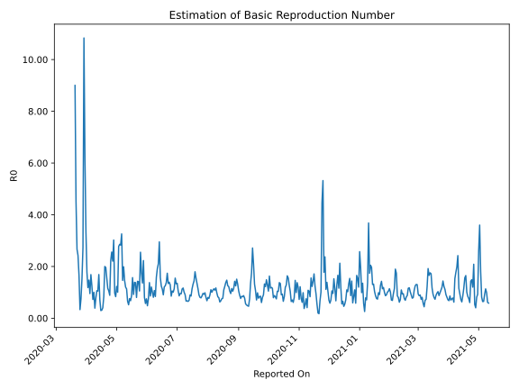

# Country Figures: Time Series for Basic Reproduction Number of Honduras 

| Reported On | &Delta; Confirmed | Total &Delta; Confirmed First Interval | Total &Delta; Confirmed Second Interval | Estimated Basic Reproduction Number R0 | 
|-------------|-------------------|----------------------------------------|-----------------------------------------|---------------------------------------------------|
| 2020-05-06 | 191 |  466  |  143  |  3.26  | 
| 2020-05-05 | 92 |  407  |  144  |  2.83  | 
| 2020-05-04 | 123 |  317  |  111  |  2.86  | 
| 2020-05-03 | 45 |  308  |  111  |  2.77  | 
| 2020-05-02 | 206 |  143  |  142  |  1.01  | 
| 2020-05-01 | 33 |  144  |  117  |  1.23  | 
| 2020-04-30 | 33 |  111  |  133  |  0.83  | 
| 2020-04-29 | 36 |  111  |  114  |  0.97  | 
| 2020-04-28 | 41 |  142  |  47  |  3.02  | 
| 2020-04-27 | 34 |  117  |  53  |  2.21  | 
| 2020-04-26 | 0 |  133  |  52  |  2.56  | 
| 2020-04-25 | 36 |  114  |  51  |  2.24  | 
| 2020-04-24 | 72 |  47  |  53  |  0.89  | 
| 2020-04-23 | 9 |  53  |  50  |  1.06  | 
| 2020-04-22 | 16 |  52  |  45  |  1.16  | 
| 2020-04-21 | 17 |  51  |  33  |  1.55  | 
| 2020-04-20 | 5 |  53  |  27  |  1.96  | 
| 2020-04-19 | 15 |  50  |  25  |  2.00  | 
| 2020-04-18 | 15 |  45  |  54  |  0.83  | 
| 2020-04-17 | 16 |  33  |  81  |  0.41  | 
| 2020-04-16 | 7 |  27  |  87  |  0.31  | 
| 2020-04-15 | 12 |  25  |  84  |  0.30  | 
| 2020-04-14 | 10 |  54  |  75  |  0.72  | 
| 2020-04-13 | 4 |  81  |  48  |  1.69  | 
| 2020-04-12 | 1 |  87  |  83  |  1.05  | 
| 2020-04-11 | 10 |  84  |  79  |  1.06  | 
| 2020-04-10 | 39 |  75  |  96  |  0.78  | 
| 2020-04-09 | 31 |  48  |  123  |  0.39  | 
| 2020-04-08 | 7 |  83  |  83  |  1.00  | 
| 2020-04-07 | 7 |  79  |  109  |  0.72  | 
| 2020-04-06 | 30 |  96  |  77  |  1.25  | 
| 2020-04-05 | 4 |  123  |  73  |  1.68  | 
| 2020-04-04 | 42 |  83  |  87  |  0.95  | 
| 2020-04-03 | 3 |  109  |  74  |  1.47  | 
| 2020-04-02 | 47 |  77  |  65  |  1.18  | 
| 2020-04-01 | 31 |  73  |  41  |  1.78  | 
| 2020-03-31 | 2 |  87  |  26  |  3.35  | 
| 2020-03-30 | 29 |  74  |  12  |  6.17  | 
| 2020-03-29 | 15 |  65  |  6  |  10.83  | 
| 2020-03-28 | 27 |  41  |  15  |  2.73  | 
| 2020-03-27 | 16 |  26  |  17  |  1.53  | 
| 2020-03-26 | 16 |  12  |  16  |  0.75  | 
| 2020-03-25 | 6 |  6  |  18  |  0.33  | 
| 2020-03-24 | 3 |  15  |  9  |  1.67  | 
| 2020-03-23 | 1 |  17  |  7  |  2.43  | 
| 2020-03-22 | 2 |  16  |  6  |  2.67  | 
| 2020-03-21 | 0 |  18  |  4  |  4.50  | 
| 2020-03-20 | 12 |  9  |  1  |  9.00  | 
| 2020-03-19 | 3 |  7  |  None  |  None  | 
| 2020-03-18 | 1 |  6  |  None  |  None  | 
| 2020-03-17 | 2 |  4  |  None  |  None  | 
| 2020-03-16 | 3 |  1  |  None  |  None  | 
| 2020-03-15 | 1 |  None  |  None  |  None  | 
| 2020-03-14 | 0 |  None  |  None  |  None  | 
| 2020-03-13 | 0 |  None  |  None  |  None  | 
| 2020-03-12 | 0 |  None  |  None  |  None  | 
| 2020-03-11 | None |  None  |  None  |  None  | 

