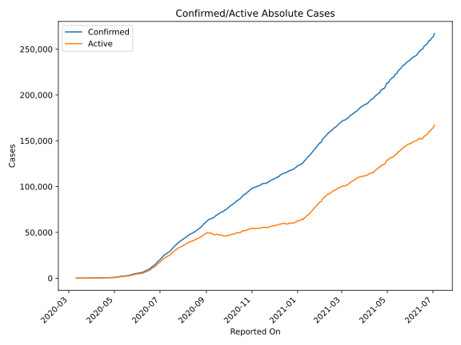
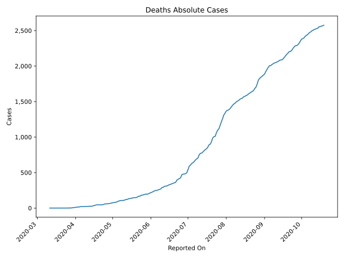
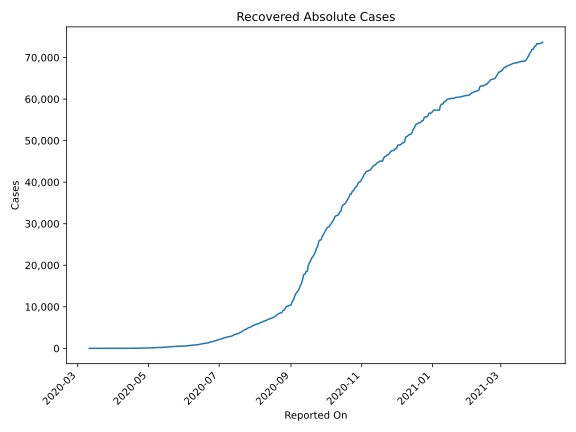
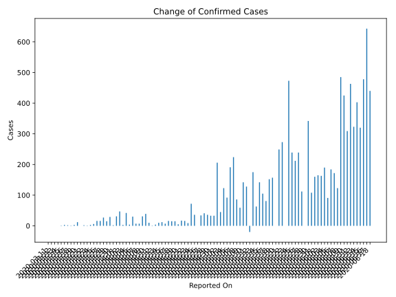
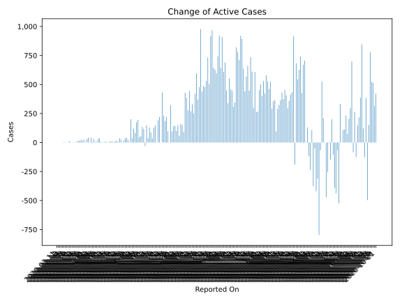
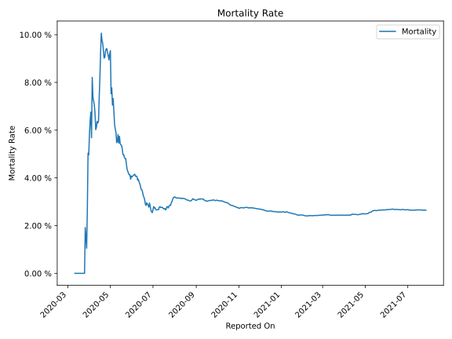

# Country Figures: Time Series for Honduras 

| Reported On | Confirmed | Deaths | Recovered | Active | Mortality | &Delta; Confirmed | &Delta; Deaths | &Delta; Active | % Active of Population |
|-------------|-----------|--------|-----------|--------|-----------|-------------------|----------------|----------------|------------------------|
| 2020-03-25 | 36 | 0 | 0 | 36 |  None  | 6 | 0 | 6 |  0.000 %  | 
| 2020-03-24 | 30 | 0 | 0 | 30 |  None  | 3 | 0 | 3 |  0.000 %  | 
| 2020-03-23 | 27 | 0 | 0 | 27 |  None  | 1 | 0 | 1 |  0.000 %  | 
| 2020-03-22 | 26 | 0 | 0 | 26 |  None  | 2 | 0 | 2 |  0.000 %  | 
| 2020-03-21 | 24 | 0 | 0 | 24 |  None  | 0 | 0 | 0 |  0.000 %  | 
| 2020-03-20 | 24 | 0 | 0 | 24 |  None  | 12 | 0 | 12 |  0.000 %  | 
| 2020-03-19 | 12 | 0 | 0 | 12 |  None  | 3 | 0 | 3 |  0.000 %  | 
| 2020-03-18 | 9 | 0 | 0 | 9 |  None  | 1 | 0 | 1 |  0.000 %  | 
| 2020-03-17 | 8 | 0 | 0 | 8 |  None  | 2 | 0 | 2 |  0.000 %  | 
| 2020-03-16 | 6 | 0 | 0 | 6 |  None  | 3 | 0 | 3 |  0.000 %  | 
| 2020-03-15 | 3 | 0 | 0 | 3 |  None  | 1 | 0 | 1 |  0.000 %  | 
| 2020-03-14 | 2 | 0 | 0 | 2 |  None  | 0 | 0 | 0 |  0.000 %  | 
| 2020-03-13 | 2 | 0 | 0 | 2 |  None  | 0 | 0 | 0 |  0.000 %  | 
| 2020-03-12 | 2 | 0 | 0 | 2 |  None  | 0 | 0 | 0 |  0.000 %  | 
| 2020-03-11 | 2 | 0 | 0 | 2 |  None  | None | None | None |  0.000 %  | 

