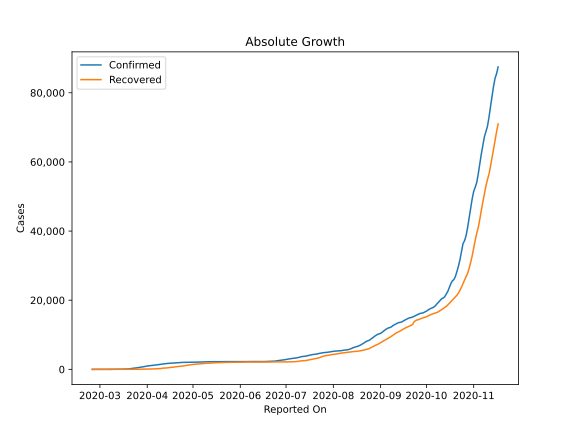
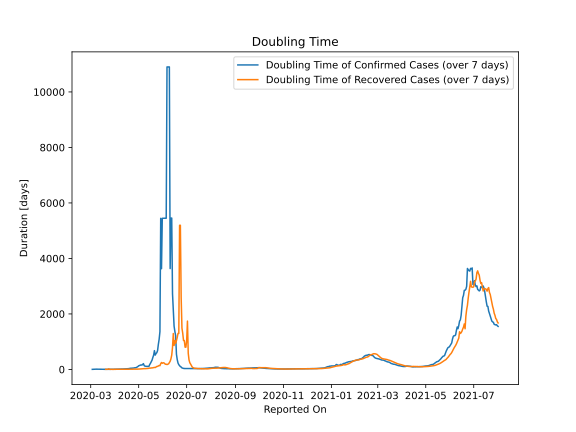

# Country Figures: Doubling Time of Infections for Croatia 

The doubling time below are calculated based on
* an exponential growth assumption
* for time difference of past seven (7) days.
The doubling time's unit is "days".

The first doubling time indicates the increase of confirmed (infected)
cases. There, the *higher* the number is, the better is to take control
of the disease.

The second doubling time indicates the increase of recovered (healed)
cases. There, the *lower* the number is, the better it is to take
control of the disease.

| Reported On | Confirmed | Doubling Time (Confirmed) | Recovered | Doubling Time (Recovered) |
|-------------|-----------|---------------------------|-----------|---------------------------|
| 2020-04-11 | 1534 |  16.0 days  | 323 |  5.2 days  | 
| 2020-04-10 | 1495 |  15.2 days  | 231 |  5.6 days  | 
| 2020-04-09 | 1407 |  15.0 days  | 219 |  5.7 days  | 
| 2020-04-08 | 1343 |  14.9 days  | 179 |  5.7 days  | 
| 2020-04-07 | 1282 |  12.7 days  | 167 |  5.7 days  | 
| 2020-04-06 | 1222 |  11.5 days  | 130 |  7.7 days  | 
| 2020-04-05 | 1182 |  9.9 days  | 125 |  5.9 days  | 
| 2020-04-04 | 1126 |  9.3 days  | 119 |  5.3 days  | 
| 2020-04-03 | 1079 |  8.3 days  | 92 |  5.7 days  | 
| 2020-04-02 | 1011 |  7.1 days  | 88 |  3.8 days  | 
| 2020-04-01 | 963 |  6.6 days  | 73 |  4.4 days  | 
| 2020-03-31 | 867 |  6.3 days  | 67 |  2.2 days  | 
| 2020-03-30 | 790 |  5.6 days  | 67 |  2.2 days  | 
| 2020-03-29 | 713 |  5.0 days  | 52 |  2.4 days  | 
| 2020-03-28 | 657 |  4.5 days  | 45 |  2.5 days  | 
| 2020-03-27 | 586 |  3.5 days  | 37 |  2.8 days  | 
| 2020-03-26 | 495 |  3.5 days  | 22 |  3.6 days  | 
| 2020-03-25 | 442 |  3.2 days  | 22 |  3.2 days  | 
| 2020-03-24 | 382 |  3.1 days  | 5 |  22.1 days  | 
| 2020-03-23 | 315 |  3.2 days  | 5 |  5.6 days  | 
| 2020-03-22 | 254 |  3.3 days  | 5 |  3.3 days  | 
| 2020-03-21 | 206 |  3.2 days  | 5 |  3.3 days  | 
| 2020-03-20 | 128 |  3.8 days  | 5 |  3.3 days  | 
| 2020-03-19 | 105 |  3.2 days  | 5 |  None  | 
| 2020-03-18 | 81 |  3.7 days  | 4 |  None  | 
| 2020-03-17 | 65 |  3.5 days  | 4 |  None  | 
| 2020-03-16 | 57 |  3.4 days  | 2 |  None  | 
| 2020-03-15 | 49 |  3.8 days  | 1 |  None  | 
| 2020-03-14 | 38 |  4.5 days  | 1 |  None  | 
| 2020-03-13 | 32 |  4.9 days  | 1 |  None  | 
| 2020-03-12 | 19 |  7.9 days  | 0 |  None  | 
| 2020-03-11 | 19 |  7.9 days  | 0 |  None  | 
| 2020-03-10 | 14 |  11.3 days  | 0 |  None  | 
| 2020-03-09 | 12 |  9.3 days  | 0 |  None  | 
| 2020-03-08 | 12 |  9.3 days  | 0 |  None  | 
| 2020-03-07 | 12 |  7.3 days  | 0 |  None  | 
| 2020-03-06 | 11 |  6.5 days  | 0 |  None  | 
| 2020-03-05 | 10 |  4.4 days  | 0 |  None  | 
| 2020-03-04 | 10 |  4.4 days  | 0 |  None  | 
| 2020-03-03 | 9 |  2.5 days  | 0 |  None  | 
| 2020-03-02 | 7 |  None  | 0 |  None  | 
| 2020-03-01 | 7 |  None  | 0 |  None  | 
| 2020-02-29 | 6 |  None  | 0 |  None  | 
| 2020-02-28 | 5 |  None  | 0 |  None  | 
| 2020-02-27 | 3 |  None  | 0 |  None  | 
| 2020-02-26 | 3 |  None  | 0 |  None  | 
| 2020-02-25 | 1 |  None  | 0 |  None  | 

