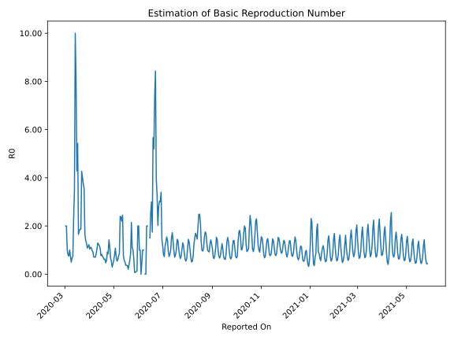

# Country Figures: Time Series for Basic Reproduction Number of Croatia 

| Reported On | &Delta; Confirmed | Total &Delta; Confirmed First Interval | Total &Delta; Confirmed Second Interval | Estimated Basic Reproduction Number R0 | 
|-------------|-------------------|----------------------------------------|-----------------------------------------|---------------------------------------------------|
| 2020-04-28 | 8 |  58  |  110  |  0.53  | 
| 2020-04-27 | 9 |  80  |  118  |  0.68  | 
| 2020-04-26 | 14 |  108  |  94  |  1.15  | 
| 2020-04-25 | 7 |  128  |  90  |  1.42  | 
| 2020-04-24 | 28 |  110  |  130  |  0.85  | 
| 2020-04-23 | 31 |  118  |  128  |  0.92  | 
| 2020-04-22 | 42 |  94  |  164  |  0.57  | 
| 2020-04-21 | 27 |  90  |  191  |  0.47  | 
| 2020-04-20 | 10 |  130  |  207  |  0.63  | 
| 2020-04-19 | 39 |  128  |  209  |  0.61  | 
| 2020-04-18 | 18 |  164  |  243  |  0.67  | 
| 2020-04-17 | 23 |  191  |  257  |  0.74  | 
| 2020-04-16 | 50 |  207  |  252  |  0.82  | 
| 2020-04-15 | 37 |  209  |  273  |  0.77  | 
| 2020-04-14 | 54 |  243  |  225  |  1.08  | 
| 2020-04-13 | 50 |  257  |  217  |  1.18  | 
| 2020-04-12 | 66 |  252  |  203  |  1.24  | 
| 2020-04-11 | 39 |  273  |  211  |  1.29  | 
| 2020-04-10 | 88 |  225  |  219  |  1.03  | 
| 2020-04-09 | 64 |  217  |  259  |  0.84  | 
| 2020-04-08 | 61 |  203  |  289  |  0.70  | 
| 2020-04-07 | 60 |  211  |  298  |  0.71  | 
| 2020-04-06 | 40 |  219  |  306  |  0.72  | 
| 2020-04-05 | 56 |  259  |  281  |  0.92  | 
| 2020-04-04 | 47 |  289  |  295  |  0.98  | 
| 2020-04-03 | 68 |  298  |  271  |  1.10  | 
| 2020-04-02 | 48 |  306  |  275  |  1.11  | 
| 2020-04-01 | 96 |  281  |  271  |  1.04  | 
| 2020-03-31 | 77 |  295  |  241  |  1.22  | 
| 2020-03-30 | 77 |  271  |  236  |  1.15  | 
| 2020-03-29 | 56 |  275  |  254  |  1.08  | 
| 2020-03-28 | 71 |  271  |  210  |  1.29  | 
| 2020-03-27 | 91 |  241  |  173  |  1.39  | 
| 2020-03-26 | 53 |  236  |  141  |  1.67  | 
| 2020-03-25 | 60 |  254  |  71  |  3.58  | 
| 2020-03-24 | 67 |  210  |  56  |  3.75  | 
| 2020-03-23 | 61 |  173  |  43  |  4.02  | 
| 2020-03-22 | 48 |  141  |  33  |  4.27  | 
| 2020-03-21 | 78 |  71  |  38  |  1.87  | 
| 2020-03-20 | 23 |  56  |  30  |  1.87  | 
| 2020-03-19 | 24 |  43  |  24  |  1.79  | 
| 2020-03-18 | 16 |  33  |  20  |  1.65  | 
| 2020-03-17 | 8 |  38  |  7  |  5.43  | 
| 2020-03-16 | 8 |  30  |  7  |  4.29  | 
| 2020-03-15 | 11 |  24  |  3  |  8.00  | 
| 2020-03-14 | 6 |  20  |  2  |  10.00  | 
| 2020-03-13 | 13 |  7  |  2  |  3.50  | 
| 2020-03-12 | 0 |  7  |  3  |  2.33  | 
| 2020-03-11 | 5 |  3  |  4  |  0.75  | 
| 2020-03-10 | 2 |  2  |  3  |  0.67  | 
| 2020-03-09 | 0 |  2  |  4  |  0.50  | 
| 2020-03-08 | 0 |  3  |  4  |  0.75  | 
| 2020-03-07 | 1 |  4  |  4  |  1.00  | 
| 2020-03-06 | 1 |  3  |  4  |  0.75  | 
| 2020-03-05 | 0 |  4  |  5  |  0.80  | 
| 2020-03-04 | 1 |  4  |  4  |  1.00  | 
| 2020-03-03 | 2 |  4  |  2  |  2.00  | 
| 2020-03-02 | 0 |  4  |  2  |  2.00  | 
| 2020-03-01 | 1 |  5  |  None  |  None  | 
| 2020-02-29 | 1 |  4  |  None  |  None  | 
| 2020-02-28 | 2 |  2  |  None  |  None  | 
| 2020-02-27 | 0 |  2  |  None  |  None  | 
| 2020-02-26 | 2 |  None  |  None  |  None  | 
| 2020-02-25 | None |  None  |  None  |  None  | 

