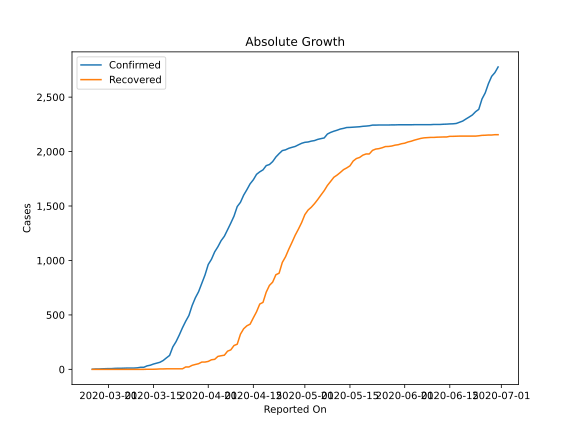
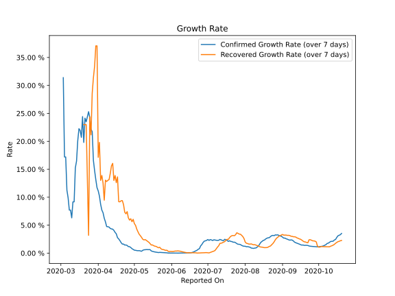

# Country Figures: Growth Rate for Croatia 

The growth rates below are calculated based on
* an exponential growth assumption
* for time difference of past seven (7) days.
The growth rate is to be understood as on "growth per day".

The first growth rate indicates the increase of confirmed (infected) cases.

The second growth rate indicates the increase of recovered (healed) cases.

| Reported On | Confirmed | Growth Rate (Confirmed) | Recovered | Growth Rate (Recovered) |
|-------------|-----------|-------------------------|-----------|-------------------------|
| 2020-05-03 | 2096 |  0.46 %  | 1489 |  4.287 %  | 
| 2020-05-02 | 2088 |  0.50 %  | 1463 |  4.958 %  | 
| 2020-05-01 | 2085 |  0.53 %  | 1421 |  5.279 %  | 
| 2020-04-30 | 2076 |  0.67 %  | 1348 |  6.044 %  | 
| 2020-04-29 | 2062 |  0.80 %  | 1288 |  5.621 %  | 
| 2020-04-28 | 2047 |  1.00 %  | 1232 |  6.150 %  | 
| 2020-04-27 | 2039 |  1.15 %  | 1166 |  5.909 %  | 
| 2020-04-26 | 2030 |  1.17 %  | 1103 |  6.313 %  | 
| 2020-04-25 | 2016 |  1.37 %  | 1034 |  7.422 %  | 
| 2020-04-24 | 2009 |  1.46 %  | 982 |  7.038 %  | 
| 2020-04-23 | 1981 |  1.44 %  | 883 |  7.319 %  | 
| 2020-04-22 | 1950 |  1.62 %  | 869 |  8.689 %  | 
| 2020-04-21 | 1908 |  1.62 %  | 801 |  9.394 %  | 
| 2020-04-20 | 1881 |  1.87 %  | 771 |  9.375 %  | 
| 2020-04-19 | 1871 |  2.24 %  | 709 |  9.175 %  | 
| 2020-04-18 | 1832 |  2.54 %  | 615 |  9.200 %  | 
| 2020-04-17 | 1814 |  2.76 %  | 600 |  13.636 %  | 
| 2020-04-16 | 1791 |  3.45 %  | 529 |  12.599 %  | 
| 2020-04-15 | 1741 |  3.71 %  | 473 |  13.882 %  | 
| 2020-04-14 | 1704 |  4.07 %  | 415 |  13.004 %  | 
| 2020-04-13 | 1650 |  4.29 %  | 400 |  16.056 %  | 
| 2020-04-12 | 1600 |  4.33 %  | 373 |  15.618 %  | 
| 2020-04-11 | 1534 |  4.42 %  | 323 |  14.265 %  | 
| 2020-04-10 | 1495 |  4.66 %  | 231 |  13.152 %  | 
| 2020-04-09 | 1407 |  4.72 %  | 219 |  13.025 %  | 
| 2020-04-08 | 1343 |  4.75 %  | 179 |  12.813 %  | 
| 2020-04-07 | 1282 |  5.59 %  | 167 |  13.047 %  | 
| 2020-04-06 | 1222 |  6.23 %  | 130 |  9.469 %  | 
| 2020-04-05 | 1182 |  7.22 %  | 125 |  12.530 %  | 
| 2020-04-04 | 1126 |  7.70 %  | 119 |  13.892 %  | 
| 2020-04-03 | 1079 |  8.72 %  | 92 |  13.012 %  | 
| 2020-04-02 | 1011 |  10.20 %  | 88 |  19.804 %  | 
| 2020-04-01 | 963 |  11.12 %  | 73 |  17.135 %  | 
| 2020-03-31 | 867 |  11.71 %  | 67 |  37.075 %  | 
| 2020-03-30 | 790 |  13.14 %  | 67 |  37.075 %  | 
| 2020-03-29 | 713 |  14.74 %  | 52 |  33.454 %  | 
| 2020-03-28 | 657 |  16.57 %  | 45 |  31.389 %  | 
| 2020-03-27 | 586 |  21.73 %  | 37 |  28.593 %  | 
| 2020-03-26 | 495 |  22.15 %  | 22 |  21.166 %  | 
| 2020-03-25 | 442 |  24.24 %  | 22 |  24.354 %  | 
| 2020-03-24 | 382 |  25.30 %  | 5 |  3.188 %  | 
| 2020-03-23 | 315 |  24.42 %  | 5 |  13.090 %  | 
| 2020-03-22 | 254 |  23.51 %  | 5 |  22.992 %  | 
| 2020-03-21 | 206 |  24.15 %  | 5 |  22.992 %  | 
| 2020-03-20 | 128 |  19.80 %  | 5 |  22.992 %  | 
| 2020-03-19 | 105 |  24.42 %  | 5 |  None  | 
| 2020-03-18 | 81 |  20.71 %  | 4 |  None  | 
| 2020-03-17 | 65 |  21.93 %  | 4 |  None  | 
| 2020-03-16 | 57 |  22.26 %  | 2 |  None  | 
| 2020-03-15 | 49 |  20.10 %  | 1 |  None  | 
| 2020-03-14 | 38 |  16.47 %  | 1 |  None  | 
| 2020-03-13 | 32 |  15.25 %  | 1 |  None  | 
| 2020-03-12 | 19 |  9.17 %  | 0 |  None  | 
| 2020-03-11 | 19 |  9.17 %  | 0 |  None  | 
| 2020-03-10 | 14 |  6.31 %  | 0 |  None  | 
| 2020-03-09 | 12 |  7.70 %  | 0 |  None  | 
| 2020-03-08 | 12 |  7.70 %  | 0 |  None  | 
| 2020-03-07 | 12 |  9.90 %  | 0 |  None  | 
| 2020-03-06 | 11 |  11.26 %  | 0 |  None  | 
| 2020-03-05 | 10 |  17.20 %  | 0 |  None  | 
| 2020-03-04 | 10 |  17.20 %  | 0 |  None  | 
| 2020-03-03 | 9 |  31.39 %  | 0 |  None  | 
| 2020-03-02 | 7 |  None  | 0 |  None  | 
| 2020-03-01 | 7 |  None  | 0 |  None  | 
| 2020-02-29 | 6 |  None  | 0 |  None  | 
| 2020-02-28 | 5 |  None  | 0 |  None  | 
| 2020-02-27 | 3 |  None  | 0 |  None  | 
| 2020-02-26 | 3 |  None  | 0 |  None  | 
| 2020-02-25 | 1 |  None  | 0 |  None  | 

