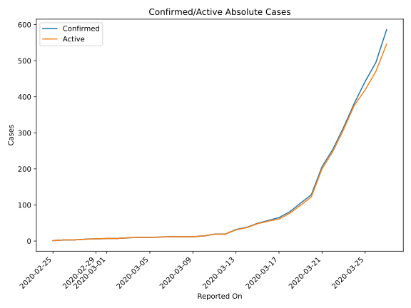
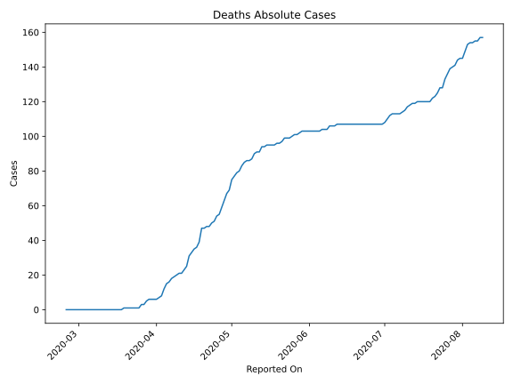
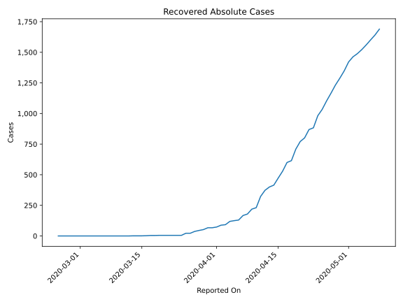
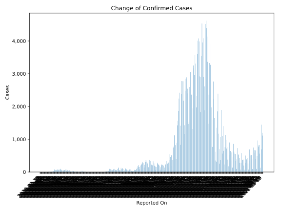
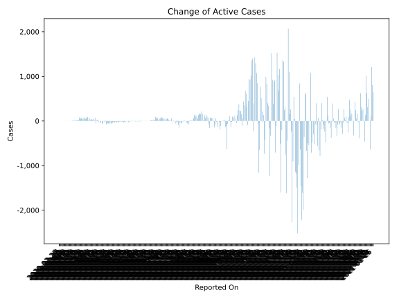
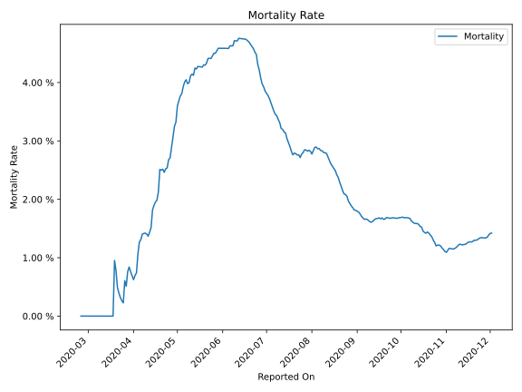

# Country Figures: Time Series for Croatia 

| Reported On | Confirmed | Deaths | Recovered | Active | Mortality | &Delta; Confirmed | &Delta; Deaths | &Delta; Active | % Active of Population |
|-------------|-----------|--------|-----------|--------|-----------|-------------------|----------------|----------------|------------------------|
| 2020-04-02 | 1011 | 7 | 88 | 916 |  0.69 %  | 48 | 1 | 32 |  0.022 %  | 
| 2020-04-01 | 963 | 6 | 73 | 884 |  0.62 %  | 96 | 0 | 90 |  0.022 %  | 
| 2020-03-31 | 867 | 6 | 67 | 794 |  0.69 %  | 77 | 0 | 77 |  0.019 %  | 
| 2020-03-30 | 790 | 6 | 67 | 717 |  0.76 %  | 77 | 0 | 62 |  0.018 %  | 
| 2020-03-29 | 713 | 6 | 52 | 655 |  0.84 %  | 56 | 1 | 48 |  0.016 %  | 
| 2020-03-28 | 657 | 5 | 45 | 607 |  0.76 %  | 71 | 2 | 61 |  0.015 %  | 
| 2020-03-27 | 586 | 3 | 37 | 546 |  0.51 %  | 91 | 0 | 76 |  0.013 %  | 
| 2020-03-26 | 495 | 3 | 22 | 470 |  0.61 %  | 53 | 2 | 51 |  0.011 %  | 
| 2020-03-25 | 442 | 1 | 22 | 419 |  0.23 %  | 60 | 0 | 43 |  0.010 %  | 
| 2020-03-24 | 382 | 1 | 5 | 376 |  0.26 %  | 67 | 0 | 67 |  0.009 %  | 
| 2020-03-23 | 315 | 1 | 5 | 309 |  0.32 %  | 61 | 0 | 61 |  0.008 %  | 
| 2020-03-22 | 254 | 1 | 5 | 248 |  0.39 %  | 48 | 0 | 48 |  0.006 %  | 
| 2020-03-21 | 206 | 1 | 5 | 200 |  0.49 %  | 78 | 0 | 78 |  0.005 %  | 
| 2020-03-20 | 128 | 1 | 5 | 122 |  0.78 %  | 23 | 0 | 23 |  0.003 %  | 
| 2020-03-19 | 105 | 1 | 5 | 99 |  0.95 %  | 24 | 1 | 22 |  0.002 %  | 
| 2020-03-18 | 81 | 0 | 4 | 77 |  None  | 16 | 0 | 16 |  0.002 %  | 
| 2020-03-17 | 65 | 0 | 4 | 61 |  None  | 8 | 0 | 6 |  0.001 %  | 
| 2020-03-16 | 57 | 0 | 2 | 55 |  None  | 8 | 0 | 7 |  0.001 %  | 
| 2020-03-15 | 49 | 0 | 1 | 48 |  None  | 11 | 0 | 11 |  0.001 %  | 
| 2020-03-14 | 38 | 0 | 1 | 37 |  None  | 6 | 0 | 6 |  0.001 %  | 
| 2020-03-13 | 32 | 0 | 1 | 31 |  None  | 13 | 0 | 12 |  0.001 %  | 
| 2020-03-12 | 19 | 0 | 0 | 19 |  None  | 0 | 0 | 0 |  0.000 %  | 
| 2020-03-11 | 19 | 0 | 0 | 19 |  None  | 5 | 0 | 5 |  0.000 %  | 
| 2020-03-10 | 14 | 0 | 0 | 14 |  None  | 2 | 0 | 2 |  0.000 %  | 
| 2020-03-09 | 12 | 0 | 0 | 12 |  None  | 0 | 0 | 0 |  0.000 %  | 
| 2020-03-08 | 12 | 0 | 0 | 12 |  None  | 0 | 0 | 0 |  0.000 %  | 
| 2020-03-07 | 12 | 0 | 0 | 12 |  None  | 1 | 0 | 1 |  0.000 %  | 
| 2020-03-06 | 11 | 0 | 0 | 11 |  None  | 1 | 0 | 1 |  0.000 %  | 
| 2020-03-05 | 10 | 0 | 0 | 10 |  None  | 0 | 0 | 0 |  0.000 %  | 
| 2020-03-04 | 10 | 0 | 0 | 10 |  None  | 1 | 0 | 1 |  0.000 %  | 
| 2020-03-03 | 9 | 0 | 0 | 9 |  None  | 2 | 0 | 2 |  0.000 %  | 
| 2020-03-02 | 7 | 0 | 0 | 7 |  None  | 0 | 0 | 0 |  0.000 %  | 
| 2020-03-01 | 7 | 0 | 0 | 7 |  None  | 1 | 0 | 1 |  0.000 %  | 
| 2020-02-29 | 6 | 0 | 0 | 6 |  None  | 1 | 0 | 1 |  0.000 %  | 
| 2020-02-28 | 5 | 0 | 0 | 5 |  None  | 2 | 0 | 2 |  0.000 %  | 
| 2020-02-27 | 3 | 0 | 0 | 3 |  None  | 0 | 0 | 0 |  0.000 %  | 
| 2020-02-26 | 3 | 0 | 0 | 3 |  None  | 2 | 0 | 2 |  0.000 %  | 
| 2020-02-25 | 1 | 0 | 0 | 1 |  None  | None | None | None |  0.000 %  | 

