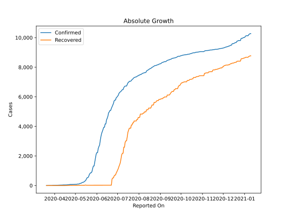
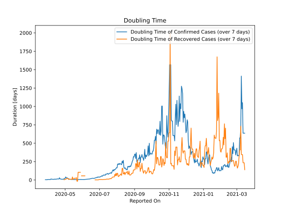

# Country Figures: Doubling Time of Infections for Haiti 

The doubling time below are calculated based on
* an exponential growth assumption
* for time difference of past seven (7) days.
The doubling time's unit is "days".

The first doubling time indicates the increase of confirmed (infected)
cases. There, the *higher* the number is, the better is to take control
of the disease.

The second doubling time indicates the increase of recovered (healed)
cases. There, the *lower* the number is, the better it is to take
control of the disease.

| Reported On | Confirmed | Doubling Time (Confirmed) | Recovered | Doubling Time (Recovered) |
|-------------|-----------|---------------------------|-----------|---------------------------|
| 2020-05-09 | 151 |  8.8 days  | 17 |  9.5 days  | 
| 2020-05-08 | 146 |  9.3 days  | 17 |  9.5 days  | 
| 2020-05-07 | 129 |  10.8 days  | 16 |  7.3 days  | 
| 2020-05-06 | 101 |  17.4 days  | 10 |  22.1 days  | 
| 2020-05-05 | 101 |  17.4 days  | 10 |  22.1 days  | 
| 2020-05-04 | 100 |  18.0 days  | 10 |  22.1 days  | 
| 2020-05-03 | 88 |  28.3 days  | 10 |  13.9 days  | 
| 2020-05-02 | 85 |  29.6 days  | 10 |  9.8 days  | 
| 2020-05-01 | 85 |  29.6 days  | 10 |  9.8 days  | 
| 2020-04-30 | 81 |  41.5 days  | 8 |  3.8 days  | 
| 2020-04-29 | 76 |  24.2 days  | 8 |  3.8 days  | 
| 2020-04-28 | 76 |  17.2 days  | 8 |  None  | 
| 2020-04-27 | 76 |  17.2 days  | 8 |  None  | 
| 2020-04-26 | 74 |  11.0 days  | 7 |  None  | 
| 2020-04-25 | 72 |  10.2 days  | 6 |  None  | 
| 2020-04-24 | 72 |  9.8 days  | 6 |  None  | 
| 2020-04-23 | 72 |  9.0 days  | 2 |  None  | 
| 2020-04-22 | 62 |  12.1 days  | 2 |  None  | 
| 2020-04-21 | 57 |  14.0 days  | 0 |  None  | 
| 2020-04-20 | 57 |  14.0 days  | 0 |  None  | 
| 2020-04-19 | 47 |  14.1 days  | 0 |  None  | 
| 2020-04-18 | 44 |  17.2 days  | 0 |  None  | 
| 2020-04-17 | 43 |  15.2 days  | 0 |  None  | 
| 2020-04-16 | 41 |  15.9 days  | 0 |  None  | 
| 2020-04-15 | 41 |  12.0 days  | 0 |  None  | 
| 2020-04-14 | 40 |  10.7 days  | 0 |  None  | 
| 2020-04-13 | 40 |  9.8 days  | 0 |  None  | 
| 2020-04-12 | 33 |  11.1 days  | 0 |  None  | 
| 2020-04-11 | 33 |  10.0 days  | 0 |  None  | 
| 2020-04-10 | 31 |  9.3 days  | 0 |  None  | 
| 2020-04-09 | 30 |  8.1 days  | 0 |  None  | 
| 2020-04-08 | 27 |  9.6 days  | 0 |  None  | 
| 2020-04-07 | 25 |  9.8 days  | 0 |  None  | 
| 2020-04-06 | 24 |  10.7 days  | 0 |  None  | 
| 2020-04-05 | 21 |  14.8 days  | 1 |  None  | 
| 2020-04-04 | 20 |  5.6 days  | 1 |  None  | 
| 2020-04-03 | 18 |  6.3 days  | 1 |  None  | 
| 2020-04-02 | 16 |  7.3 days  | 1 |  None  | 
| 2020-04-01 | 16 |  7.3 days  | 1 |  None  | 
| 2020-03-31 | 15 |  6.7 days  | 1 |  None  | 
| 2020-03-30 | 15 |  5.6 days  | 1 |  None  | 
| 2020-03-29 | 15 |  2.7 days  | 1 |  None  | 
| 2020-03-28 | 8 |  3.8 days  | 0 |  None  | 
| 2020-03-27 | 8 |  3.8 days  | 0 |  None  | 
| 2020-03-26 | 8 |  None  | 0 |  None  | 
| 2020-03-25 | 8 |  None  | 0 |  None  | 
| 2020-03-24 | 7 |  None  | 0 |  None  | 
| 2020-03-23 | 6 |  None  | 0 |  None  | 
| 2020-03-22 | 2 |  None  | 0 |  None  | 
| 2020-03-21 | 2 |  None  | 0 |  None  | 
| 2020-03-20 | 2 |  None  | 0 |  None  | 

