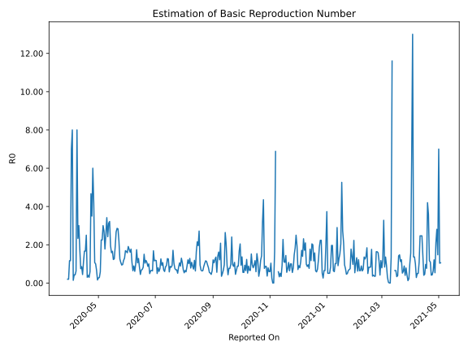

# Country Figures: Time Series for Basic Reproduction Number of Haiti 

| Reported On | &Delta; Confirmed | Total &Delta; Confirmed First Interval | Total &Delta; Confirmed Second Interval | Estimated Basic Reproduction Number R0 | 
|-------------|-------------------|----------------------------------------|-----------------------------------------|---------------------------------------------------|
| 2020-04-30 | 5 |  4  |  15  |  0.27  | 
| 2020-04-29 | 0 |  4  |  15  |  0.27  | 
| 2020-04-28 | 0 |  4  |  25  |  0.16  | 
| 2020-04-27 | 2 |  12  |  18  |  0.67  | 
| 2020-04-26 | 2 |  15  |  14  |  1.07  | 
| 2020-04-25 | 0 |  15  |  16  |  0.94  | 
| 2020-04-24 | 0 |  25  |  6  |  4.17  | 
| 2020-04-23 | 10 |  18  |  4  |  4.50  | 
| 2020-04-22 | 5 |  14  |  3  |  4.67  | 
| 2020-04-21 | 0 |  16  |  8  |  2.00  | 
| 2020-04-20 | 10 |  6  |  8  |  0.75  | 
| 2020-04-19 | 3 |  4  |  9  |  0.44  | 
| 2020-04-18 | 1 |  3  |  10  |  0.30  | 
| 2020-04-17 | 2 |  8  |  6  |  1.33  | 
| 2020-04-16 | 0 |  8  |  8  |  1.00  | 
| 2020-04-15 | 1 |  9  |  7  |  1.29  | 
| 2020-04-14 | 0 |  10  |  9  |  1.11  | 
| 2020-04-13 | 7 |  6  |  7  |  0.86  | 
| 2020-04-12 | 0 |  8  |  7  |  1.14  | 
| 2020-04-11 | 2 |  7  |  8  |  0.88  | 
| 2020-04-10 | 1 |  9  |  5  |  1.80  | 
| 2020-04-09 | 3 |  7  |  5  |  1.40  | 
| 2020-04-08 | 2 |  7  |  3  |  2.33  | 
| 2020-04-07 | 1 |  8  |  1  |  8.00  | 
| 2020-04-06 | 3 |  5  |  8  |  0.62  | 
| 2020-04-05 | 1 |  5  |  7  |  0.71  | 
| 2020-04-04 | 2 |  3  |  7  |  0.43  | 
| 2020-04-03 | 2 |  1  |  7  |  0.14  | 
| 2020-04-02 | 0 |  8  |  1  |  8.00  | 
| 2020-04-01 | 1 |  7  |  2  |  3.50  | 
| 2020-03-31 | 0 |  7  |  6  |  1.17  | 
| 2020-03-30 | 0 |  7  |  6  |  1.17  | 
| 2020-03-29 | 7 |  1  |  5  |  0.20  | 
| 2020-03-28 | 0 |  2  |  4  |  0.50  | 
| 2020-03-27 | 0 |  6  |  None  |  None  | 
| 2020-03-26 | 0 |  6  |  None  |  None  | 
| 2020-03-25 | 1 |  5  |  None  |  None  | 
| 2020-03-24 | 1 |  4  |  None  |  None  | 
| 2020-03-23 | 4 |  None  |  None  |  None  | 
| 2020-03-22 | 0 |  None  |  None  |  None  | 
| 2020-03-21 | 0 |  None  |  None  |  None  | 
| 2020-03-20 | None |  None  |  None  |  None  | 

