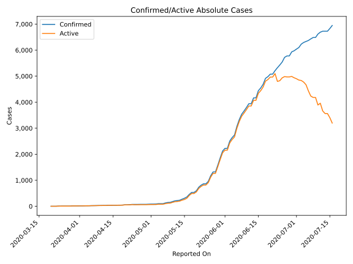
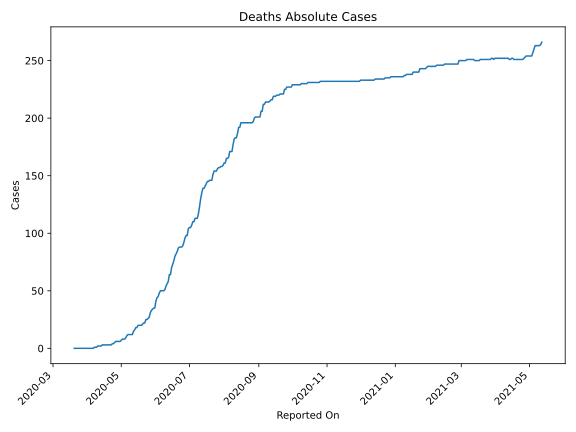
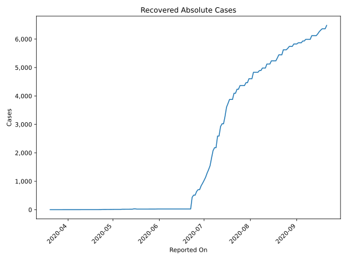
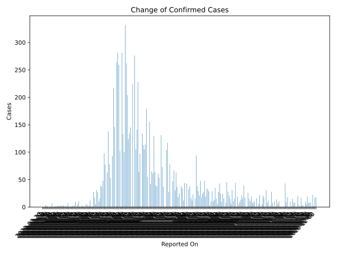
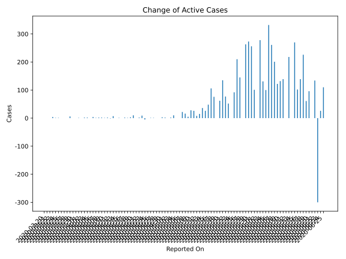
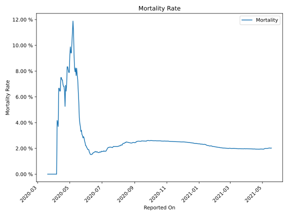

# Country Figures: Time Series for Haiti 

| Reported On | Confirmed | Deaths | Recovered | Active | Mortality | &Delta; Confirmed | &Delta; Deaths | &Delta; Recovered | &Delta; Active | % Active of Population |
|-------------|-----------|--------|-----------|--------|-----------|-------------------|----------------|-------------------|----------------|------------------------|
| 2020-04-29 | 76 | 6 | 8 | 62 |  7.89 %  | 0 | 0 | 0 | 0 |  0.001 %  | 
| 2020-04-28 | 76 | 6 | 8 | 62 |  7.89 %  | 0 | 0 | 0 | 0 |  0.001 %  | 
| 2020-04-27 | 76 | 6 | 8 | 62 |  7.89 %  | 2 | 0 | 1 | 1 |  0.001 %  | 
| 2020-04-26 | 74 | 6 | 7 | 61 |  8.11 %  | 2 | 0 | 1 | 1 |  0.001 %  | 
| 2020-04-25 | 72 | 6 | 6 | 60 |  8.33 %  | 0 | 0 | 0 | 0 |  0.001 %  | 
| 2020-04-24 | 72 | 6 | 6 | 60 |  8.33 %  | 0 | 1 | 4 | -5 |  0.001 %  | 
| 2020-04-23 | 72 | 5 | 2 | 65 |  6.94 %  | 10 | 1 | 0 | 9 |  0.001 %  | 
| 2020-04-22 | 62 | 4 | 2 | 56 |  6.45 %  | 5 | 1 | 2 | 2 |  0.001 %  | 
| 2020-04-21 | 57 | 3 | 0 | 54 |  5.26 %  | 0 | 0 | 0 | 0 |  0.000 %  | 
| 2020-04-20 | 57 | 3 | 0 | 54 |  5.26 %  | 10 | 0 | 0 | 10 |  0.000 %  | 
| 2020-04-19 | 47 | 3 | 0 | 44 |  6.38 %  | 3 | 0 | 0 | 3 |  0.000 %  | 
| 2020-04-18 | 44 | 3 | 0 | 41 |  6.82 %  | 1 | 0 | 0 | 1 |  0.000 %  | 
| 2020-04-17 | 43 | 3 | 0 | 40 |  6.98 %  | 2 | 0 | 0 | 2 |  0.000 %  | 
| 2020-04-16 | 41 | 3 | 0 | 38 |  7.32 %  | 0 | 0 | 0 | 0 |  0.000 %  | 
| 2020-04-15 | 41 | 3 | 0 | 38 |  7.32 %  | 1 | 0 | 0 | 1 |  0.000 %  | 
| 2020-04-14 | 40 | 3 | 0 | 37 |  7.50 %  | 0 | 0 | 0 | 0 |  0.000 %  | 
| 2020-04-13 | 40 | 3 | 0 | 37 |  7.50 %  | 7 | 0 | 0 | 7 |  0.000 %  | 
| 2020-04-12 | 33 | 3 | 0 | 30 |  9.09 %  | 0 | 1 | 0 | -1 |  0.000 %  | 
| 2020-04-11 | 33 | 2 | 0 | 31 |  6.06 %  | 2 | 0 | 0 | 2 |  0.000 %  | 
| 2020-04-10 | 31 | 2 | 0 | 29 |  6.45 %  | 1 | 0 | 0 | 1 |  0.000 %  | 
| 2020-04-09 | 30 | 2 | 0 | 28 |  6.67 %  | 3 | 1 | 0 | 2 |  0.000 %  | 
| 2020-04-08 | 27 | 1 | 0 | 26 |  3.70 %  | 2 | 0 | 0 | 2 |  0.000 %  | 
| 2020-04-07 | 25 | 1 | 0 | 24 |  4.00 %  | 1 | 0 | 0 | 1 |  0.000 %  | 
| 2020-04-06 | 24 | 1 | 0 | 23 |  4.17 %  | 3 | 0 | -1 | 4 |  0.000 %  | 
| 2020-04-05 | 21 | 1 | 1 | 19 |  4.76 %  | 1 | 1 | 0 | 0 |  0.000 %  | 
| 2020-04-04 | 20 | 0 | 1 | 19 |  None  | 2 | 0 | 0 | 2 |  0.000 %  | 
| 2020-04-03 | 18 | 0 | 1 | 17 |  None  | 2 | 0 | 0 | 2 |  0.000 %  | 
| 2020-04-02 | 16 | 0 | 1 | 15 |  None  | 0 | 0 | 0 | 0 |  0.000 %  | 
| 2020-04-01 | 16 | 0 | 1 | 15 |  None  | 1 | 0 | 0 | 1 |  0.000 %  | 
| 2020-03-31 | 15 | 0 | 1 | 14 |  None  | 0 | 0 | 0 | 0 |  0.000 %  | 
| 2020-03-30 | 15 | 0 | 1 | 14 |  None  | 0 | 0 | 0 | 0 |  0.000 %  | 
| 2020-03-29 | 15 | 0 | 1 | 14 |  None  | 7 | 0 | 1 | 6 |  0.000 %  | 
| 2020-03-28 | 8 | 0 | 0 | 8 |  None  | 0 | 0 | 0 | 0 |  0.000 %  | 
| 2020-03-27 | 8 | 0 | 0 | 8 |  None  | 0 | 0 | 0 | 0 |  0.000 %  | 
| 2020-03-26 | 8 | 0 | 0 | 8 |  None  | 0 | 0 | 0 | 0 |  0.000 %  | 
| 2020-03-25 | 8 | 0 | 0 | 8 |  None  | 1 | 0 | 0 | 1 |  0.000 %  | 
| 2020-03-24 | 7 | 0 | 0 | 7 |  None  | 1 | 0 | 0 | 1 |  0.000 %  | 
| 2020-03-23 | 6 | 0 | 0 | 6 |  None  | 4 | 0 | 0 | 4 |  0.000 %  | 
| 2020-03-22 | 2 | 0 | 0 | 2 |  None  | 0 | 0 | 0 | 0 |  0.000 %  | 
| 2020-03-21 | 2 | 0 | 0 | 2 |  None  | 0 | 0 | 0 | 0 |  0.000 %  | 
| 2020-03-20 | 2 | 0 | 0 | 2 |  None  | None | None | None | None |  0.000 %  | 

