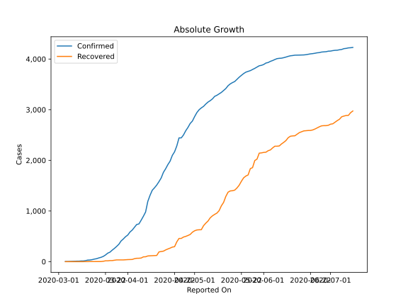
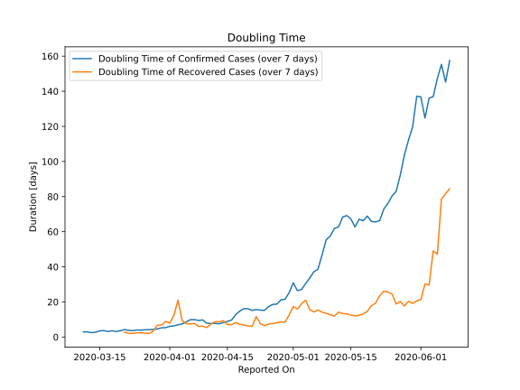

# Country Figures: Doubling Time of Infections for Hungary 

The doubling time below are calculated based on
* an exponential growth assumption
* for time difference of past seven (7) days.
The doubling time's unit is "days".

The first doubling time indicates the increase of confirmed (infected)
cases. There, the *higher* the number is, the better is to take control
of the disease.

The second doubling time indicates the increase of recovered (healed)
cases. There, the *lower* the number is, the better it is to take
control of the disease.

| Reported On | Confirmed | Doubling Time (Confirmed) | Recovered | Doubling Time (Recovered) |
|-------------|-----------|---------------------------|-----------|---------------------------|
| 2020-04-17 | 1763 |  12.7 days  | 207 |  8.2 days  | 
| 2020-04-16 | 1652 |  9.6 days  | 199 |  7.0 days  | 
| 2020-04-15 | 1579 |  8.9 days  | 192 |  7.1 days  | 
| 2020-04-14 | 1512 |  8.2 days  | 122 |  9.3 days  | 
| 2020-04-13 | 1458 |  7.6 days  | 120 |  8.7 days  | 
| 2020-04-12 | 1410 |  7.8 days  | 118 |  8.7 days  | 
| 2020-04-11 | 1310 |  7.7 days  | 115 |  7.4 days  | 
| 2020-04-10 | 1190 |  7.8 days  | 112 |  5.4 days  | 
| 2020-04-09 | 980 |  9.7 days  | 96 |  6.2 days  | 
| 2020-04-08 | 895 |  9.4 days  | 94 |  6.0 days  | 
| 2020-04-07 | 817 |  9.9 days  | 71 |  7.8 days  | 
| 2020-04-06 | 744 |  9.9 days  | 67 |  7.5 days  | 
| 2020-04-05 | 733 |  8.6 days  | 66 |  7.7 days  | 
| 2020-04-04 | 678 |  7.5 days  | 58 |  9.4 days  | 
| 2020-04-03 | 623 |  7.0 days  | 43 |  21.0 days  | 
| 2020-04-02 | 585 |  6.4 days  | 42 |  12.3 days  | 
| 2020-04-01 | 525 |  6.1 days  | 40 |  7.9 days  | 
| 2020-03-31 | 492 |  5.4 days  | 37 |  8.9 days  | 
| 2020-03-30 | 447 |  5.3 days  | 34 |  6.8 days  | 
| 2020-03-29 | 408 |  4.6 days  | 34 |  6.8 days  | 
| 2020-03-28 | 343 |  4.4 days  | 34 |  3.4 days  | 
| 2020-03-27 | 300 |  4.2 days  | 34 |  2.0 days  | 
| 2020-03-26 | 261 |  4.1 days  | 28 |  2.2 days  | 
| 2020-03-25 | 226 |  3.9 days  | 21 |  2.4 days  | 
| 2020-03-24 | 187 |  4.0 days  | 21 |  2.4 days  | 
| 2020-03-23 | 167 |  3.7 days  | 16 |  2.1 days  | 
| 2020-03-22 | 131 |  3.8 days  | 16 |  2.1 days  | 
| 2020-03-21 | 103 |  4.3 days  | 7 |  2.8 days  | 
| 2020-03-20 | 85 |  3.6 days  | 2 |  None  | 
| 2020-03-19 | 73 |  3.1 days  | 2 |  None  | 
| 2020-03-18 | 58 |  3.6 days  | 2 |  None  | 
| 2020-03-17 | 50 |  3.2 days  | 2 |  None  | 
| 2020-03-16 | 39 |  3.6 days  | 1 |  None  | 
| 2020-03-15 | 32 |  3.5 days  | 1 |  None  | 
| 2020-03-14 | 30 |  2.7 days  | 1 |  None  | 
| 2020-03-13 | 19 |  2.5 days  | 0 |  None  | 
| 2020-03-12 | 13 |  2.9 days  | 0 |  None  | 
| 2020-03-11 | 13 |  2.9 days  | 0 |  None  | 
| 2020-03-10 | 9 |  None  | 0 |  None  | 
| 2020-03-09 | 9 |  None  | 0 |  None  | 
| 2020-03-08 | 7 |  None  | 0 |  None  | 
| 2020-03-07 | 4 |  None  | 0 |  None  | 
| 2020-03-06 | 2 |  None  | 0 |  None  | 
| 2020-03-05 | 2 |  None  | 0 |  None  | 
| 2020-03-04 | 2 |  None  | 0 |  None  | 

