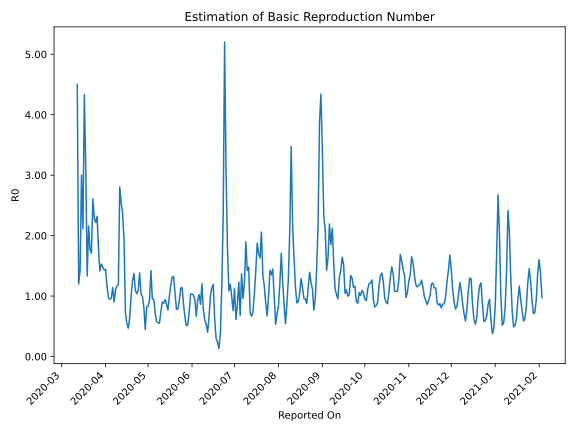

# Country Figures: Time Series for Basic Reproduction Number of Hungary 

| Reported On | &Delta; Confirmed | Total &Delta; Confirmed First Interval | Total &Delta; Confirmed Second Interval | Estimated Basic Reproduction Number R0 | 
|-------------|-------------------|----------------------------------------|-----------------------------------------|---------------------------------------------------|
| 2020-04-29 | 78 |  206  |  459  |  0.45  | 
| 2020-04-28 | 66 |  299  |  368  |  0.81  | 
| 2020-04-27 | 83 |  332  |  334  |  0.99  | 
| 2020-04-26 | 57 |  345  |  335  |  1.03  | 
| 2020-04-25 | 0 |  459  |  332  |  1.38  | 
| 2020-04-24 | 159 |  368  |  337  |  1.09  | 
| 2020-04-23 | 116 |  334  |  322  |  1.04  | 
| 2020-04-22 | 70 |  335  |  305  |  1.10  | 
| 2020-04-21 | 114 |  332  |  242  |  1.37  | 
| 2020-04-20 | 68 |  337  |  269  |  1.25  | 
| 2020-04-19 | 82 |  322  |  322  |  1.00  | 
| 2020-04-18 | 71 |  305  |  478  |  0.64  | 
| 2020-04-17 | 111 |  242  |  515  |  0.47  | 
| 2020-04-16 | 73 |  269  |  493  |  0.55  | 
| 2020-04-15 | 67 |  322  |  446  |  0.72  | 
| 2020-04-14 | 54 |  478  |  247  |  1.94  | 
| 2020-04-13 | 48 |  515  |  217  |  2.37  | 
| 2020-04-12 | 100 |  493  |  194  |  2.54  | 
| 2020-04-11 | 120 |  446  |  159  |  2.81  | 
| 2020-04-10 | 210 |  247  |  208  |  1.19  | 
| 2020-04-09 | 85 |  217  |  186  |  1.17  | 
| 2020-04-08 | 78 |  194  |  176  |  1.10  | 
| 2020-04-07 | 73 |  159  |  177  |  0.90  | 
| 2020-04-06 | 11 |  208  |  182  |  1.14  | 
| 2020-04-05 | 55 |  186  |  192  |  0.97  | 
| 2020-04-04 | 55 |  176  |  186  |  0.95  | 
| 2020-04-03 | 38 |  177  |  182  |  0.97  | 
| 2020-04-02 | 60 |  182  |  156  |  1.17  | 
| 2020-04-01 | 33 |  192  |  133  |  1.44  | 
| 2020-03-31 | 45 |  186  |  130  |  1.43  | 
| 2020-03-30 | 39 |  182  |  123  |  1.48  | 
| 2020-03-29 | 65 |  156  |  102  |  1.53  | 
| 2020-03-28 | 43 |  133  |  94  |  1.41  | 
| 2020-03-27 | 39 |  130  |  73  |  1.78  | 
| 2020-03-26 | 35 |  123  |  53  |  2.32  | 
| 2020-03-25 | 39 |  102  |  46  |  2.22  | 
| 2020-03-24 | 20 |  94  |  41  |  2.29  | 
| 2020-03-23 | 36 |  73  |  28  |  2.61  | 
| 2020-03-22 | 28 |  53  |  31  |  1.71  | 
| 2020-03-21 | 18 |  46  |  26  |  1.77  | 
| 2020-03-20 | 12 |  41  |  19  |  2.16  | 
| 2020-03-19 | 15 |  28  |  21  |  1.33  | 
| 2020-03-18 | 8 |  31  |  10  |  3.10  | 
| 2020-03-17 | 11 |  26  |  6  |  4.33  | 
| 2020-03-16 | 7 |  19  |  9  |  2.11  | 
| 2020-03-15 | 2 |  21  |  7  |  3.00  | 
| 2020-03-14 | 11 |  10  |  7  |  1.43  | 
| 2020-03-13 | 6 |  6  |  5  |  1.20  | 
| 2020-03-12 | 0 |  9  |  2  |  4.50  | 
| 2020-03-11 | 4 |  7  |  None  |  None  | 
| 2020-03-10 | 0 |  7  |  None  |  None  | 
| 2020-03-09 | 2 |  5  |  None  |  None  | 
| 2020-03-08 | 3 |  2  |  None  |  None  | 
| 2020-03-07 | 2 |  None  |  None  |  None  | 
| 2020-03-06 | 0 |  None  |  None  |  None  | 
| 2020-03-05 | 0 |  None  |  None  |  None  | 
| 2020-03-04 | None |  None  |  None  |  None  | 

