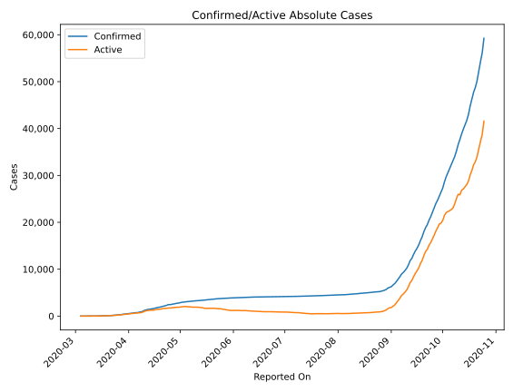
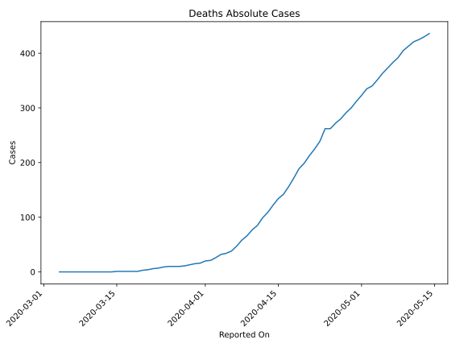
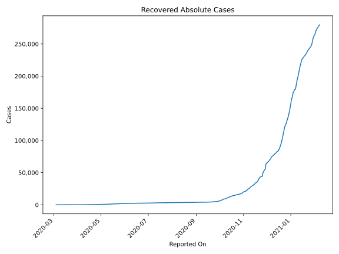
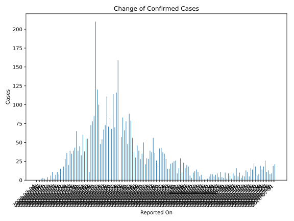
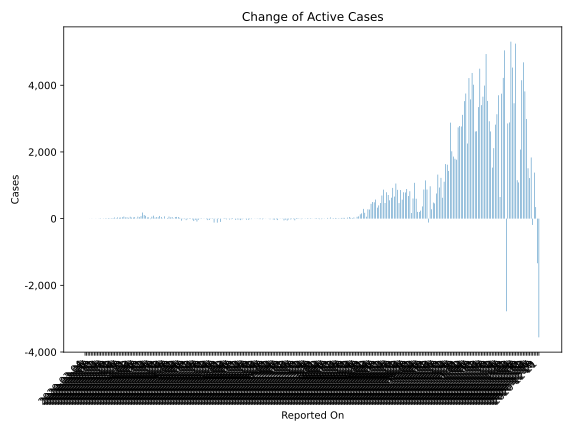
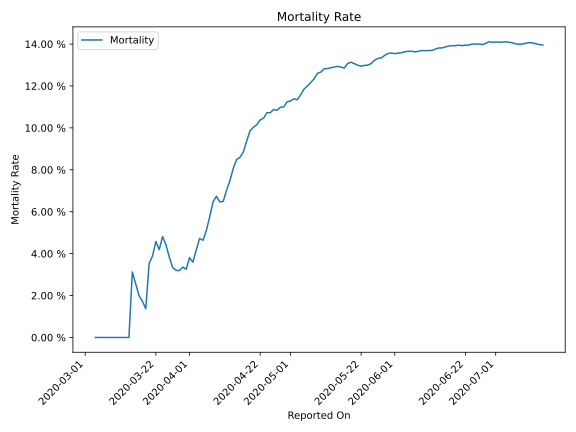

# Country Figures: Time Series for Hungary 

| Reported On | Confirmed | Deaths | Recovered | Active | Mortality | &Delta; Confirmed | &Delta; Deaths | &Delta; Active | % Active of Population |
|-------------|-----------|--------|-----------|--------|-----------|-------------------|----------------|----------------|------------------------|
| 2020-04-02 | 585 | 21 | 42 | 522 |  3.59 %  | 60 | 1 | 57 |  0.005 %  | 
| 2020-04-01 | 525 | 20 | 40 | 465 |  3.81 %  | 33 | 4 | 26 |  0.005 %  | 
| 2020-03-31 | 492 | 16 | 37 | 439 |  3.25 %  | 45 | 1 | 41 |  0.004 %  | 
| 2020-03-30 | 447 | 15 | 34 | 398 |  3.36 %  | 39 | 2 | 37 |  0.004 %  | 
| 2020-03-29 | 408 | 13 | 34 | 361 |  3.19 %  | 65 | 2 | 63 |  0.004 %  | 
| 2020-03-28 | 343 | 11 | 34 | 298 |  3.21 %  | 43 | 1 | 42 |  0.003 %  | 
| 2020-03-27 | 300 | 10 | 34 | 256 |  3.33 %  | 39 | 0 | 33 |  0.003 %  | 
| 2020-03-26 | 261 | 10 | 28 | 223 |  3.83 %  | 35 | 0 | 28 |  0.002 %  | 
| 2020-03-25 | 226 | 10 | 21 | 195 |  4.42 %  | 39 | 1 | 38 |  0.002 %  | 
| 2020-03-24 | 187 | 9 | 21 | 157 |  4.81 %  | 20 | 2 | 13 |  0.002 %  | 
| 2020-03-23 | 167 | 7 | 16 | 144 |  4.19 %  | 36 | 1 | 35 |  0.001 %  | 
| 2020-03-22 | 131 | 6 | 16 | 109 |  4.58 %  | 28 | 2 | 17 |  0.001 %  | 
| 2020-03-21 | 103 | 4 | 7 | 92 |  3.88 %  | 18 | 1 | 12 |  0.001 %  | 
| 2020-03-20 | 85 | 3 | 2 | 80 |  3.53 %  | 12 | 2 | 10 |  0.001 %  | 
| 2020-03-19 | 73 | 1 | 2 | 70 |  1.37 %  | 15 | 0 | 15 |  0.001 %  | 
| 2020-03-18 | 58 | 1 | 2 | 55 |  1.72 %  | 8 | 0 | 8 |  0.001 %  | 
| 2020-03-17 | 50 | 1 | 2 | 47 |  2.00 %  | 11 | 0 | 10 |  0.000 %  | 
| 2020-03-16 | 39 | 1 | 1 | 37 |  2.56 %  | 7 | 0 | 7 |  0.000 %  | 
| 2020-03-15 | 32 | 1 | 1 | 30 |  3.12 %  | 2 | 1 | 1 |  0.000 %  | 
| 2020-03-14 | 30 | 0 | 1 | 29 |  None  | 11 | 0 | 10 |  0.000 %  | 
| 2020-03-13 | 19 | 0 | 0 | 19 |  None  | 6 | 0 | 6 |  0.000 %  | 
| 2020-03-12 | 13 | 0 | 0 | 13 |  None  | 0 | 0 | 0 |  0.000 %  | 
| 2020-03-11 | 13 | 0 | 0 | 13 |  None  | 4 | 0 | 4 |  0.000 %  | 
| 2020-03-10 | 9 | 0 | 0 | 9 |  None  | 0 | 0 | 0 |  0.000 %  | 
| 2020-03-09 | 9 | 0 | 0 | 9 |  None  | 2 | 0 | 2 |  0.000 %  | 
| 2020-03-08 | 7 | 0 | 0 | 7 |  None  | 3 | 0 | 3 |  0.000 %  | 
| 2020-03-07 | 4 | 0 | 0 | 4 |  None  | 2 | 0 | 2 |  0.000 %  | 
| 2020-03-06 | 2 | 0 | 0 | 2 |  None  | 0 | 0 | 0 |  0.000 %  | 
| 2020-03-05 | 2 | 0 | 0 | 2 |  None  | 0 | 0 | 0 |  0.000 %  | 
| 2020-03-04 | 2 | 0 | 0 | 2 |  None  | None | None | None |  0.000 %  | 

