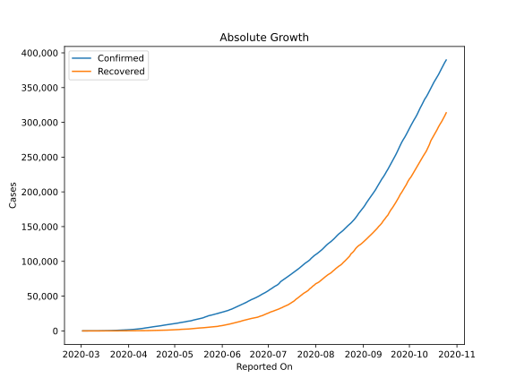
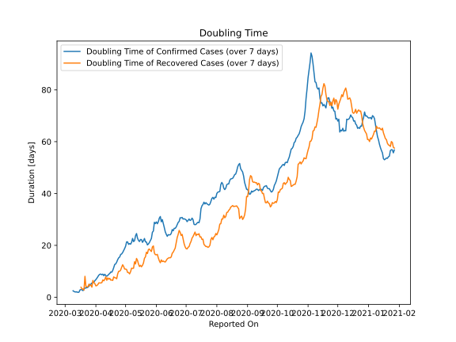

# Country Figures: Doubling Time of Infections for Indonesia 

The doubling time below are calculated based on
* an exponential growth assumption
* for time difference of past seven (7) days.
The doubling time's unit is "days".

The first doubling time indicates the increase of confirmed (infected)
cases. There, the *higher* the number is, the better is to take control
of the disease.

The second doubling time indicates the increase of recovered (healed)
cases. There, the *lower* the number is, the better it is to take
control of the disease.

| Reported On | Confirmed | Doubling Time (Confirmed) | Recovered | Doubling Time (Recovered) |
|-------------|-----------|---------------------------|-----------|---------------------------|
| 2020-04-25 | 8607 |  15.5 days  | 1042 |  10.0 days  | 
| 2020-04-24 | 8211 |  15.2 days  | 1002 |  10.0 days  | 
| 2020-04-23 | 7775 |  14.5 days  | 960 |  9.0 days  | 
| 2020-04-22 | 7418 |  13.5 days  | 913 |  7.1 days  | 
| 2020-04-21 | 7135 |  12.8 days  | 842 |  7.5 days  | 
| 2020-04-20 | 6760 |  12.6 days  | 747 |  7.5 days  | 
| 2020-04-19 | 6575 |  11.4 days  | 686 |  7.8 days  | 
| 2020-04-18 | 6248 |  10.3 days  | 631 |  6.5 days  | 
| 2020-04-17 | 5923 |  9.6 days  | 607 |  6.7 days  | 
| 2020-04-16 | 5516 |  9.7 days  | 548 |  6.6 days  | 
| 2020-04-15 | 5136 |  9.1 days  | 446 |  7.3 days  | 
| 2020-04-14 | 4839 |  8.9 days  | 426 |  6.9 days  | 
| 2020-04-13 | 4557 |  8.4 days  | 380 |  7.4 days  | 
| 2020-04-12 | 4241 |  8.1 days  | 359 |  6.5 days  | 
| 2020-04-11 | 3842 |  8.3 days  | 286 |  7.9 days  | 
| 2020-04-10 | 3512 |  8.9 days  | 282 |  6.9 days  | 
| 2020-04-09 | 3293 |  8.3 days  | 252 |  6.3 days  | 
| 2020-04-08 | 2956 |  8.9 days  | 222 |  6.7 days  | 
| 2020-04-07 | 2738 |  8.7 days  | 204 |  5.6 days  | 
| 2020-04-06 | 2491 |  8.9 days  | 192 |  5.5 days  | 
| 2020-04-05 | 2273 |  8.8 days  | 164 |  5.5 days  | 
| 2020-04-04 | 2092 |  8.5 days  | 150 |  5.5 days  | 
| 2020-04-03 | 1986 |  7.9 days  | 134 |  4.9 days  | 
| 2020-04-02 | 1790 |  7.3 days  | 112 |  4.5 days  | 
| 2020-04-01 | 1677 |  6.8 days  | 103 |  4.4 days  | 
| 2020-03-31 | 1528 |  6.4 days  | 81 |  5.2 days  | 
| 2020-03-30 | 1414 |  5.8 days  | 75 |  5.6 days  | 
| 2020-03-29 | 1285 |  5.6 days  | 64 |  6.5 days  | 
| 2020-03-28 | 1155 |  5.5 days  | 59 |  3.9 days  | 
| 2020-03-27 | 1046 |  5.0 days  | 46 |  4.7 days  | 
| 2020-03-26 | 893 |  4.9 days  | 35 |  4.5 days  | 
| 2020-03-25 | 790 |  4.2 days  | 31 |  5.0 days  | 
| 2020-03-24 | 686 |  3.8 days  | 30 |  4.0 days  | 
| 2020-03-23 | 579 |  3.7 days  | 30 |  4.0 days  | 
| 2020-03-22 | 514 |  3.6 days  | 29 |  4.1 days  | 
| 2020-03-21 | 450 |  3.5 days  | 15 |  8.1 days  | 
| 2020-03-20 | 369 |  3.2 days  | 15 |  2.7 days  | 
| 2020-03-19 | 311 |  2.5 days  | 11 |  3.2 days  | 
| 2020-03-18 | 227 |  2.9 days  | 11 |  3.2 days  | 
| 2020-03-17 | 172 |  3.0 days  | 8 |  3.8 days  | 
| 2020-03-16 | 134 |  2.8 days  | 8 |  None  | 
| 2020-03-15 | 117 |  2.0 days  | 8 |  None  | 
| 2020-03-14 | 96 |  1.9 days  | 8 |  None  | 
| 2020-03-13 | 69 |  2.0 days  | 2 |  None  | 
| 2020-03-12 | 34 |  2.0 days  | 2 |  None  | 
| 2020-03-11 | 34 |  2.0 days  | 2 |  None  | 
| 2020-03-10 | 27 |  2.2 days  | 2 |  None  | 
| 2020-03-09 | 19 |  2.5 days  | 0 |  None  | 
| 2020-03-08 | 6 |  None  | 0 |  None  | 
| 2020-03-07 | 4 |  None  | 0 |  None  | 
| 2020-03-06 | 4 |  None  | 0 |  None  | 
| 2020-03-05 | 2 |  None  | 0 |  None  | 
| 2020-03-04 | 2 |  None  | 0 |  None  | 
| 2020-03-03 | 2 |  None  | 0 |  None  | 
| 2020-03-02 | 2 |  None  | 0 |  None  | 

