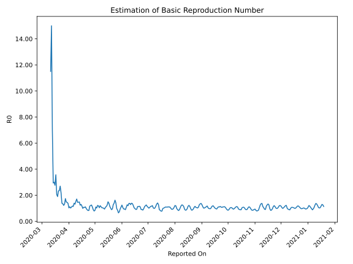

# Country Figures: Time Series for Basic Reproduction Number of Indonesia 

| Reported On | &Delta; Confirmed | Total &Delta; Confirmed First Interval | Total &Delta; Confirmed Second Interval | Estimated Basic Reproduction Number R0 | 
|-------------|-------------------|----------------------------------------|-----------------------------------------|---------------------------------------------------|
| 2020-05-06 | 367 |  1520  |  1455  |  1.04  | 
| 2020-05-05 | 484 |  1469  |  1236  |  1.19  | 
| 2020-05-04 | 395 |  1421  |  1164  |  1.22  | 
| 2020-05-03 | 349 |  1332  |  1300  |  1.02  | 
| 2020-05-02 | 292 |  1455  |  1321  |  1.10  | 
| 2020-05-01 | 433 |  1236  |  1464  |  0.84  | 
| 2020-04-30 | 347 |  1164  |  1472  |  0.79  | 
| 2020-04-29 | 260 |  1300  |  1451  |  0.90  | 
| 2020-04-28 | 415 |  1321  |  1200  |  1.10  | 
| 2020-04-27 | 214 |  1464  |  1170  |  1.25  | 
| 2020-04-26 | 275 |  1472  |  1212  |  1.21  | 
| 2020-04-25 | 396 |  1451  |  1244  |  1.17  | 
| 2020-04-24 | 436 |  1200  |  1439  |  0.83  | 
| 2020-04-23 | 357 |  1170  |  1409  |  0.83  | 
| 2020-04-22 | 283 |  1212  |  1366  |  0.89  | 
| 2020-04-21 | 375 |  1244  |  1275  |  0.98  | 
| 2020-04-20 | 185 |  1439  |  1294  |  1.11  | 
| 2020-04-19 | 327 |  1409  |  1327  |  1.06  | 
| 2020-04-18 | 325 |  1366  |  1264  |  1.08  | 
| 2020-04-17 | 407 |  1275  |  1285  |  0.99  | 
| 2020-04-16 | 380 |  1294  |  1104  |  1.17  | 
| 2020-04-15 | 297 |  1327  |  1021  |  1.30  | 
| 2020-04-14 | 282 |  1264  |  1020  |  1.24  | 
| 2020-04-13 | 316 |  1285  |  864  |  1.49  | 
| 2020-04-12 | 399 |  1104  |  752  |  1.47  | 
| 2020-04-11 | 330 |  1021  |  701  |  1.46  | 
| 2020-04-10 | 219 |  1020  |  596  |  1.71  | 
| 2020-04-09 | 337 |  864  |  564  |  1.53  | 
| 2020-04-08 | 218 |  752  |  572  |  1.31  | 
| 2020-04-07 | 247 |  701  |  505  |  1.39  | 
| 2020-04-06 | 218 |  596  |  522  |  1.14  | 
| 2020-04-05 | 181 |  564  |  482  |  1.17  | 
| 2020-04-04 | 106 |  572  |  521  |  1.10  | 
| 2020-04-03 | 196 |  505  |  495  |  1.02  | 
| 2020-04-02 | 113 |  522  |  469  |  1.11  | 
| 2020-04-01 | 149 |  482  |  467  |  1.03  | 
| 2020-03-31 | 114 |  521  |  379  |  1.37  | 
| 2020-03-30 | 129 |  495  |  340  |  1.46  | 
| 2020-03-29 | 130 |  469  |  317  |  1.48  | 
| 2020-03-28 | 109 |  467  |  268  |  1.74  | 
| 2020-03-27 | 153 |  379  |  287  |  1.32  | 
| 2020-03-26 | 103 |  340  |  278  |  1.22  | 
| 2020-03-25 | 104 |  317  |  235  |  1.35  | 
| 2020-03-24 | 107 |  268  |  194  |  1.38  | 
| 2020-03-23 | 65 |  287  |  131  |  2.19  | 
| 2020-03-22 | 64 |  278  |  103  |  2.70  | 
| 2020-03-21 | 81 |  235  |  100  |  2.35  | 
| 2020-03-20 | 58 |  194  |  83  |  2.34  | 
| 2020-03-19 | 84 |  131  |  69  |  1.90  | 
| 2020-03-18 | 55 |  103  |  50  |  2.06  | 
| 2020-03-17 | 38 |  100  |  28  |  3.57  | 
| 2020-03-16 | 17 |  83  |  30  |  2.77  | 
| 2020-03-15 | 21 |  69  |  23  |  3.00  | 
| 2020-03-14 | 27 |  50  |  17  |  2.94  | 
| 2020-03-13 | 35 |  28  |  4  |  7.00  | 
| 2020-03-12 | 0 |  30  |  2  |  15.00  | 
| 2020-03-11 | 7 |  23  |  2  |  11.50  | 
| 2020-03-10 | 8 |  17  |  None  |  None  | 
| 2020-03-09 | 13 |  4  |  None  |  None  | 
| 2020-03-08 | 2 |  2  |  None  |  None  | 
| 2020-03-07 | 0 |  2  |  None  |  None  | 
| 2020-03-06 | 2 |  None  |  None  |  None  | 
| 2020-03-05 | 0 |  None  |  None  |  None  | 
| 2020-03-04 | 0 |  None  |  None  |  None  | 
| 2020-03-03 | 0 |  None  |  None  |  None  | 
| 2020-03-02 | None |  None  |  None  |  None  | 

