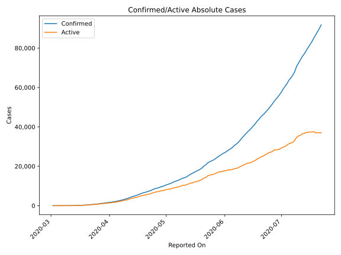
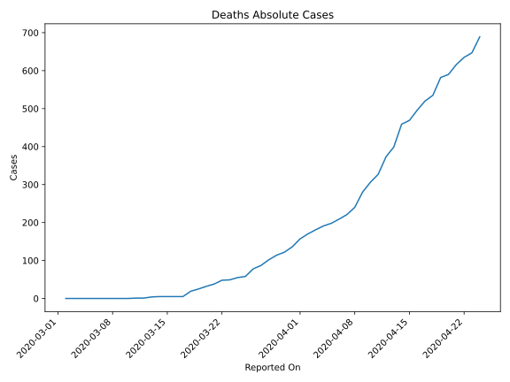
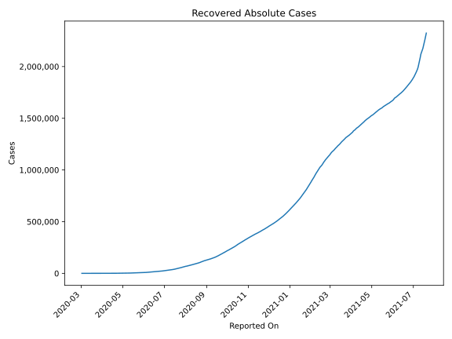
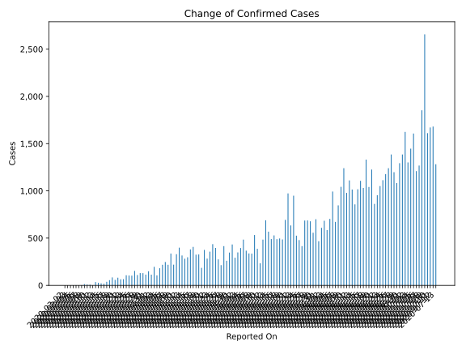
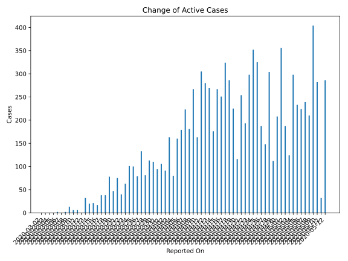
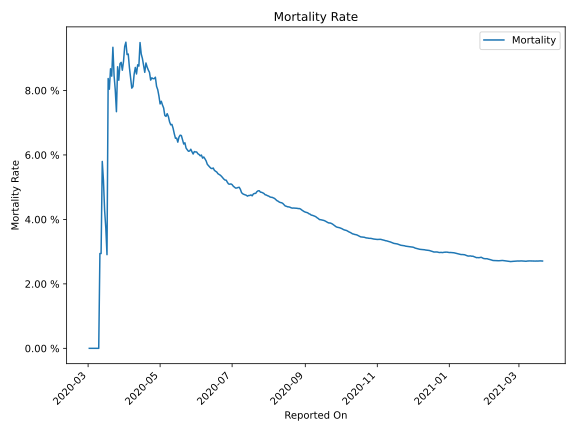

# Country Figures: Time Series for Indonesia 

| Reported On | Confirmed | Deaths | Recovered | Active | Mortality | &Delta; Confirmed | &Delta; Deaths | &Delta; Active | % Active of Population |
|-------------|-----------|--------|-----------|--------|-----------|-------------------|----------------|----------------|------------------------|
| 2020-04-05 | 2273 | 198 | 164 | 1911 |  8.71 %  | 181 | 7 | 160 |  0.001 %  | 
| 2020-04-04 | 2092 | 191 | 150 | 1751 |  9.13 %  | 106 | 10 | 80 |  0.001 %  | 
| 2020-04-03 | 1986 | 181 | 134 | 1671 |  9.11 %  | 196 | 11 | 163 |  0.001 %  | 
| 2020-04-02 | 1790 | 170 | 112 | 1508 |  9.50 %  | 113 | 13 | 91 |  0.001 %  | 
| 2020-04-01 | 1677 | 157 | 103 | 1417 |  9.36 %  | 149 | 21 | 106 |  0.001 %  | 
| 2020-03-31 | 1528 | 136 | 81 | 1311 |  8.90 %  | 114 | 14 | 94 |  0.000 %  | 
| 2020-03-30 | 1414 | 122 | 75 | 1217 |  8.63 %  | 129 | 8 | 110 |  0.000 %  | 
| 2020-03-29 | 1285 | 114 | 64 | 1107 |  8.87 %  | 130 | 12 | 113 |  0.000 %  | 
| 2020-03-28 | 1155 | 102 | 59 | 994 |  8.83 %  | 109 | 15 | 81 |  0.000 %  | 
| 2020-03-27 | 1046 | 87 | 46 | 913 |  8.32 %  | 153 | 9 | 133 |  0.000 %  | 
| 2020-03-26 | 893 | 78 | 35 | 780 |  8.73 %  | 103 | 20 | 79 |  0.000 %  | 
| 2020-03-25 | 790 | 58 | 31 | 701 |  7.34 %  | 104 | 3 | 100 |  0.000 %  | 
| 2020-03-24 | 686 | 55 | 30 | 601 |  8.02 %  | 107 | 6 | 101 |  0.000 %  | 
| 2020-03-23 | 579 | 49 | 30 | 500 |  8.46 %  | 65 | 1 | 63 |  0.000 %  | 
| 2020-03-22 | 514 | 48 | 29 | 437 |  9.34 %  | 64 | 10 | 40 |  0.000 %  | 
| 2020-03-21 | 450 | 38 | 15 | 397 |  8.44 %  | 81 | 6 | 75 |  0.000 %  | 
| 2020-03-20 | 369 | 32 | 15 | 322 |  8.67 %  | 58 | 7 | 47 |  0.000 %  | 
| 2020-03-19 | 311 | 25 | 11 | 275 |  8.04 %  | 84 | 6 | 78 |  0.000 %  | 
| 2020-03-18 | 227 | 19 | 11 | 197 |  8.37 %  | 55 | 14 | 38 |  0.000 %  | 
| 2020-03-17 | 172 | 5 | 8 | 159 |  2.91 %  | 38 | 0 | 38 |  0.000 %  | 
| 2020-03-16 | 134 | 5 | 8 | 121 |  3.73 %  | 17 | 0 | 17 |  0.000 %  | 
| 2020-03-15 | 117 | 5 | 8 | 104 |  4.27 %  | 21 | 0 | 21 |  0.000 %  | 
| 2020-03-14 | 96 | 5 | 8 | 83 |  5.21 %  | 27 | 1 | 20 |  0.000 %  | 
| 2020-03-13 | 69 | 4 | 2 | 63 |  5.80 %  | 35 | 3 | 32 |  0.000 %  | 
| 2020-03-12 | 34 | 1 | 2 | 31 |  2.94 %  | 0 | 0 | 0 |  0.000 %  | 
| 2020-03-11 | 34 | 1 | 2 | 31 |  2.94 %  | 7 | 1 | 6 |  0.000 %  | 
| 2020-03-10 | 27 | 0 | 2 | 25 |  None  | 8 | 0 | 6 |  0.000 %  | 
| 2020-03-09 | 19 | 0 | 0 | 19 |  None  | 13 | 0 | 13 |  0.000 %  | 
| 2020-03-08 | 6 | 0 | 0 | 6 |  None  | 2 | 0 | 2 |  0.000 %  | 
| 2020-03-07 | 4 | 0 | 0 | 4 |  None  | 0 | 0 | 0 |  0.000 %  | 
| 2020-03-06 | 4 | 0 | 0 | 4 |  None  | 2 | 0 | 2 |  0.000 %  | 
| 2020-03-05 | 2 | 0 | 0 | 2 |  None  | 0 | 0 | 0 |  0.000 %  | 
| 2020-03-04 | 2 | 0 | 0 | 2 |  None  | 0 | 0 | 0 |  0.000 %  | 
| 2020-03-03 | 2 | 0 | 0 | 2 |  None  | 0 | 0 | 0 |  0.000 %  | 
| 2020-03-02 | 2 | 0 | 0 | 2 |  None  | None | None | None |  0.000 %  | 

