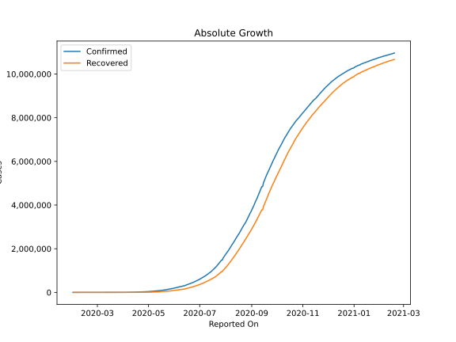
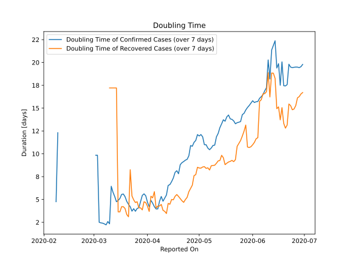

# Country Figures: Doubling Time of Infections for India 

The doubling time below are calculated based on
* an exponential growth assumption
* for time difference of past seven (7) days.
The doubling time's unit is "days".

The first doubling time indicates the increase of confirmed (infected)
cases. There, the *higher* the number is, the better is to take control
of the disease.

The second doubling time indicates the increase of recovered (healed)
cases. There, the *lower* the number is, the better it is to take
control of the disease.

| Reported On | Confirmed | Doubling Time (Confirmed) | Recovered | Doubling Time (Recovered) |
|-------------|-----------|---------------------------|-----------|---------------------------|
| 2020-04-25 | 26283 |  9.8 days  | 5939 |  5.9 days  | 
| 2020-04-24 | 24530 |  9.4 days  | 5498 |  5.2 days  | 
| 2020-04-23 | 23077 |  9.3 days  | 5012 |  5.0 days  | 
| 2020-04-22 | 21370 |  9.2 days  | 4370 |  4.7 days  | 
| 2020-04-21 | 20080 |  9.0 days  | 3975 |  4.9 days  | 
| 2020-04-20 | 18539 |  8.8 days  | 3273 |  5.1 days  | 
| 2020-04-19 | 17615 |  7.8 days  | 2854 |  5.3 days  | 
| 2020-04-18 | 15722 |  8.2 days  | 2463 |  5.5 days  | 
| 2020-04-17 | 14352 |  8.0 days  | 2041 |  5.3 days  | 
| 2020-04-16 | 13430 |  7.4 days  | 1768 |  5.0 days  | 
| 2020-04-15 | 12322 |  7.0 days  | 1432 |  5.0 days  | 
| 2020-04-14 | 11487 |  6.6 days  | 1359 |  4.5 days  | 
| 2020-04-13 | 10453 |  6.5 days  | 1181 |  4.6 days  | 
| 2020-04-12 | 9205 |  5.5 days  | 1080 |  3.5 days  | 
| 2020-04-11 | 8446 |  5.2 days  | 969 |  3.7 days  | 
| 2020-04-10 | 7598 |  4.8 days  | 774 |  3.8 days  | 
| 2020-04-09 | 6725 |  5.3 days  | 620 |  4.5 days  | 
| 2020-04-08 | 5916 |  4.8 days  | 506 |  4.3 days  | 
| 2020-04-07 | 5311 |  4.0 days  | 421 |  4.3 days  | 
| 2020-04-06 | 4778 |  4.0 days  | 375 |  4.1 days  | 
| 2020-04-05 | 3588 |  4.2 days  | 229 |  5.9 days  | 
| 2020-04-04 | 3082 |  4.6 days  | 229 |  5.2 days  | 
| 2020-04-03 | 2567 |  4.9 days  | 192 |  5.4 days  | 
| 2020-04-02 | 2543 |  4.2 days  | 191 |  3.7 days  | 
| 2020-04-01 | 1998 |  4.7 days  | 148 |  4.3 days  | 
| 2020-03-31 | 1397 |  5.4 days  | 123 |  4.7 days  | 
| 2020-03-30 | 1251 |  5.6 days  | 102 |  4.8 days  | 
| 2020-03-29 | 1024 |  5.4 days  | 95 |  3.9 days  | 
| 2020-03-28 | 987 |  4.8 days  | 84 |  4.1 days  | 
| 2020-03-27 | 887 |  4.1 days  | 73 |  4.1 days  | 
| 2020-03-26 | 727 |  4.0 days  | 45 |  4.8 days  | 
| 2020-03-25 | 657 |  3.7 days  | 43 |  4.7 days  | 
| 2020-03-24 | 536 |  4.0 days  | 40 |  5.0 days  | 
| 2020-03-23 | 499 |  3.7 days  | 34 |  5.4 days  | 
| 2020-03-22 | 396 |  4.2 days  | 24 |  8.3 days  | 
| 2020-03-21 | 330 |  4.5 days  | 23 |  3.1 days  | 
| 2020-03-20 | 244 |  4.8 days  | 20 |  3.3 days  | 
| 2020-03-19 | 194 |  5.3 days  | 15 |  4.0 days  | 
| 2020-03-18 | 156 |  5.6 days  | 14 |  4.2 days  | 
| 2020-03-17 | 142 |  5.6 days  | 14 |  4.2 days  | 
| 2020-03-16 | 119 |  5.1 days  | 13 |  3.6 days  | 
| 2020-03-15 | 113 |  4.9 days  | 13 |  3.6 days  | 
| 2020-03-14 | 102 |  4.8 days  | 4 |  17.2 days  | 
| 2020-03-13 | 82 |  5.3 days  | 4 |  17.2 days  | 
| 2020-03-12 | 73 |  5.8 days  | 4 |  17.2 days  | 
| 2020-03-11 | 62 |  6.4 days  | 4 |  17.2 days  | 
| 2020-03-10 | 56 |  2.3 days  | 4 |  17.2 days  | 
| 2020-03-09 | 43 |  2.6 days  | 3 |  None  | 
| 2020-03-08 | 39 |  2.2 days  | 3 |  None  | 
| 2020-03-07 | 34 |  2.3 days  | 3 |  None  | 
| 2020-03-06 | 31 |  2.4 days  | 3 |  None  | 
| 2020-03-05 | 30 |  2.4 days  | 3 |  None  | 
| 2020-03-04 | 28 |  2.5 days  | 3 |  None  | 
| 2020-03-03 | 5 |  9.8 days  | 3 |  None  | 
| 2020-03-02 | 5 |  9.8 days  | 3 |  None  | 
| 2020-02-15 | 3 |  None  | 0 |  None  | 
| 2020-02-14 | 3 |  None  | 0 |  None  | 
| 2020-02-13 | 3 |  None  | 0 |  None  | 
| 2020-02-12 | 3 |  None  | 0 |  None  | 
| 2020-02-11 | 3 |  None  | 0 |  None  | 
| 2020-02-10 | 3 |  None  | 0 |  None  | 
| 2020-02-09 | 3 |  12.3 days  | 0 |  None  | 
| 2020-02-08 | 3 |  4.8 days  | 0 |  None  | 
| 2020-02-07 | 3 |  None  | 0 |  None  | 
| 2020-02-06 | 3 |  None  | 0 |  None  | 
| 2020-02-05 | 3 |  None  | 0 |  None  | 
| 2020-02-04 | 3 |  None  | 0 |  None  | 
| 2020-02-03 | 3 |  None  | 0 |  None  | 
| 2020-02-02 | 2 |  None  | 0 |  None  | 
| 2020-02-01 | 1 |  None  | 0 |  None  | 

