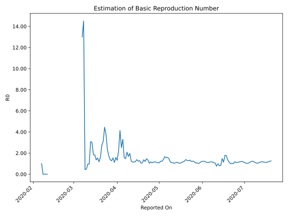

# Country Figures: Time Series for Basic Reproduction Number of India 

| Reported On | &Delta; Confirmed | Total &Delta; Confirmed First Interval | Total &Delta; Confirmed Second Interval | Estimated Basic Reproduction Number R0 | 
|-------------|-------------------|----------------------------------------|-----------------------------------------|---------------------------------------------------|
| 2020-04-28 | 1873 |  6374  |  5462  |  1.17  | 
| 2020-04-27 | 1561 |  6520  |  5648  |  1.15  | 
| 2020-04-26 | 1607 |  6203  |  5728  |  1.08  | 
| 2020-04-25 | 1753 |  5991  |  5109  |  1.17  | 
| 2020-04-24 | 1453 |  5462  |  5293  |  1.03  | 
| 2020-04-23 | 1707 |  5648  |  4235  |  1.33  | 
| 2020-04-22 | 1290 |  5728  |  3899  |  1.47  | 
| 2020-04-21 | 1541 |  5109  |  4225  |  1.21  | 
| 2020-04-20 | 924 |  5293  |  3876  |  1.37  | 
| 2020-04-19 | 1893 |  4235  |  3889  |  1.09  | 
| 2020-04-18 | 1370 |  3899  |  3728  |  1.05  | 
| 2020-04-17 | 922 |  4225  |  3289  |  1.28  | 
| 2020-04-16 | 1108 |  3876  |  3135  |  1.24  | 
| 2020-04-15 | 835 |  3889  |  2820  |  1.38  | 
| 2020-04-14 | 1034 |  3728  |  3137  |  1.19  | 
| 2020-04-13 | 1248 |  3289  |  2834  |  1.16  | 
| 2020-04-12 | 759 |  3135  |  2744  |  1.14  | 
| 2020-04-11 | 848 |  2820  |  2235  |  1.26  | 
| 2020-04-10 | 873 |  3137  |  1590  |  1.97  | 
| 2020-04-09 | 809 |  2834  |  1685  |  1.68  | 
| 2020-04-08 | 605 |  2744  |  1316  |  2.09  | 
| 2020-04-07 | 533 |  2235  |  1519  |  1.47  | 
| 2020-04-06 | 1190 |  1590  |  1011  |  1.57  | 
| 2020-04-05 | 506 |  1685  |  510  |  3.30  | 
| 2020-04-04 | 515 |  1316  |  524  |  2.51  | 
| 2020-04-03 | 24 |  1519  |  367  |  4.14  | 
| 2020-04-02 | 545 |  1011  |  451  |  2.24  | 
| 2020-04-01 | 601 |  510  |  388  |  1.31  | 
| 2020-03-31 | 146 |  524  |  331  |  1.58  | 
| 2020-03-30 | 227 |  367  |  327  |  1.12  | 
| 2020-03-29 | 37 |  451  |  292  |  1.54  | 
| 2020-03-28 | 100 |  388  |  305  |  1.27  | 
| 2020-03-27 | 160 |  331  |  240  |  1.38  | 
| 2020-03-26 | 70 |  327  |  188  |  1.74  | 
| 2020-03-25 | 121 |  292  |  125  |  2.34  | 
| 2020-03-24 | 37 |  305  |  81  |  3.77  | 
| 2020-03-23 | 103 |  240  |  54  |  4.44  | 
| 2020-03-22 | 66 |  188  |  60  |  3.13  | 
| 2020-03-21 | 86 |  125  |  46  |  2.72  | 
| 2020-03-20 | 50 |  81  |  51  |  1.59  | 
| 2020-03-19 | 38 |  54  |  46  |  1.17  | 
| 2020-03-18 | 14 |  60  |  39  |  1.54  | 
| 2020-03-17 | 23 |  46  |  34  |  1.35  | 
| 2020-03-16 | 6 |  51  |  28  |  1.82  | 
| 2020-03-15 | 11 |  46  |  25  |  1.84  | 
| 2020-03-14 | 20 |  39  |  13  |  3.00  | 
| 2020-03-13 | 9 |  34  |  11  |  3.09  | 
| 2020-03-12 | 11 |  28  |  29  |  0.97  | 
| 2020-03-11 | 6 |  25  |  26  |  0.96  | 
| 2020-03-10 | 13 |  13  |  27  |  0.48  | 
| 2020-03-09 | 4 |  11  |  25  |  0.44  | 
| 2020-03-08 | 5 |  29  |  2  |  14.50  | 
| 2020-03-07 | 3 |  26  |  2  |  13.00  | 
| 2020-03-06 | 1 |  27  |  None  |  None  | 
| 2020-03-05 | 2 |  25  |  None  |  None  | 
| 2020-03-04 | 23 |  2  |  None  |  None  | 
| 2020-03-03 | 0 |  2  |  None  |  None  | 
| 2020-03-02 | 2 |  None  |  None  |  None  | 
| 2020-03-01 | 0 |  None  |  None  |  None  | 
| 2020-02-29 | 0 |  None  |  None  |  None  | 
| 2020-02-28 | 0 |  None  |  None  |  None  | 
| 2020-02-27 | 0 |  None  |  None  |  None  | 
| 2020-02-26 | 0 |  None  |  None  |  None  | 
| 2020-02-25 | 0 |  None  |  None  |  None  | 
| 2020-02-24 | 0 |  None  |  None  |  None  | 
| 2020-02-23 | 0 |  None  |  None  |  None  | 
| 2020-02-22 | 0 |  None  |  None  |  None  | 
| 2020-02-21 | 0 |  None  |  None  |  None  | 
| 2020-02-20 | 0 |  None  |  None  |  None  | 
| 2020-02-19 | 0 |  None  |  None  |  None  | 
| 2020-02-18 | 0 |  None  |  None  |  None  | 
| 2020-02-17 | 0 |  None  |  None  |  None  | 
| 2020-02-16 | 0 |  None  |  None  |  None  | 
| 2020-02-15 | 0 |  None  |  None  |  None  | 
| 2020-02-14 | 0 |  None  |  None  |  None  | 
| 2020-02-13 | 0 |  None  |  None  |  None  | 
| 2020-02-12 | 0 |  None  |  None  |  None  | 
| 2020-02-11 | 0 |  None  |  1  |  None  | 
| 2020-02-10 | 0 |  None  |  2  |  None  | 
| 2020-02-09 | 0 |  None  |  2  |  None  | 
| 2020-02-08 | 0 |  None  |  2  |  None  | 
| 2020-02-07 | 0 |  1  |  1  |  1.00  | 
| 2020-02-06 | 0 |  2  |  None  |  None  | 
| 2020-02-05 | 0 |  2  |  None  |  None  | 
| 2020-02-04 | 0 |  2  |  None  |  None  | 
| 2020-02-03 | 1 |  1  |  None  |  None  | 
| 2020-02-02 | 1 |  None  |  None  |  None  | 
| 2020-02-01 | 0 |  None  |  None  |  None  | 
| 2020-01-31 | 0 |  None  |  None  |  None  | 
| 2020-01-30 | None |  None  |  None  |  None  | 

