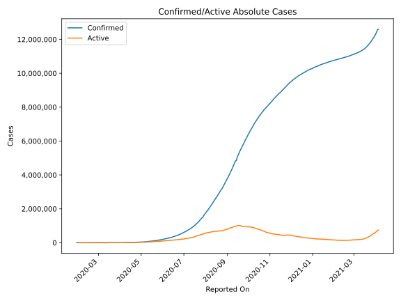
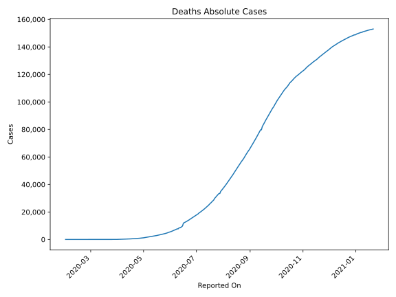
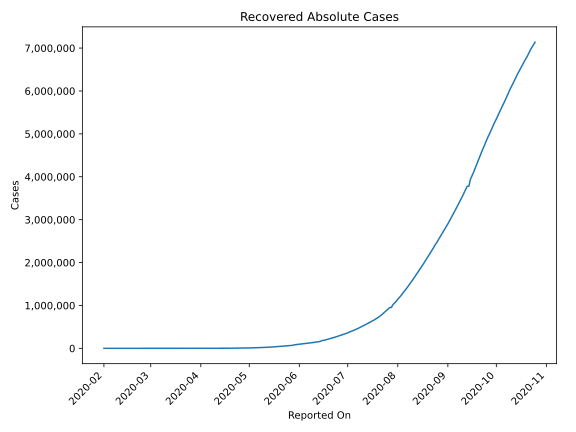
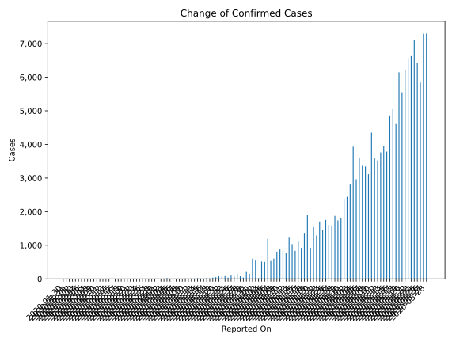
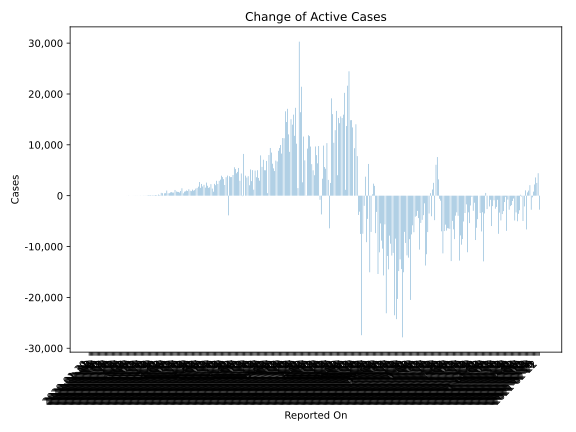
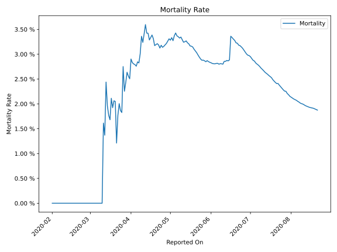

# Country Figures: Time Series for India 

| Reported On | Confirmed | Deaths | Recovered | Active | Mortality | &Delta; Confirmed | &Delta; Deaths | &Delta; Recovered | &Delta; Active | % Active of Population |
|-------------|-----------|--------|-----------|--------|-----------|-------------------|----------------|-------------------|----------------|------------------------|
| 2020-04-18 | 15722 | 521 | 2463 | 12738 |  3.31 %  | 1370 | 35 | 422 | 913 |  0.001 %  | 
| 2020-04-17 | 14352 | 486 | 2041 | 11825 |  3.39 %  | 922 | 38 | 273 | 611 |  0.001 %  | 
| 2020-04-16 | 13430 | 448 | 1768 | 11214 |  3.34 %  | 1108 | 43 | 336 | 729 |  0.001 %  | 
| 2020-04-15 | 12322 | 405 | 1432 | 10485 |  3.29 %  | 835 | 12 | 73 | 750 |  0.001 %  | 
| 2020-04-14 | 11487 | 393 | 1359 | 9735 |  3.42 %  | 1034 | 35 | 178 | 821 |  0.001 %  | 
| 2020-04-13 | 10453 | 358 | 1181 | 8914 |  3.42 %  | 1248 | 27 | 101 | 1120 |  0.001 %  | 
| 2020-04-12 | 9205 | 331 | 1080 | 7794 |  3.60 %  | 759 | 43 | 111 | 605 |  0.001 %  | 
| 2020-04-11 | 8446 | 288 | 969 | 7189 |  3.41 %  | 848 | 42 | 195 | 611 |  0.001 %  | 
| 2020-04-10 | 7598 | 246 | 774 | 6578 |  3.24 %  | 873 | 20 | 154 | 699 |  0.000 %  | 
| 2020-04-09 | 6725 | 226 | 620 | 5879 |  3.36 %  | 809 | 48 | 114 | 647 |  0.000 %  | 
| 2020-04-08 | 5916 | 178 | 506 | 5232 |  3.01 %  | 605 | 28 | 85 | 492 |  0.000 %  | 
| 2020-04-07 | 5311 | 150 | 421 | 4740 |  2.82 %  | 533 | 14 | 46 | 473 |  0.000 %  | 
| 2020-04-06 | 4778 | 136 | 375 | 4267 |  2.85 %  | 1190 | 37 | 146 | 1007 |  0.000 %  | 
| 2020-04-05 | 3588 | 99 | 229 | 3260 |  2.76 %  | 506 | 13 | 0 | 493 |  0.000 %  | 
| 2020-04-04 | 3082 | 86 | 229 | 2767 |  2.79 %  | 515 | 14 | 37 | 464 |  0.000 %  | 
| 2020-04-03 | 2567 | 72 | 192 | 2303 |  2.80 %  | 24 | 0 | 1 | 23 |  0.000 %  | 
| 2020-04-02 | 2543 | 72 | 191 | 2280 |  2.83 %  | 545 | 14 | 43 | 488 |  0.000 %  | 
| 2020-04-01 | 1998 | 58 | 148 | 1792 |  2.90 %  | 601 | 23 | 25 | 553 |  0.000 %  | 
| 2020-03-31 | 1397 | 35 | 123 | 1239 |  2.51 %  | 146 | 3 | 21 | 122 |  0.000 %  | 
| 2020-03-30 | 1251 | 32 | 102 | 1117 |  2.56 %  | 227 | 5 | 7 | 215 |  0.000 %  | 
| 2020-03-29 | 1024 | 27 | 95 | 902 |  2.64 %  | 37 | 3 | 11 | 23 |  0.000 %  | 
| 2020-03-28 | 987 | 24 | 84 | 879 |  2.43 %  | 100 | 4 | 11 | 85 |  0.000 %  | 
| 2020-03-27 | 887 | 20 | 73 | 794 |  2.25 %  | 160 | 0 | 28 | 132 |  0.000 %  | 
| 2020-03-26 | 727 | 20 | 45 | 662 |  2.75 %  | 70 | 8 | 2 | 60 |  0.000 %  | 
| 2020-03-25 | 657 | 12 | 43 | 602 |  1.83 %  | 121 | 2 | 3 | 116 |  0.000 %  | 
| 2020-03-24 | 536 | 10 | 40 | 486 |  1.87 %  | 37 | 0 | 6 | 31 |  0.000 %  | 
| 2020-03-23 | 499 | 10 | 34 | 455 |  2.00 %  | 103 | 3 | 10 | 90 |  0.000 %  | 
| 2020-03-22 | 396 | 7 | 24 | 365 |  1.77 %  | 66 | 3 | 1 | 62 |  0.000 %  | 
| 2020-03-21 | 330 | 4 | 23 | 303 |  1.21 %  | 86 | -1 | 3 | 84 |  0.000 %  | 
| 2020-03-20 | 244 | 5 | 20 | 219 |  2.05 %  | 50 | 1 | 5 | 44 |  0.000 %  | 
| 2020-03-19 | 194 | 4 | 15 | 175 |  2.06 %  | 38 | 1 | 1 | 36 |  0.000 %  | 
| 2020-03-18 | 156 | 3 | 14 | 139 |  1.92 %  | 14 | 0 | 0 | 14 |  0.000 %  | 
| 2020-03-17 | 142 | 3 | 14 | 125 |  2.11 %  | 23 | 1 | 1 | 21 |  0.000 %  | 
| 2020-03-16 | 119 | 2 | 13 | 104 |  1.68 %  | 6 | 0 | 0 | 6 |  0.000 %  | 
| 2020-03-15 | 113 | 2 | 13 | 98 |  1.77 %  | 11 | 0 | 9 | 2 |  0.000 %  | 
| 2020-03-14 | 102 | 2 | 4 | 96 |  1.96 %  | 20 | 0 | 0 | 20 |  0.000 %  | 
| 2020-03-13 | 82 | 2 | 4 | 76 |  2.44 %  | 9 | 1 | 0 | 8 |  0.000 %  | 
| 2020-03-12 | 73 | 1 | 4 | 68 |  1.37 %  | 11 | 0 | 0 | 11 |  0.000 %  | 
| 2020-03-11 | 62 | 1 | 4 | 57 |  1.61 %  | 6 | 1 | 0 | 5 |  0.000 %  | 
| 2020-03-10 | 56 | 0 | 4 | 52 |  None  | 13 | 0 | 1 | 12 |  0.000 %  | 
| 2020-03-09 | 43 | 0 | 3 | 40 |  None  | 4 | 0 | 0 | 4 |  0.000 %  | 
| 2020-03-08 | 39 | 0 | 3 | 36 |  None  | 5 | 0 | 0 | 5 |  0.000 %  | 
| 2020-03-07 | 34 | 0 | 3 | 31 |  None  | 3 | 0 | 0 | 3 |  0.000 %  | 
| 2020-03-06 | 31 | 0 | 3 | 28 |  None  | 1 | 0 | 0 | 1 |  0.000 %  | 
| 2020-03-05 | 30 | 0 | 3 | 27 |  None  | 2 | 0 | 0 | 2 |  0.000 %  | 
| 2020-03-04 | 28 | 0 | 3 | 25 |  None  | 23 | 0 | 0 | 23 |  0.000 %  | 
| 2020-03-03 | 5 | 0 | 3 | 2 |  None  | 0 | 0 | 0 | 0 |  0.000 %  | 
| 2020-03-02 | 5 | 0 | 3 | 2 |  None  | 2 | 0 | 0 | 2 |  0.000 %  | 
| 2020-03-01 | 3 | 0 | 3 | 0 |  None  | 0 | 0 | 0 | 0 |  n/a  | 
| 2020-02-29 | 3 | 0 | 3 | 0 |  None  | 0 | 0 | 0 | 0 |  n/a  | 
| 2020-02-28 | 3 | 0 | 3 | 0 |  None  | 0 | 0 | 0 | 0 |  n/a  | 
| 2020-02-27 | 3 | 0 | 3 | 0 |  None  | 0 | 0 | 0 | 0 |  n/a  | 
| 2020-02-26 | 3 | 0 | 3 | 0 |  None  | 0 | 0 | 0 | 0 |  n/a  | 
| 2020-02-25 | 3 | 0 | 3 | 0 |  None  | 0 | 0 | 0 | 0 |  n/a  | 
| 2020-02-24 | 3 | 0 | 3 | 0 |  None  | 0 | 0 | 0 | 0 |  n/a  | 
| 2020-02-23 | 3 | 0 | 3 | 0 |  None  | 0 | 0 | 0 | 0 |  n/a  | 
| 2020-02-22 | 3 | 0 | 3 | 0 |  None  | 0 | 0 | 0 | 0 |  n/a  | 
| 2020-02-21 | 3 | 0 | 3 | 0 |  None  | 0 | 0 | 0 | 0 |  n/a  | 
| 2020-02-20 | 3 | 0 | 3 | 0 |  None  | 0 | 0 | 0 | 0 |  n/a  | 
| 2020-02-19 | 3 | 0 | 3 | 0 |  None  | 0 | 0 | 0 | 0 |  n/a  | 
| 2020-02-18 | 3 | 0 | 3 | 0 |  None  | 0 | 0 | 0 | 0 |  n/a  | 
| 2020-02-17 | 3 | 0 | 3 | 0 |  None  | 0 | 0 | 0 | 0 |  n/a  | 
| 2020-02-16 | 3 | 0 | 3 | 0 |  None  | 0 | 0 | 3 | -3 |  n/a  | 
| 2020-02-15 | 3 | 0 | 0 | 3 |  None  | 0 | 0 | 0 | 0 |  0.000 %  | 
| 2020-02-14 | 3 | 0 | 0 | 3 |  None  | 0 | 0 | 0 | 0 |  0.000 %  | 
| 2020-02-13 | 3 | 0 | 0 | 3 |  None  | 0 | 0 | 0 | 0 |  0.000 %  | 
| 2020-02-12 | 3 | 0 | 0 | 3 |  None  | 0 | 0 | 0 | 0 |  0.000 %  | 
| 2020-02-11 | 3 | 0 | 0 | 3 |  None  | 0 | 0 | 0 | 0 |  0.000 %  | 
| 2020-02-10 | 3 | 0 | 0 | 3 |  None  | 0 | 0 | 0 | 0 |  0.000 %  | 
| 2020-02-09 | 3 | 0 | 0 | 3 |  None  | 0 | 0 | 0 | 0 |  0.000 %  | 
| 2020-02-08 | 3 | 0 | 0 | 3 |  None  | 0 | 0 | 0 | 0 |  0.000 %  | 
| 2020-02-07 | 3 | 0 | 0 | 3 |  None  | 0 | 0 | 0 | 0 |  0.000 %  | 
| 2020-02-06 | 3 | 0 | 0 | 3 |  None  | 0 | 0 | 0 | 0 |  0.000 %  | 
| 2020-02-05 | 3 | 0 | 0 | 3 |  None  | 0 | 0 | 0 | 0 |  0.000 %  | 
| 2020-02-04 | 3 | 0 | 0 | 3 |  None  | 0 | 0 | 0 | 0 |  0.000 %  | 
| 2020-02-03 | 3 | 0 | 0 | 3 |  None  | 1 | 0 | 0 | 1 |  0.000 %  | 
| 2020-02-02 | 2 | 0 | 0 | 2 |  None  | 1 | 0 | 0 | 1 |  0.000 %  | 
| 2020-02-01 | 1 | 0 | 0 | 1 |  None  | 0 | None | None | None |  0.000 %  | 
| 2020-01-31 | 1 | None | None | None |  None  | 0 | None | None | None |  n/a  | 
| 2020-01-30 | 1 | None | None | None |  None  | None | None | None | None |  n/a  | 

