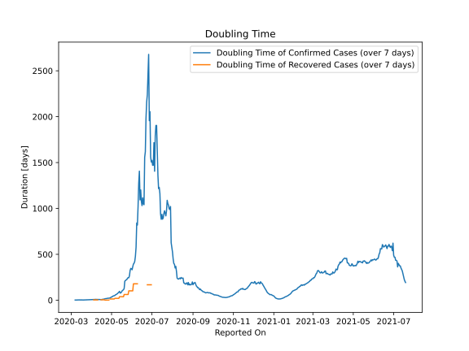

# Country Figures: New Infections in Previous 7 Days per 100,000 Population for Ireland 

<!--  --> 

| Reported On | &Delta; Confirmed (on the day) | &Delta; Confirmed (last 7 days) | New Cases in Previous 7 Days per 100,000 Population |
|-------------|--------------------------------|---------------------------------|-----------------------------------------------------|
| 2020-05-09 |  219  |  1584  |  32.636  |
| 2020-05-08 |  156  |  1708  |  35.191  |
| 2020-05-07 |  137  |  1773  |  36.530  |
| 2020-05-06 |  265  |  1995  |  41.104  |
| 2020-05-05 |  211  |  2106  |  43.391  |
| 2020-05-04 |  266  |  2124  |  43.762  |
| 2020-05-03 |  330  |  2244  |  46.235  |
| 2020-05-02 |  343  |  2615  |  53.879  |
| 2020-05-01 |  221  |  2649  |  54.579  |
| 2020-04-30 |  359  |  3005  |  61.914  |
| 2020-04-29 |  376  |  3582  |  73.802  |
| 2020-04-28 |  229  |  3837  |  79.056  |
| 2020-04-27 |  386  |  3996  |  82.332  |
| 2020-04-26 |  701  |  4011  |  82.641  |
| 2020-04-25 |  377  |  3803  |  78.356  |
| 2020-04-24 |  577  |  4204  |  86.618  |
| 2020-04-23 |  936  |  4336  |  89.337  |
| 2020-04-22 |  631  |  4124  |  84.970  |
| 2020-04-21 |  388  |  4561  |  93.973  |
| 2020-04-20 |  401  |  5005  |  103.121  |
| 2020-04-19 |  493  |  5596  |  115.298  |
| 2020-04-18 |  778  |  5830  |  120.119  |
| 2020-04-17 |  709  |  5891  |  121.376  |
| 2020-04-16 |  724  |  6697  |  137.983  |
| 2020-04-15 |  1068  |  6473  |  133.368  |
| 2020-04-14 |  832  |  5770  |  118.883  |
| 2020-04-13 |  992  |  5283  |  108.849  |
| 2020-04-12 |  727  |  4661  |  96.034  |
| 2020-04-11 |  839  |  4324  |  89.090  |
| 2020-04-10 |  1515  |  3816  |  78.624  |
| 2020-04-09 |  500  |  2725  |  56.145  |
| 2020-04-08 |  365  |  2627  |  54.126  |
| 2020-04-07 |  345  |  2474  |  50.973  |
| 2020-04-06 |  370  |  2454  |  50.561  |
| 2020-04-05 |  390  |  2379  |  49.016  |
| 2020-04-04 |  331  |  2189  |  45.101  |
| 2020-04-03 |  424  |  2152  |  44.339  |
| 2020-04-02 |  402  |  2030  |  41.825  |
| 2020-04-01 |  212  |  1883  |  38.797  |
| 2020-03-31 |  325  |  1906  |  39.271  |
| 2020-03-30 |  295  |  1785  |  36.778  |
| 2020-03-29 |  200  |  1709  |  35.212  |
| 2020-03-28 |  294  |  1630  |  33.584  |
| 2020-03-27 |  302  |  1438  |  29.628  |
| 2020-03-26 |  255  |  1262  |  26.002  |
| 2020-03-25 |  235  |  1272  |  26.208  |
| 2020-03-24 |  204  |  1106  |  22.788  |
| 2020-03-23 |  219  |  956  |  19.697  |
| 2020-03-22 |  121  |  777  |  16.009  |
| 2020-03-21 |  102  |  656  |  13.516  |
| 2020-03-20 |  126  |  593  |  12.218  |
| 2020-03-19 |  265  |  514  |  10.590  |
| 2020-03-18 |  69  |  249  |  5.130  |
| 2020-03-17 |  54  |  189  |  3.894  |
| 2020-03-16 |  40  |  148  |  3.049  |
| 2020-03-15 |  None  |  108  |  2.225  |
| 2020-03-14 |  39  |  111  |  2.287  |
| 2020-03-13 |  47  |  72  |  1.483  |
| 2020-03-12 |  None  |  37  |  0.762  |
| 2020-03-11 |  9  |  37  |  0.762  |
| 2020-03-10 |  13  |  32  |  0.659  |
| 2020-03-09 |  None  |  20  |  0.412  |
| 2020-03-08 |  3  |  20  |  0.412  |
| 2020-03-07 |  None  |  17  |  0.350  |
| 2020-03-06 |  12  |  17  |  0.350  |
| 2020-03-05 |  None  |  5  |  0.103  |
| 2020-03-04 |  4  |  5  |  0.103  |
| 2020-03-03 |  1  |  1  |  0.021  |
| 2020-03-02 |  None  |  None  |  None  |
| 2020-03-01 |  None  |  None  |  None  |
| 2020-02-29 |  None  |  None  |  None  |

