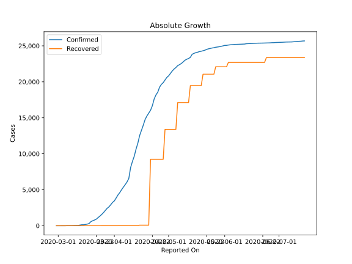

# Country Figures: Doubling Time of Infections for Ireland 

The doubling time below are calculated based on
* an exponential growth assumption
* for time difference of past seven (7) days.
The doubling time's unit is "days".

The first doubling time indicates the increase of confirmed (infected)
cases. There, the *higher* the number is, the better is to take control
of the disease.

The second doubling time indicates the increase of recovered (healed)
cases. There, the *lower* the number is, the better it is to take
control of the disease.

| Reported On | Confirmed | Doubling Time (Confirmed) | Recovered | Doubling Time (Recovered) |
|-------------|-----------|---------------------------|-----------|---------------------------|
| 2020-04-27 | 19648 |  21.7 days  | 9233 |  1.3 days  | 
| 2020-04-26 | 19262 |  21.1 days  | 9233 |  1.3 days  | 
| 2020-04-25 | 18561 |  21.5 days  | 9233 |  1.3 days  | 
| 2020-04-24 | 18184 |  18.8 days  | 9233 |  1.3 days  | 
| 2020-04-23 | 17607 |  17.5 days  | 9233 |  1.3 days  | 
| 2020-04-22 | 16671 |  17.4 days  | 9233 |  1.3 days  | 
| 2020-04-21 | 16040 |  14.8 days  | 9233 |  1.1 days  | 
| 2020-04-20 | 15652 |  12.9 days  | 77 |  4.7 days  | 
| 2020-04-19 | 15251 |  11.0 days  | 77 |  4.7 days  | 
| 2020-04-18 | 14758 |  10.0 days  | 77 |  4.7 days  | 
| 2020-04-17 | 13980 |  9.2 days  | 77 |  4.7 days  | 
| 2020-04-16 | 13271 |  7.2 days  | 77 |  4.7 days  | 
| 2020-04-15 | 12547 |  7.0 days  | 77 |  4.7 days  | 
| 2020-04-14 | 11479 |  7.3 days  | 25 |  None  | 
| 2020-04-13 | 10647 |  7.4 days  | 25 |  None  | 
| 2020-04-12 | 9655 |  7.7 days  | 25 |  None  | 
| 2020-04-11 | 8928 |  7.7 days  | 25 |  None  | 
| 2020-04-10 | 8089 |  7.9 days  | 25 |  3.3 days  | 
| 2020-04-09 | 6574 |  9.4 days  | 25 |  3.3 days  | 
| 2020-04-08 | 6074 |  8.9 days  | 25 |  3.3 days  | 
| 2020-04-07 | 5709 |  8.9 days  | 25 |  3.3 days  | 
| 2020-04-06 | 5364 |  8.3 days  | 25 |  3.3 days  | 
| 2020-04-05 | 4994 |  7.8 days  | 25 |  3.3 days  | 
| 2020-04-04 | 4604 |  7.9 days  | 25 |  3.3 days  | 
| 2020-04-03 | 4273 |  7.3 days  | 5 |  None  | 
| 2020-04-02 | 3849 |  6.8 days  | 5 |  None  | 
| 2020-04-01 | 3447 |  6.5 days  | 5 |  None  | 
| 2020-03-31 | 3235 |  5.8 days  | 5 |  None  | 
| 2020-03-30 | 2910 |  5.4 days  | 5 |  None  | 
| 2020-03-29 | 2615 |  4.9 days  | 5 |  None  | 
| 2020-03-28 | 2415 |  4.7 days  | 5 |  None  | 
| 2020-03-27 | 2121 |  4.6 days  | 5 |  None  | 
| 2020-03-26 | 1819 |  4.4 days  | 5 |  None  | 
| 2020-03-25 | 1564 |  3.2 days  | 5 |  None  | 
| 2020-03-24 | 1329 |  3.1 days  | 5 |  None  | 
| 2020-03-23 | 1125 |  2.9 days  | 5 |  None  | 
| 2020-03-22 | 906 |  2.8 days  | 5 |  None  | 
| 2020-03-21 | 785 |  3.0 days  | 5 |  None  | 
| 2020-03-20 | 683 |  2.7 days  | 5 |  None  | 
| 2020-03-19 | 557 |  2.2 days  | 5 |  None  | 
| 2020-03-18 | 292 |  2.9 days  | 5 |  None  | 
| 2020-03-17 | 223 |  2.9 days  | 5 |  None  | 
| 2020-03-16 | 169 |  2.7 days  | 0 |  None  | 
| 2020-03-15 | 129 |  3.0 days  | 0 |  None  | 
| 2020-03-14 | 129 |  2.8 days  | 0 |  None  | 
| 2020-03-13 | 90 |  3.3 days  | 0 |  None  | 
| 2020-03-12 | 43 |  2.8 days  | 0 |  None  | 
| 2020-03-11 | 43 |  2.8 days  | 0 |  None  | 
| 2020-03-10 | 34 |  2.0 days  | 0 |  None  | 
| 2020-03-09 | 21 |  1.9 days  | 0 |  None  | 
| 2020-03-08 | 21 |  1.9 days  | 0 |  None  | 
| 2020-03-07 | 18 |  2.0 days  | 0 |  None  | 
| 2020-03-06 | 18 |  None  | 0 |  None  | 
| 2020-03-05 | 6 |  None  | 0 |  None  | 
| 2020-03-04 | 6 |  None  | 0 |  None  | 
| 2020-03-03 | 2 |  None  | 0 |  None  | 
| 2020-03-02 | 1 |  None  | 0 |  None  | 
| 2020-03-01 | 1 |  None  | 0 |  None  | 
| 2020-02-29 | 1 |  None  | 0 |  None  | 

