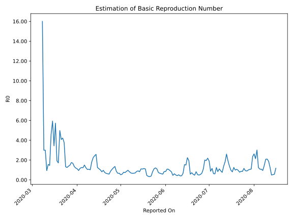

# Country Figures: Time Series for Basic Reproduction Number of Ireland 

| Reported On | &Delta; Confirmed | Total &Delta; Confirmed First Interval | Total &Delta; Confirmed Second Interval | Estimated Basic Reproduction Number R0 | 
|-------------|-------------------|----------------------------------------|-----------------------------------------|---------------------------------------------------|
| 2020-04-27 | 386 |  2591  |  1913  |  1.35  | 
| 2020-04-26 | 701 |  2521  |  2060  |  1.22  | 
| 2020-04-25 | 377 |  2532  |  2381  |  1.06  | 
| 2020-04-24 | 577 |  2356  |  2704  |  0.87  | 
| 2020-04-23 | 936 |  1913  |  3279  |  0.58  | 
| 2020-04-22 | 631 |  2060  |  3333  |  0.62  | 
| 2020-04-21 | 388 |  2381  |  3616  |  0.66  | 
| 2020-04-20 | 401 |  2704  |  3619  |  0.75  | 
| 2020-04-19 | 493 |  3279  |  3390  |  0.97  | 
| 2020-04-18 | 778 |  3333  |  4073  |  0.82  | 
| 2020-04-17 | 709 |  3616  |  3581  |  1.01  | 
| 2020-04-16 | 724 |  3619  |  3219  |  1.12  | 
| 2020-04-15 | 1068 |  3390  |  2725  |  1.24  | 
| 2020-04-14 | 832 |  4073  |  1580  |  2.58  | 
| 2020-04-13 | 992 |  3581  |  1470  |  2.44  | 
| 2020-04-12 | 727 |  3219  |  1436  |  2.24  | 
| 2020-04-11 | 839 |  2725  |  1515  |  1.80  | 
| 2020-04-10 | 1515 |  1580  |  1547  |  1.02  | 
| 2020-04-09 | 500 |  1470  |  1369  |  1.07  | 
| 2020-04-08 | 365 |  1436  |  1363  |  1.05  | 
| 2020-04-07 | 345 |  1515  |  1234  |  1.23  | 
| 2020-04-06 | 370 |  1547  |  1032  |  1.50  | 
| 2020-04-05 | 390 |  1369  |  1114  |  1.23  | 
| 2020-04-04 | 331 |  1363  |  1091  |  1.25  | 
| 2020-04-03 | 424 |  1234  |  1051  |  1.17  | 
| 2020-04-02 | 402 |  1032  |  1086  |  0.95  | 
| 2020-04-01 | 212 |  1114  |  996  |  1.12  | 
| 2020-03-31 | 325 |  1091  |  913  |  1.19  | 
| 2020-03-30 | 295 |  1051  |  779  |  1.35  | 
| 2020-03-29 | 200 |  1086  |  646  |  1.68  | 
| 2020-03-28 | 294 |  996  |  568  |  1.75  | 
| 2020-03-27 | 302 |  913  |  614  |  1.49  | 
| 2020-03-26 | 255 |  779  |  562  |  1.39  | 
| 2020-03-25 | 235 |  646  |  514  |  1.26  | 
| 2020-03-24 | 204 |  568  |  428  |  1.33  | 
| 2020-03-23 | 219 |  614  |  163  |  3.77  | 
| 2020-03-22 | 121 |  562  |  133  |  4.23  | 
| 2020-03-21 | 102 |  514  |  126  |  4.08  | 
| 2020-03-20 | 126 |  428  |  86  |  4.98  | 
| 2020-03-19 | 265 |  163  |  95  |  1.72  | 
| 2020-03-18 | 69 |  133  |  69  |  1.93  | 
| 2020-03-17 | 54 |  126  |  22  |  5.73  | 
| 2020-03-16 | 40 |  86  |  25  |  3.44  | 
| 2020-03-15 | 0 |  95  |  16  |  5.94  | 
| 2020-03-14 | 39 |  69  |  15  |  4.60  | 
| 2020-03-13 | 47 |  22  |  15  |  1.47  | 
| 2020-03-12 | 0 |  25  |  16  |  1.56  | 
| 2020-03-11 | 9 |  16  |  17  |  0.94  | 
| 2020-03-10 | 13 |  15  |  5  |  3.00  | 
| 2020-03-09 | 0 |  15  |  5  |  3.00  | 
| 2020-03-08 | 3 |  16  |  1  |  16.00  | 
| 2020-03-07 | 0 |  17  |  None  |  None  | 
| 2020-03-06 | 12 |  5  |  None  |  None  | 
| 2020-03-05 | 0 |  5  |  None  |  None  | 
| 2020-03-04 | 4 |  1  |  None  |  None  | 
| 2020-03-03 | 1 |  None  |  None  |  None  | 
| 2020-03-02 | 0 |  None  |  None  |  None  | 
| 2020-03-01 | 0 |  None  |  None  |  None  | 
| 2020-02-29 | None |  None  |  None  |  None  | 

