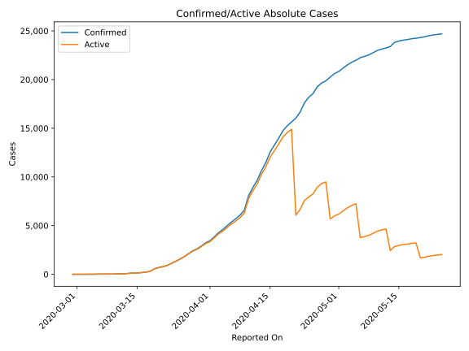
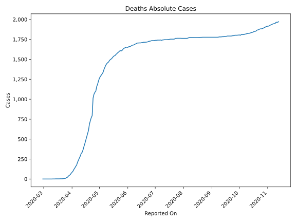
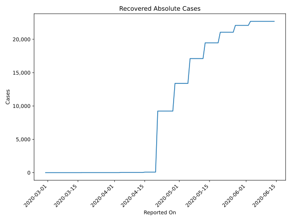
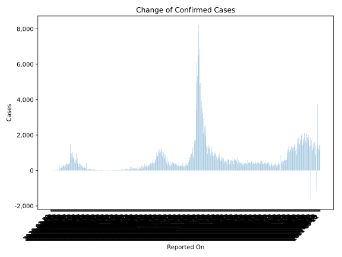
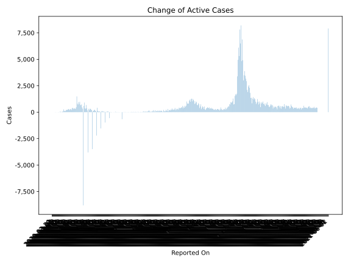
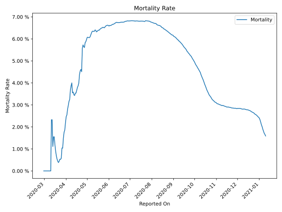

# Country Figures: Time Series for Ireland 

| Reported On | Confirmed | Deaths | Recovered | Active | Mortality | &Delta; Confirmed | &Delta; Deaths | &Delta; Recovered | &Delta; Active | % Active of Population |
|-------------|-----------|--------|-----------|--------|-----------|-------------------|----------------|-------------------|----------------|------------------------|
| 2020-05-01 | 20833 | 1265 | 13386 | 6182 |  6.07 %  | 221 | 33 | 0 | 188 |  0.127 %  | 
| 2020-04-30 | 20612 | 1232 | 13386 | 5994 |  5.98 %  | 359 | 42 | 0 | 317 |  0.123 %  | 
| 2020-04-29 | 20253 | 1190 | 13386 | 5677 |  5.88 %  | 376 | 31 | 4153 | -3808 |  0.117 %  | 
| 2020-04-28 | 19877 | 1159 | 9233 | 9485 |  5.83 %  | 229 | 57 | 0 | 172 |  0.195 %  | 
| 2020-04-27 | 19648 | 1102 | 9233 | 9313 |  5.61 %  | 386 | 15 | 0 | 371 |  0.192 %  | 
| 2020-04-26 | 19262 | 1087 | 9233 | 8942 |  5.64 %  | 701 | 24 | 0 | 677 |  0.184 %  | 
| 2020-04-25 | 18561 | 1063 | 9233 | 8265 |  5.73 %  | 377 | 49 | 0 | 328 |  0.170 %  | 
| 2020-04-24 | 18184 | 1014 | 9233 | 7937 |  5.58 %  | 577 | 220 | 0 | 357 |  0.164 %  | 
| 2020-04-23 | 17607 | 794 | 9233 | 7580 |  4.51 %  | 936 | 25 | 0 | 911 |  0.156 %  | 
| 2020-04-22 | 16671 | 769 | 9233 | 6669 |  4.61 %  | 631 | 39 | 0 | 592 |  0.137 %  | 
| 2020-04-21 | 16040 | 730 | 9233 | 6077 |  4.55 %  | 388 | 43 | 9156 | -8811 |  0.125 %  | 
| 2020-04-20 | 15652 | 687 | 77 | 14888 |  4.39 %  | 401 | 77 | 0 | 324 |  0.307 %  | 
| 2020-04-19 | 15251 | 610 | 77 | 14564 |  4.00 %  | 493 | 39 | 0 | 454 |  0.300 %  | 
| 2020-04-18 | 14758 | 571 | 77 | 14110 |  3.87 %  | 778 | 41 | 0 | 737 |  0.291 %  | 
| 2020-04-17 | 13980 | 530 | 77 | 13373 |  3.79 %  | 709 | 44 | 0 | 665 |  0.276 %  | 
| 2020-04-16 | 13271 | 486 | 77 | 12708 |  3.66 %  | 724 | 42 | 0 | 682 |  0.262 %  | 
| 2020-04-15 | 12547 | 444 | 77 | 12026 |  3.54 %  | 1068 | 38 | 52 | 978 |  0.248 %  | 
| 2020-04-14 | 11479 | 406 | 25 | 11048 |  3.54 %  | 832 | 41 | 0 | 791 |  0.228 %  | 
| 2020-04-13 | 10647 | 365 | 25 | 10257 |  3.43 %  | 992 | 31 | 0 | 961 |  0.211 %  | 
| 2020-04-12 | 9655 | 334 | 25 | 9296 |  3.46 %  | 727 | 14 | 0 | 713 |  0.192 %  | 
| 2020-04-11 | 8928 | 320 | 25 | 8583 |  3.58 %  | 839 | 33 | 0 | 806 |  0.177 %  | 
| 2020-04-10 | 8089 | 287 | 25 | 7777 |  3.55 %  | 1515 | 24 | 0 | 1491 |  0.160 %  | 
| 2020-04-09 | 6574 | 263 | 25 | 6286 |  4.00 %  | 500 | 28 | 0 | 472 |  0.130 %  | 
| 2020-04-08 | 6074 | 235 | 25 | 5814 |  3.87 %  | 365 | 25 | 0 | 340 |  0.120 %  | 
| 2020-04-07 | 5709 | 210 | 25 | 5474 |  3.68 %  | 345 | 36 | 0 | 309 |  0.113 %  | 
| 2020-04-06 | 5364 | 174 | 25 | 5165 |  3.24 %  | 370 | 16 | 0 | 354 |  0.106 %  | 
| 2020-04-05 | 4994 | 158 | 25 | 4811 |  3.16 %  | 390 | 21 | 0 | 369 |  0.099 %  | 
| 2020-04-04 | 4604 | 137 | 25 | 4442 |  2.98 %  | 331 | 17 | 20 | 294 |  0.092 %  | 
| 2020-04-03 | 4273 | 120 | 5 | 4148 |  2.81 %  | 424 | 22 | 0 | 402 |  0.085 %  | 
| 2020-04-02 | 3849 | 98 | 5 | 3746 |  2.55 %  | 402 | 13 | 0 | 389 |  0.077 %  | 
| 2020-04-01 | 3447 | 85 | 5 | 3357 |  2.47 %  | 212 | 14 | 0 | 198 |  0.069 %  | 
| 2020-03-31 | 3235 | 71 | 5 | 3159 |  2.19 %  | 325 | 17 | 0 | 308 |  0.065 %  | 
| 2020-03-30 | 2910 | 54 | 5 | 2851 |  1.86 %  | 295 | 8 | 0 | 287 |  0.059 %  | 
| 2020-03-29 | 2615 | 46 | 5 | 2564 |  1.76 %  | 200 | 10 | 0 | 190 |  0.053 %  | 
| 2020-03-28 | 2415 | 36 | 5 | 2374 |  1.49 %  | 294 | 14 | 0 | 280 |  0.049 %  | 
| 2020-03-27 | 2121 | 22 | 5 | 2094 |  1.04 %  | 302 | 3 | 0 | 299 |  0.043 %  | 
| 2020-03-26 | 1819 | 19 | 5 | 1795 |  1.04 %  | 255 | 10 | 0 | 245 |  0.037 %  | 
| 2020-03-25 | 1564 | 9 | 5 | 1550 |  0.58 %  | 235 | 2 | 0 | 233 |  0.032 %  | 
| 2020-03-24 | 1329 | 7 | 5 | 1317 |  0.53 %  | 204 | 1 | 0 | 203 |  0.027 %  | 
| 2020-03-23 | 1125 | 6 | 5 | 1114 |  0.53 %  | 219 | 2 | 0 | 217 |  0.023 %  | 
| 2020-03-22 | 906 | 4 | 5 | 897 |  0.44 %  | 121 | 1 | 0 | 120 |  0.018 %  | 
| 2020-03-21 | 785 | 3 | 5 | 777 |  0.38 %  | 102 | 0 | 0 | 102 |  0.016 %  | 
| 2020-03-20 | 683 | 3 | 5 | 675 |  0.44 %  | 126 | 0 | 0 | 126 |  0.014 %  | 
| 2020-03-19 | 557 | 3 | 5 | 549 |  0.54 %  | 265 | 1 | 0 | 264 |  0.011 %  | 
| 2020-03-18 | 292 | 2 | 5 | 285 |  0.68 %  | 69 | 0 | 0 | 69 |  0.006 %  | 
| 2020-03-17 | 223 | 2 | 5 | 216 |  0.90 %  | 54 | 0 | 5 | 49 |  0.004 %  | 
| 2020-03-16 | 169 | 2 | 0 | 167 |  1.18 %  | 40 | 0 | 0 | 40 |  0.003 %  | 
| 2020-03-15 | 129 | 2 | 0 | 127 |  1.55 %  | 0 | 0 | 0 | 0 |  0.003 %  | 
| 2020-03-14 | 129 | 2 | 0 | 127 |  1.55 %  | 39 | 1 | 0 | 38 |  0.003 %  | 
| 2020-03-13 | 90 | 1 | 0 | 89 |  1.11 %  | 47 | 0 | 0 | 47 |  0.002 %  | 
| 2020-03-12 | 43 | 1 | 0 | 42 |  2.33 %  | 0 | 0 | 0 | 0 |  0.001 %  | 
| 2020-03-11 | 43 | 1 | 0 | 42 |  2.33 %  | 9 | 1 | 0 | 8 |  0.001 %  | 
| 2020-03-10 | 34 | 0 | 0 | 34 |  None  | 13 | 0 | 0 | 13 |  0.001 %  | 
| 2020-03-09 | 21 | 0 | 0 | 21 |  None  | 0 | 0 | 0 | 0 |  0.000 %  | 
| 2020-03-08 | 21 | 0 | 0 | 21 |  None  | 3 | 0 | 0 | 3 |  0.000 %  | 
| 2020-03-07 | 18 | 0 | 0 | 18 |  None  | 0 | 0 | 0 | 0 |  0.000 %  | 
| 2020-03-06 | 18 | 0 | 0 | 18 |  None  | 12 | 0 | 0 | 12 |  0.000 %  | 
| 2020-03-05 | 6 | 0 | 0 | 6 |  None  | 0 | 0 | 0 | 0 |  0.000 %  | 
| 2020-03-04 | 6 | 0 | 0 | 6 |  None  | 4 | 0 | 0 | 4 |  0.000 %  | 
| 2020-03-03 | 2 | 0 | 0 | 2 |  None  | 1 | 0 | 0 | 1 |  0.000 %  | 
| 2020-03-02 | 1 | 0 | 0 | 1 |  None  | 0 | 0 | 0 | 0 |  0.000 %  | 
| 2020-03-01 | 1 | 0 | 0 | 1 |  None  | 0 | 0 | 0 | 0 |  0.000 %  | 
| 2020-02-29 | 1 | 0 | 0 | 1 |  None  | None | None | None | None |  0.000 %  | 

