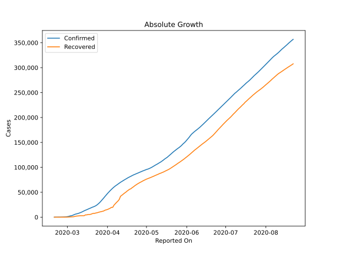
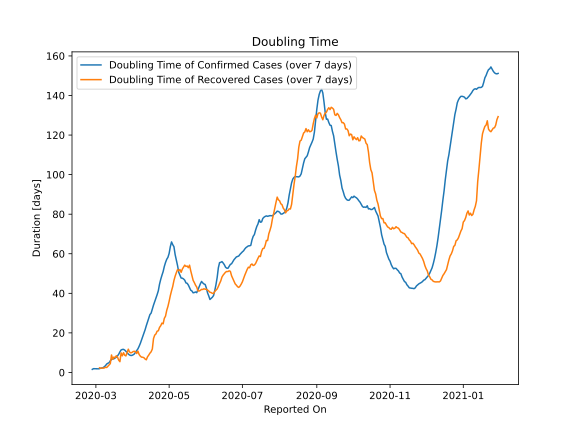

# Country Figures: Doubling Time of Infections for Iran 

The doubling time below are calculated based on
* an exponential growth assumption
* for time difference of past seven (7) days.
The doubling time's unit is "days".

The first doubling time indicates the increase of confirmed (infected)
cases. There, the *higher* the number is, the better is to take control
of the disease.

The second doubling time indicates the increase of recovered (healed)
cases. There, the *lower* the number is, the better it is to take
control of the disease.

| Reported On | Confirmed | Doubling Time (Confirmed) | Recovered | Doubling Time (Recovered) |
|-------------|-----------|---------------------------|-----------|---------------------------|
| 2020-04-22 | 85996 |  41.3 days  | 63113 |  21.1 days  | 
| 2020-04-21 | 84802 |  39.3 days  | 60965 |  20.9 days  | 
| 2020-04-20 | 83505 |  37.6 days  | 59273 |  19.5 days  | 
| 2020-04-19 | 82211 |  35.8 days  | 57023 |  18.9 days  | 
| 2020-04-18 | 80868 |  34.1 days  | 55987 |  17.1 days  | 
| 2020-04-17 | 79494 |  32.0 days  | 54064 |  11.9 days  | 
| 2020-04-16 | 77995 |  30.0 days  | 52229 |  10.4 days  | 
| 2020-04-15 | 76389 |  29.3 days  | 49933 |  9.7 days  | 
| 2020-04-14 | 74877 |  27.4 days  | 48129 |  8.8 days  | 
| 2020-04-13 | 73303 |  25.6 days  | 45983 |  7.9 days  | 
| 2020-04-12 | 71686 |  23.7 days  | 43894 |  6.4 days  | 
| 2020-04-11 | 70029 |  21.6 days  | 41947 |  6.8 days  | 
| 2020-04-10 | 68192 |  19.9 days  | 35465 |  7.5 days  | 
| 2020-04-09 | 66220 |  18.2 days  | 32309 |  7.7 days  | 
| 2020-04-08 | 64586 |  16.2 days  | 29812 |  7.7 days  | 
| 2020-04-07 | 62589 |  14.7 days  | 27039 |  8.3 days  | 
| 2020-04-06 | 60500 |  13.2 days  | 24236 |  9.1 days  | 
| 2020-04-05 | 58226 |  11.9 days  | 19736 |  10.8 days  | 
| 2020-04-04 | 55743 |  11.0 days  | 19736 |  9.6 days  | 
| 2020-04-03 | 53183 |  10.1 days  | 17935 |  10.5 days  | 
| 2020-04-02 | 50468 |  9.3 days  | 16711 |  10.7 days  | 
| 2020-04-01 | 47593 |  8.9 days  | 15473 |  10.6 days  | 
| 2020-03-31 | 44605 |  8.6 days  | 14656 |  10.1 days  | 
| 2020-03-30 | 41495 |  8.6 days  | 13911 |  9.9 days  | 
| 2020-03-29 | 38309 |  8.8 days  | 12391 |  10.4 days  | 
| 2020-03-28 | 35408 |  9.3 days  | 11679 |  11.8 days  | 
| 2020-03-27 | 32332 |  10.1 days  | 11133 |  10.0 days  | 
| 2020-03-26 | 29406 |  10.7 days  | 10457 |  8.4 days  | 
| 2020-03-25 | 27017 |  11.3 days  | 9625 |  8.7 days  | 
| 2020-03-24 | 24811 |  11.7 days  | 8913 |  10.0 days  | 
| 2020-03-23 | 23049 |  11.6 days  | 8376 |  8.4 days  | 
| 2020-03-22 | 21638 |  11.4 days  | 7635 |  9.9 days  | 
| 2020-03-21 | 20610 |  10.4 days  | 7635 |  5.5 days  | 
| 2020-03-20 | 19644 |  9.2 days  | 6745 |  6.2 days  | 
| 2020-03-19 | 18407 |  8.4 days  | 5710 |  7.7 days  | 
| 2020-03-18 | 17361 |  7.7 days  | 5389 |  8.4 days  | 
| 2020-03-17 | 16169 |  7.3 days  | 5389 |  7.5 days  | 
| 2020-03-16 | 14991 |  6.9 days  | 4590 |  7.8 days  | 
| 2020-03-15 | 13938 |  6.8 days  | 4590 |  6.7 days  | 
| 2020-03-14 | 12729 |  6.5 days  | 2959 |  8.8 days  | 
| 2020-03-13 | 11364 |  5.9 days  | 2959 |  4.5 days  | 
| 2020-03-12 | 10075 |  4.9 days  | 2959 |  3.8 days  | 
| 2020-03-11 | 9000 |  4.7 days  | 2959 |  3.2 days  | 
| 2020-03-10 | 8042 |  4.3 days  | 2731 |  2.5 days  | 
| 2020-03-09 | 7161 |  3.4 days  | 2394 |  2.6 days  | 
| 2020-03-08 | 6566 |  2.9 days  | 2134 |  2.3 days  | 
| 2020-03-07 | 5823 |  2.5 days  | 1669 |  2.2 days  | 
| 2020-03-06 | 4747 |  2.3 days  | 913 |  2.2 days  | 
| 2020-03-05 | 3513 |  2.2 days  | 739 |  2.1 days  | 
| 2020-03-04 | 2922 |  1.9 days  | 552 |  2.3 days  | 
| 2020-03-03 | 2336 |  1.8 days  | 291 |  None  | 
| 2020-03-02 | 1501 |  1.8 days  | 291 |  None  | 
| 2020-03-01 | 978 |  1.9 days  | 175 |  None  | 
| 2020-02-29 | 593 |  1.9 days  | 123 |  None  | 
| 2020-02-28 | 388 |  1.9 days  | 73 |  None  | 
| 2020-02-27 | 245 |  1.6 days  | 49 |  None  | 
| 2020-02-26 | 139 |  None  | 49 |  None  | 
| 2020-02-25 | 95 |  None  | 0 |  None  | 
| 2020-02-24 | 61 |  None  | 0 |  None  | 
| 2020-02-23 | 43 |  None  | 0 |  None  | 
| 2020-02-22 | 28 |  None  | 0 |  None  | 
| 2020-02-21 | 18 |  None  | 0 |  None  | 
| 2020-02-20 | 5 |  None  | 0 |  None  | 

