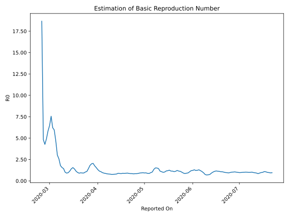

# Country Figures: Time Series for Basic Reproduction Number of Iran 

| Reported On | &Delta; Confirmed | Total &Delta; Confirmed First Interval | Total &Delta; Confirmed Second Interval | Estimated Basic Reproduction Number R0 | 
|-------------|-------------------|----------------------------------------|-----------------------------------------|---------------------------------------------------|
| 2020-05-05 | 1323 |  4007  |  4159  |  0.96  | 
| 2020-05-04 | 1223 |  3767  |  4329  |  0.87  | 
| 2020-05-03 | 976 |  3864  |  4390  |  0.88  | 
| 2020-05-02 | 802 |  4174  |  4446  |  0.94  | 
| 2020-05-01 | 1006 |  4159  |  4485  |  0.93  | 
| 2020-04-30 | 983 |  4329  |  4526  |  0.96  | 
| 2020-04-29 | 1073 |  4390  |  4689  |  0.94  | 
| 2020-04-28 | 1112 |  4446  |  4815  |  0.92  | 
| 2020-04-27 | 991 |  4485  |  5128  |  0.87  | 
| 2020-04-26 | 1153 |  4526  |  5308  |  0.85  | 
| 2020-04-25 | 1134 |  4689  |  5510  |  0.85  | 
| 2020-04-24 | 1168 |  4815  |  5822  |  0.83  | 
| 2020-04-23 | 1030 |  5128  |  5991  |  0.86  | 
| 2020-04-22 | 1194 |  5308  |  6191  |  0.86  | 
| 2020-04-21 | 1297 |  5510  |  6309  |  0.87  | 
| 2020-04-20 | 1294 |  5822  |  6360  |  0.92  | 
| 2020-04-19 | 1343 |  5991  |  6685  |  0.90  | 
| 2020-04-18 | 1374 |  6191  |  7083  |  0.87  | 
| 2020-04-17 | 1499 |  6309  |  7100  |  0.89  | 
| 2020-04-16 | 1606 |  6360  |  7440  |  0.85  | 
| 2020-04-15 | 1512 |  6685  |  7692  |  0.87  | 
| 2020-04-14 | 1574 |  7083  |  7994  |  0.89  | 
| 2020-04-13 | 1617 |  7100  |  8843  |  0.80  | 
| 2020-04-12 | 1657 |  7440  |  9406  |  0.79  | 
| 2020-04-11 | 1837 |  7692  |  10032  |  0.77  | 
| 2020-04-10 | 1972 |  7994  |  10633  |  0.75  | 
| 2020-04-09 | 1634 |  8843  |  11138  |  0.79  | 
| 2020-04-08 | 1997 |  9406  |  11688  |  0.80  | 
| 2020-04-07 | 2089 |  10032  |  12159  |  0.83  | 
| 2020-04-06 | 2274 |  10633  |  12185  |  0.87  | 
| 2020-04-05 | 2483 |  11138  |  12273  |  0.91  | 
| 2020-04-04 | 2560 |  11688  |  12089  |  0.97  | 
| 2020-04-03 | 2715 |  12159  |  11292  |  1.08  | 
| 2020-04-02 | 2875 |  12185  |  10597  |  1.15  | 
| 2020-04-01 | 2988 |  12273  |  9283  |  1.32  | 
| 2020-03-31 | 3110 |  12089  |  7768  |  1.56  | 
| 2020-03-30 | 3186 |  11292  |  6407  |  1.76  | 
| 2020-03-29 | 2901 |  10597  |  5167  |  2.05  | 
| 2020-03-28 | 3076 |  9283  |  4642  |  2.00  | 
| 2020-03-27 | 2926 |  7768  |  4277  |  1.82  | 
| 2020-03-26 | 2389 |  6407  |  4441  |  1.44  | 
| 2020-03-25 | 2206 |  5167  |  4653  |  1.11  | 
| 2020-03-24 | 1762 |  4642  |  4469  |  1.04  | 
| 2020-03-23 | 1411 |  4277  |  4632  |  0.92  | 
| 2020-03-22 | 1028 |  4441  |  4805  |  0.92  | 
| 2020-03-21 | 966 |  4653  |  4916  |  0.95  | 
| 2020-03-20 | 1237 |  4469  |  4938  |  0.91  | 
| 2020-03-19 | 1046 |  4632  |  4687  |  0.99  | 
| 2020-03-18 | 1192 |  4805  |  4203  |  1.14  | 
| 2020-03-17 | 1178 |  4916  |  3509  |  1.40  | 
| 2020-03-16 | 1053 |  4938  |  3177  |  1.55  | 
| 2020-03-15 | 1209 |  4687  |  3295  |  1.42  | 
| 2020-03-14 | 1365 |  4203  |  3648  |  1.15  | 
| 2020-03-13 | 1289 |  3509  |  3644  |  0.96  | 
| 2020-03-12 | 1075 |  3177  |  3487  |  0.91  | 
| 2020-03-11 | 958 |  3295  |  3246  |  1.02  | 
| 2020-03-10 | 881 |  3648  |  2535  |  1.44  | 
| 2020-03-09 | 595 |  3644  |  2329  |  1.56  | 
| 2020-03-08 | 743 |  3487  |  1948  |  1.79  | 
| 2020-03-07 | 1076 |  3246  |  1256  |  2.58  | 
| 2020-03-06 | 1234 |  2535  |  839  |  3.02  | 
| 2020-03-05 | 591 |  2329  |  498  |  4.68  | 
| 2020-03-04 | 586 |  1948  |  327  |  5.96  | 
| 2020-03-03 | 835 |  1256  |  202  |  6.22  | 
| 2020-03-02 | 523 |  839  |  111  |  7.56  | 
| 2020-03-01 | 385 |  498  |  77  |  6.47  | 
| 2020-02-29 | 205 |  327  |  56  |  5.84  | 
| 2020-02-28 | 143 |  202  |  41  |  4.93  | 
| 2020-02-27 | 106 |  111  |  26  |  4.27  | 
| 2020-02-26 | 44 |  77  |  16  |  4.81  | 
| 2020-02-25 | 34 |  56  |  3  |  18.67  | 
| 2020-02-24 | 18 |  41  |  None  |  None  | 
| 2020-02-23 | 15 |  26  |  None  |  None  | 
| 2020-02-22 | 10 |  16  |  None  |  None  | 
| 2020-02-21 | 13 |  3  |  None  |  None  | 
| 2020-02-20 | 3 |  None  |  None  |  None  | 
| 2020-02-19 | None |  None  |  None  |  None  | 

