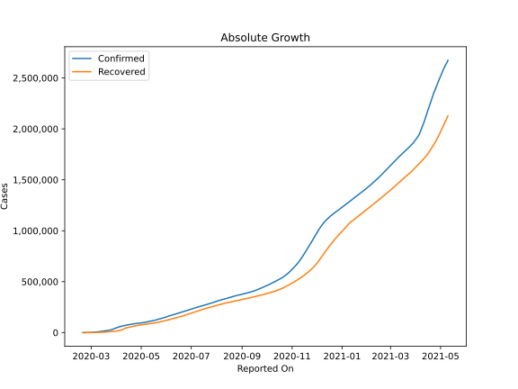
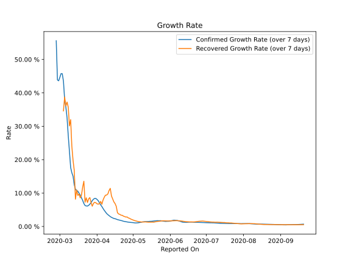

# Country Figures: Growth Rate for Iran 

The growth rates below are calculated based on
* an exponential growth assumption
* for time difference of past seven (7) days.
The growth rate is to be understood as on "growth per day".

The first growth rate indicates the increase of confirmed (infected) cases.

The second growth rate indicates the increase of recovered (healed) cases.

| Reported On | Confirmed | Growth Rate (Confirmed) | Recovered | Growth Rate (Recovered) |
|-------------|-----------|-------------------------|-----------|-------------------------|
| 2020-04-23 | 87026 |  1.57 %  | 64843 |  3.090 %  | 
| 2020-04-22 | 85996 |  1.69 %  | 63113 |  3.346 %  | 
| 2020-04-21 | 84802 |  1.78 %  | 60965 |  3.377 %  | 
| 2020-04-20 | 83505 |  1.86 %  | 59273 |  3.627 %  | 
| 2020-04-19 | 82211 |  1.96 %  | 57023 |  3.738 %  | 
| 2020-04-18 | 80868 |  2.06 %  | 55987 |  4.124 %  | 
| 2020-04-17 | 79494 |  2.19 %  | 54064 |  6.023 %  | 
| 2020-04-16 | 77995 |  2.34 %  | 52229 |  6.861 %  | 
| 2020-04-15 | 76389 |  2.40 %  | 49933 |  7.368 %  | 
| 2020-04-14 | 74877 |  2.56 %  | 48129 |  8.237 %  | 
| 2020-04-13 | 73303 |  2.74 %  | 45983 |  9.149 %  | 
| 2020-04-12 | 71686 |  2.97 %  | 43894 |  11.419 %  | 
| 2020-04-11 | 70029 |  3.26 %  | 41947 |  10.771 %  | 
| 2020-04-10 | 68192 |  3.55 %  | 35465 |  9.740 %  | 
| 2020-04-09 | 66220 |  3.88 %  | 32309 |  9.418 %  | 
| 2020-04-08 | 64586 |  4.36 %  | 29812 |  9.369 %  | 
| 2020-04-07 | 62589 |  4.84 %  | 27039 |  8.749 %  | 
| 2020-04-06 | 60500 |  5.39 %  | 24236 |  7.931 %  | 
| 2020-04-05 | 58226 |  5.98 %  | 19736 |  6.650 %  | 
| 2020-04-04 | 55743 |  6.48 %  | 19736 |  7.495 %  | 
| 2020-04-03 | 53183 |  7.11 %  | 17935 |  6.812 %  | 
| 2020-04-02 | 50468 |  7.72 %  | 16711 |  6.697 %  | 
| 2020-04-01 | 47593 |  8.09 %  | 15473 |  6.782 %  | 
| 2020-03-31 | 44605 |  8.38 %  | 14656 |  7.105 %  | 
| 2020-03-30 | 41495 |  8.40 %  | 13911 |  7.247 %  | 
| 2020-03-29 | 38309 |  8.16 %  | 12391 |  6.918 %  | 
| 2020-03-28 | 35408 |  7.73 %  | 11679 |  6.072 %  | 
| 2020-03-27 | 32332 |  7.12 %  | 11133 |  7.159 %  | 
| 2020-03-26 | 29406 |  6.69 %  | 10457 |  8.644 %  | 
| 2020-03-25 | 27017 |  6.32 %  | 9625 |  8.286 %  | 
| 2020-03-24 | 24811 |  6.12 %  | 8913 |  7.188 %  | 
| 2020-03-23 | 23049 |  6.15 %  | 8376 |  8.593 %  | 
| 2020-03-22 | 21638 |  6.28 %  | 7635 |  7.269 %  | 
| 2020-03-21 | 20610 |  6.88 %  | 7635 |  13.541 %  | 
| 2020-03-20 | 19644 |  7.82 %  | 6745 |  11.771 %  | 
| 2020-03-19 | 18407 |  8.61 %  | 5710 |  9.391 %  | 
| 2020-03-18 | 17361 |  9.39 %  | 5389 |  8.564 %  | 
| 2020-03-17 | 16169 |  9.98 %  | 5389 |  9.710 %  | 
| 2020-03-16 | 14991 |  10.55 %  | 4590 |  9.299 %  | 
| 2020-03-15 | 13938 |  10.75 %  | 4590 |  10.941 %  | 
| 2020-03-14 | 12729 |  11.17 %  | 2959 |  8.180 %  | 
| 2020-03-13 | 11364 |  12.47 %  | 2959 |  16.798 %  | 
| 2020-03-12 | 10075 |  15.05 %  | 2959 |  19.819 %  | 
| 2020-03-11 | 9000 |  16.07 %  | 2959 |  23.987 %  | 
| 2020-03-10 | 8042 |  17.66 %  | 2731 |  31.987 %  | 
| 2020-03-09 | 7161 |  22.32 %  | 2394 |  30.106 %  | 
| 2020-03-08 | 6566 |  27.20 %  | 2134 |  35.728 %  | 
| 2020-03-07 | 5823 |  32.63 %  | 1669 |  37.254 %  | 
| 2020-03-06 | 4747 |  35.78 %  | 913 |  36.090 %  | 
| 2020-03-05 | 3513 |  38.04 %  | 739 |  38.764 %  | 
| 2020-03-04 | 2922 |  43.51 %  | 552 |  34.596 %  | 
| 2020-03-03 | 2336 |  45.75 %  | 291 |  None  | 
| 2020-03-02 | 1501 |  45.76 %  | 291 |  None  | 
| 2020-03-01 | 978 |  44.63 %  | 175 |  None  | 
| 2020-02-29 | 593 |  43.61 %  | 123 |  None  | 
| 2020-02-28 | 388 |  43.87 %  | 73 |  None  | 
| 2020-02-27 | 245 |  55.60 %  | 49 |  None  | 
| 2020-02-26 | 139 |  None  | 49 |  None  | 
| 2020-02-25 | 95 |  None  | 0 |  None  | 
| 2020-02-24 | 61 |  None  | 0 |  None  | 
| 2020-02-23 | 43 |  None  | 0 |  None  | 
| 2020-02-22 | 28 |  None  | 0 |  None  | 
| 2020-02-21 | 18 |  None  | 0 |  None  | 
| 2020-02-20 | 5 |  None  | 0 |  None  | 

