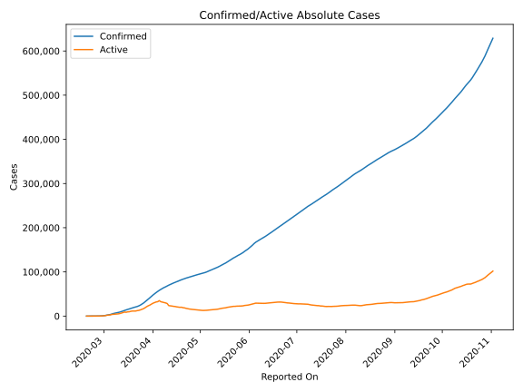
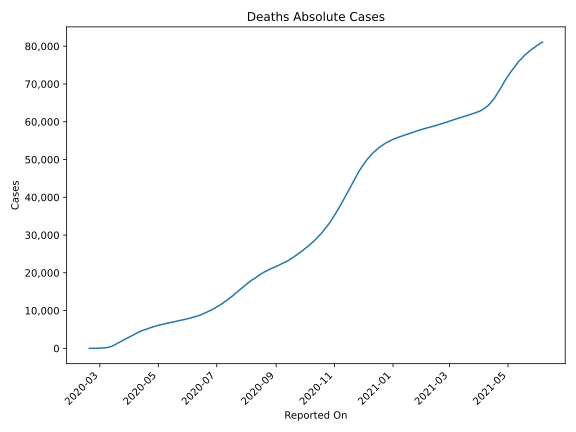
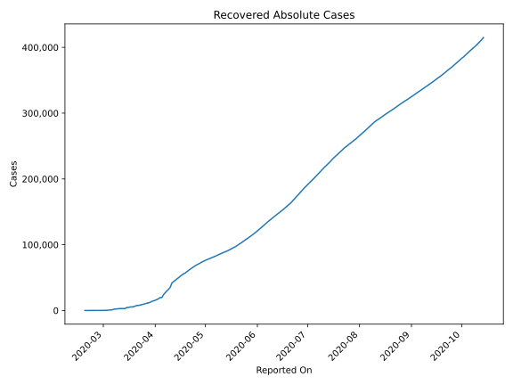
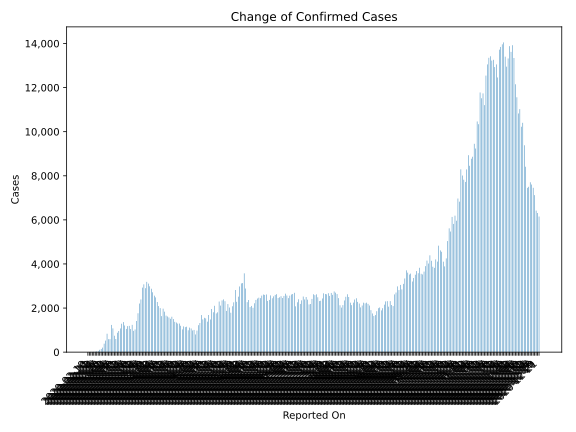
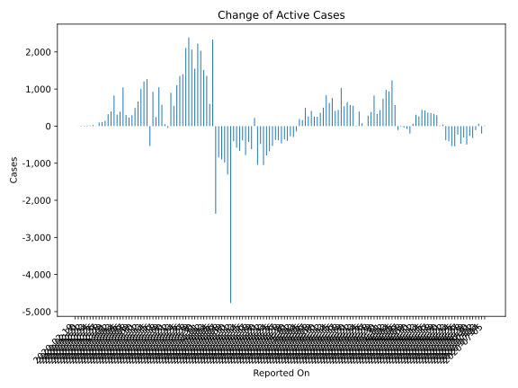
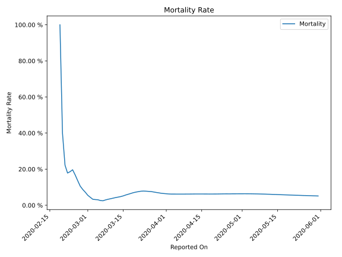

# Country Figures: Time Series for Iran 

| Reported On | Confirmed | Deaths | Recovered | Active | Mortality | &Delta; Confirmed | &Delta; Deaths | &Delta; Active | % Active of Population |
|-------------|-----------|--------|-----------|--------|-----------|-------------------|----------------|----------------|------------------------|
| 2020-03-21 | 20610 | 1556 | 7635 | 11419 |  7.55 %  | 966 | 123 | -47 |  0.014 %  | 
| 2020-03-20 | 19644 | 1433 | 6745 | 11466 |  7.29 %  | 1237 | 149 | 53 |  0.014 %  | 
| 2020-03-19 | 18407 | 1284 | 5710 | 11413 |  6.98 %  | 1046 | 149 | 576 |  0.014 %  | 
| 2020-03-18 | 17361 | 1135 | 5389 | 10837 |  6.54 %  | 1192 | 147 | 1045 |  0.013 %  | 
| 2020-03-17 | 16169 | 988 | 5389 | 9792 |  6.11 %  | 1178 | 135 | 244 |  0.012 %  | 
| 2020-03-16 | 14991 | 853 | 4590 | 9548 |  5.69 %  | 1053 | 129 | 924 |  0.012 %  | 
| 2020-03-15 | 13938 | 724 | 4590 | 8624 |  5.19 %  | 1209 | 113 | -535 |  0.011 %  | 
| 2020-03-14 | 12729 | 611 | 2959 | 9159 |  4.80 %  | 1365 | 97 | 1268 |  0.011 %  | 
| 2020-03-13 | 11364 | 514 | 2959 | 7891 |  4.52 %  | 1289 | 85 | 1204 |  0.010 %  | 
| 2020-03-12 | 10075 | 429 | 2959 | 6687 |  4.26 %  | 1075 | 75 | 1000 |  0.008 %  | 
| 2020-03-11 | 9000 | 354 | 2959 | 5687 |  3.93 %  | 958 | 63 | 667 |  0.007 %  | 
| 2020-03-10 | 8042 | 291 | 2731 | 5020 |  3.62 %  | 881 | 54 | 490 |  0.006 %  | 
| 2020-03-09 | 7161 | 237 | 2394 | 4530 |  3.31 %  | 595 | 43 | 292 |  0.006 %  | 
| 2020-03-08 | 6566 | 194 | 2134 | 4238 |  2.95 %  | 743 | 49 | 229 |  0.005 %  | 
| 2020-03-07 | 5823 | 145 | 1669 | 4009 |  2.49 %  | 1076 | 21 | 299 |  0.005 %  | 
| 2020-03-06 | 4747 | 124 | 913 | 3710 |  2.61 %  | 1234 | 17 | 1043 |  0.005 %  | 
| 2020-03-05 | 3513 | 107 | 739 | 2667 |  3.05 %  | 591 | 15 | 389 |  0.003 %  | 
| 2020-03-04 | 2922 | 92 | 552 | 2278 |  3.15 %  | 586 | 15 | 310 |  0.003 %  | 
| 2020-03-03 | 2336 | 77 | 291 | 1968 |  3.30 %  | 835 | 11 | 824 |  0.002 %  | 
| 2020-03-02 | 1501 | 66 | 291 | 1144 |  4.40 %  | 523 | 12 | 395 |  0.001 %  | 
| 2020-03-01 | 978 | 54 | 175 | 749 |  5.52 %  | 385 | 11 | 322 |  0.001 %  | 
| 2020-02-29 | 593 | 43 | 123 | 427 |  7.25 %  | 205 | 9 | 146 |  0.001 %  | 
| 2020-02-28 | 388 | 34 | 73 | 281 |  8.76 %  | 143 | 8 | 111 |  0.000 %  | 
| 2020-02-27 | 245 | 26 | 49 | 170 |  10.61 %  | 106 | 7 | 99 |  0.000 %  | 
| 2020-02-26 | 139 | 19 | 49 | 71 |  13.67 %  | 44 | 3 | -8 |  0.000 %  | 
| 2020-02-25 | 95 | 16 | 0 | 79 |  16.84 %  | 34 | 4 | 30 |  0.000 %  | 
| 2020-02-24 | 61 | 12 | 0 | 49 |  19.67 %  | 18 | 4 | 14 |  0.000 %  | 
| 2020-02-23 | 43 | 8 | 0 | 35 |  18.60 %  | 15 | 3 | 12 |  0.000 %  | 
| 2020-02-22 | 28 | 5 | 0 | 23 |  17.86 %  | 10 | 1 | 9 |  0.000 %  | 
| 2020-02-21 | 18 | 4 | 0 | 14 |  22.22 %  | 13 | 2 | 11 |  0.000 %  | 
| 2020-02-20 | 5 | 2 | 0 | 3 |  40.00 %  | 3 | 0 | 3 |  0.000 %  | 
| 2020-02-19 | 2 | 2 | 0 | 0 |  100.00 %  | None | None | None |  n/a  | 

