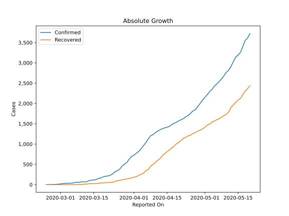
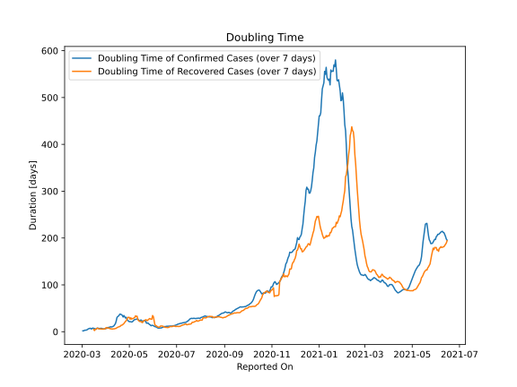

# Country Figures: Doubling Time of Infections for Iraq 

The doubling time below are calculated based on
* an exponential growth assumption
* for time difference of past seven (7) days.
The doubling time's unit is "days".

The first doubling time indicates the increase of confirmed (infected)
cases. There, the *higher* the number is, the better is to take control
of the disease.

The second doubling time indicates the increase of recovered (healed)
cases. There, the *lower* the number is, the better it is to take
control of the disease.

| Reported On | Confirmed | Doubling Time (Confirmed) | Recovered | Doubling Time (Recovered) |
|-------------|-----------|---------------------------|-----------|---------------------------|
| 2020-04-03 | 820 |  8.7 days  | 226 |  8.2 days  | 
| 2020-04-02 | 772 |  7.2 days  | 202 |  7.8 days  | 
| 2020-04-01 | 728 |  6.9 days  | 182 |  8.9 days  | 
| 2020-03-31 | 694 |  6.5 days  | 170 |  6.3 days  | 
| 2020-03-30 | 630 |  6.0 days  | 152 |  5.8 days  | 
| 2020-03-29 | 547 |  6.0 days  | 143 |  5.6 days  | 
| 2020-03-28 | 506 |  6.0 days  | 131 |  5.5 days  | 
| 2020-03-27 | 458 |  6.5 days  | 122 |  5.7 days  | 
| 2020-03-26 | 382 |  7.4 days  | 105 |  5.8 days  | 
| 2020-03-25 | 346 |  6.8 days  | 103 |  5.9 days  | 
| 2020-03-24 | 316 |  7.1 days  | 75 |  6.0 days  | 
| 2020-03-23 | 266 |  6.7 days  | 62 |  5.9 days  | 
| 2020-03-22 | 233 |  7.3 days  | 57 |  6.5 days  | 
| 2020-03-21 | 214 |  7.6 days  | 51 |  7.5 days  | 
| 2020-03-20 | 208 |  7.1 days  | 49 |  7.1 days  | 
| 2020-03-19 | 192 |  5.2 days  | 43 |  4.9 days  | 
| 2020-03-18 | 164 |  6.1 days  | 43 |  4.9 days  | 
| 2020-03-17 | 154 |  6.6 days  | 32 |  2.4 days  | 
| 2020-03-16 | 124 |  7.0 days  | 26 |  4.9 days  | 
| 2020-03-15 | 116 |  7.7 days  | 26 |  None  | 
| 2020-03-14 | 110 |  7.2 days  | 26 |  None  | 
| 2020-03-13 | 101 |  5.6 days  | 24 |  None  | 
| 2020-03-12 | 71 |  7.2 days  | 15 |  None  | 
| 2020-03-11 | 71 |  7.2 days  | 15 |  None  | 
| 2020-03-10 | 71 |  6.4 days  | 3 |  None  | 
| 2020-03-09 | 60 |  6.1 days  | 9 |  None  | 
| 2020-03-08 | 60 |  4.6 days  | 0 |  None  | 
| 2020-03-07 | 54 |  3.7 days  | 0 |  None  | 
| 2020-03-06 | 40 |  3.1 days  | 0 |  None  | 
| 2020-03-05 | 35 |  3.3 days  | 0 |  None  | 
| 2020-03-04 | 35 |  2.8 days  | 0 |  None  | 
| 2020-03-03 | 32 |  1.7 days  | 0 |  None  | 
| 2020-03-02 | 26 |  1.8 days  | 0 |  None  | 
| 2020-03-01 | 19 |  None  | 0 |  None  | 
| 2020-02-29 | 13 |  None  | 0 |  None  | 
| 2020-02-28 | 7 |  None  | 0 |  None  | 
| 2020-02-27 | 7 |  None  | 0 |  None  | 
| 2020-02-26 | 5 |  None  | 0 |  None  | 
| 2020-02-25 | 1 |  None  | 0 |  None  | 
| 2020-02-24 | 1 |  None  | 0 |  None  | 

