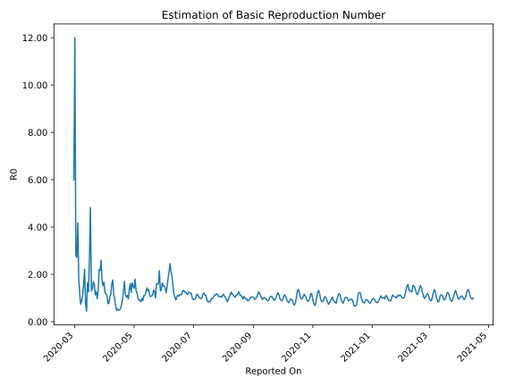

# Country Figures: Time Series for Basic Reproduction Number of Iraq 

| Reported On | &Delta; Confirmed | Total &Delta; Confirmed First Interval | Total &Delta; Confirmed Second Interval | Estimated Basic Reproduction Number R0 | 
|-------------|-------------------|----------------------------------------|-----------------------------------------|---------------------------------------------------|
| 2020-05-05 | 85 |  261  |  265  |  0.98  | 
| 2020-05-04 | 50 |  293  |  240  |  1.22  | 
| 2020-05-03 | 77 |  291  |  220  |  1.32  | 
| 2020-05-02 | 66 |  306  |  170  |  1.80  | 
| 2020-05-01 | 68 |  265  |  189  |  1.40  | 
| 2020-04-30 | 82 |  240  |  161  |  1.49  | 
| 2020-04-29 | 75 |  220  |  134  |  1.64  | 
| 2020-04-28 | 81 |  170  |  138  |  1.23  | 
| 2020-04-27 | 27 |  189  |  118  |  1.60  | 
| 2020-04-26 | 57 |  161  |  120  |  1.34  | 
| 2020-04-25 | 55 |  134  |  140  |  0.96  | 
| 2020-04-24 | 31 |  138  |  124  |  1.11  | 
| 2020-04-23 | 46 |  118  |  113  |  1.04  | 
| 2020-04-22 | 29 |  120  |  104  |  1.15  | 
| 2020-04-21 | 28 |  140  |  82  |  1.71  | 
| 2020-04-20 | 35 |  124  |  97  |  1.28  | 
| 2020-04-19 | 26 |  113  |  121  |  0.93  | 
| 2020-04-18 | 31 |  104  |  146  |  0.71  | 
| 2020-04-17 | 48 |  82  |  150  |  0.55  | 
| 2020-04-16 | 19 |  97  |  196  |  0.49  | 
| 2020-04-15 | 15 |  121  |  248  |  0.49  | 
| 2020-04-14 | 22 |  146  |  271  |  0.54  | 
| 2020-04-13 | 26 |  150  |  324  |  0.46  | 
| 2020-04-12 | 34 |  196  |  302  |  0.65  | 
| 2020-04-11 | 39 |  248  |  259  |  0.96  | 
| 2020-04-10 | 47 |  271  |  233  |  1.16  | 
| 2020-04-09 | 30 |  324  |  184  |  1.76  | 
| 2020-04-08 | 80 |  302  |  190  |  1.59  | 
| 2020-04-07 | 91 |  259  |  225  |  1.15  | 
| 2020-04-06 | 70 |  233  |  222  |  1.05  | 
| 2020-04-05 | 83 |  184  |  236  |  0.78  | 
| 2020-04-04 | 58 |  190  |  248  |  0.77  | 
| 2020-04-03 | 48 |  225  |  201  |  1.12  | 
| 2020-04-02 | 44 |  222  |  190  |  1.17  | 
| 2020-04-01 | 34 |  236  |  192  |  1.23  | 
| 2020-03-31 | 64 |  248  |  149  |  1.66  | 
| 2020-03-30 | 83 |  201  |  132  |  1.52  | 
| 2020-03-29 | 41 |  190  |  108  |  1.76  | 
| 2020-03-28 | 48 |  192  |  74  |  2.59  | 
| 2020-03-27 | 76 |  149  |  69  |  2.16  | 
| 2020-03-26 | 36 |  132  |  60  |  2.20  | 
| 2020-03-25 | 30 |  108  |  84  |  1.29  | 
| 2020-03-24 | 50 |  74  |  76  |  0.97  | 
| 2020-03-23 | 33 |  69  |  54  |  1.28  | 
| 2020-03-22 | 19 |  60  |  53  |  1.13  | 
| 2020-03-21 | 6 |  84  |  53  |  1.58  | 
| 2020-03-20 | 16 |  76  |  45  |  1.69  | 
| 2020-03-19 | 28 |  54  |  39  |  1.38  | 
| 2020-03-18 | 10 |  53  |  41  |  1.29  | 
| 2020-03-17 | 30 |  53  |  11  |  4.82  | 
| 2020-03-16 | 8 |  45  |  17  |  2.65  | 
| 2020-03-15 | 6 |  39  |  31  |  1.26  | 
| 2020-03-14 | 9 |  41  |  25  |  1.64  | 
| 2020-03-13 | 30 |  11  |  25  |  0.44  | 
| 2020-03-12 | 0 |  17  |  22  |  0.77  | 
| 2020-03-11 | 0 |  31  |  14  |  2.21  | 
| 2020-03-10 | 11 |  25  |  16  |  1.56  | 
| 2020-03-09 | 0 |  25  |  22  |  1.14  | 
| 2020-03-08 | 6 |  22  |  25  |  0.88  | 
| 2020-03-07 | 14 |  14  |  19  |  0.74  | 
| 2020-03-06 | 5 |  16  |  14  |  1.14  | 
| 2020-03-05 | 0 |  22  |  12  |  1.83  | 
| 2020-03-04 | 3 |  25  |  6  |  4.17  | 
| 2020-03-03 | 6 |  19  |  7  |  2.71  | 
| 2020-03-02 | 7 |  14  |  5  |  2.80  | 
| 2020-03-01 | 6 |  12  |  1  |  12.00  | 
| 2020-02-29 | 6 |  6  |  1  |  6.00  | 
| 2020-02-28 | 0 |  7  |  None  |  None  | 
| 2020-02-27 | 2 |  5  |  None  |  None  | 
| 2020-02-26 | 4 |  1  |  None  |  None  | 
| 2020-02-25 | 0 |  1  |  None  |  None  | 
| 2020-02-24 | 1 |  None  |  None  |  None  | 
| 2020-02-23 | None |  None  |  None  |  None  | 

