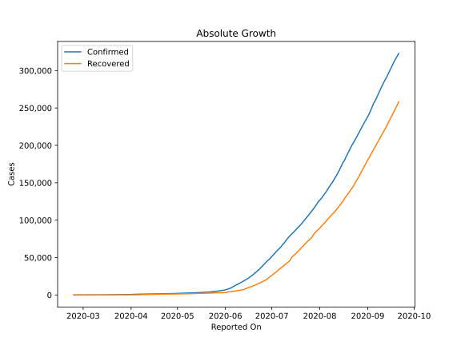
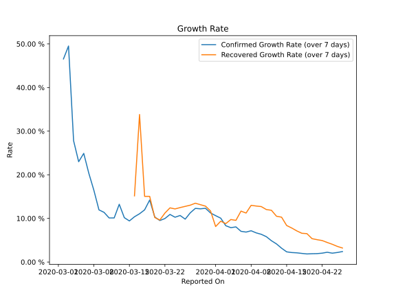

# Country Figures: Growth Rate for Iraq 

The growth rates below are calculated based on
* an exponential growth assumption
* for time difference of past seven (7) days.
The growth rate is to be understood as on "growth per day".

The first growth rate indicates the increase of confirmed (infected) cases.

The second growth rate indicates the increase of recovered (healed) cases.

| Reported On | Confirmed | Growth Rate (Confirmed) | Recovered | Growth Rate (Recovered) |
|-------------|-----------|-------------------------|-----------|-------------------------|
| 2020-04-24 | 1708 |  2.03 %  | 1204 |  4.062 %  | 
| 2020-04-23 | 1677 |  2.24 %  | 1171 |  4.476 %  | 
| 2020-04-22 | 1631 |  2.03 %  | 1146 |  4.922 %  | 
| 2020-04-21 | 1602 |  1.93 %  | 1096 |  5.118 %  | 
| 2020-04-20 | 1574 |  1.90 %  | 1043 |  5.354 %  | 
| 2020-04-19 | 1539 |  1.85 %  | 1009 |  6.504 %  | 
| 2020-04-18 | 1513 |  1.97 %  | 953 |  6.586 %  | 
| 2020-04-17 | 1482 |  2.10 %  | 906 |  7.130 %  | 
| 2020-04-16 | 1434 |  2.17 %  | 856 |  7.796 %  | 
| 2020-04-15 | 1415 |  2.33 %  | 812 |  8.369 %  | 
| 2020-04-14 | 1400 |  3.16 %  | 766 |  10.280 %  | 
| 2020-04-13 | 1378 |  4.14 %  | 717 |  10.492 %  | 
| 2020-04-12 | 1352 |  4.88 %  | 640 |  11.861 %  | 
| 2020-04-11 | 1318 |  5.80 %  | 601 |  12.025 %  | 
| 2020-04-10 | 1279 |  6.35 %  | 550 |  12.705 %  | 
| 2020-04-09 | 1232 |  6.68 %  | 496 |  12.833 %  | 
| 2020-04-08 | 1202 |  7.16 %  | 452 |  12.995 %  | 
| 2020-04-07 | 1122 |  6.86 %  | 373 |  11.225 %  | 
| 2020-04-06 | 1031 |  7.04 %  | 344 |  11.668 %  | 
| 2020-04-05 | 961 |  8.05 %  | 279 |  9.548 %  | 
| 2020-04-04 | 878 |  7.87 %  | 259 |  9.738 %  | 
| 2020-04-03 | 820 |  8.32 %  | 226 |  8.807 %  | 
| 2020-04-02 | 772 |  10.05 %  | 202 |  9.347 %  | 
| 2020-04-01 | 728 |  10.63 %  | 182 |  8.133 %  | 
| 2020-03-31 | 694 |  11.24 %  | 170 |  11.690 %  | 
| 2020-03-30 | 630 |  12.32 %  | 152 |  12.811 %  | 
| 2020-03-29 | 547 |  12.19 %  | 143 |  13.140 %  | 
| 2020-03-28 | 506 |  12.29 %  | 131 |  13.477 %  | 
| 2020-03-27 | 458 |  11.28 %  | 122 |  13.031 %  | 
| 2020-03-26 | 382 |  9.83 %  | 105 |  12.754 %  | 
| 2020-03-25 | 346 |  10.67 %  | 103 |  12.479 %  | 
| 2020-03-24 | 316 |  10.27 %  | 75 |  12.168 %  | 
| 2020-03-23 | 266 |  10.90 %  | 62 |  12.415 %  | 
| 2020-03-22 | 233 |  9.96 %  | 57 |  11.214 %  | 
| 2020-03-21 | 214 |  9.51 %  | 51 |  9.625 %  | 
| 2020-03-20 | 208 |  10.32 %  | 49 |  10.197 %  | 
| 2020-03-19 | 192 |  14.21 %  | 43 |  15.045 %  | 
| 2020-03-18 | 164 |  11.96 %  | 43 |  15.045 %  | 
| 2020-03-17 | 154 |  11.06 %  | 32 |  33.816 %  | 
| 2020-03-16 | 124 |  10.37 %  | 26 |  15.155 %  | 
| 2020-03-15 | 116 |  9.42 %  | 26 |  None  | 
| 2020-03-14 | 110 |  10.16 %  | 26 |  None  | 
| 2020-03-13 | 101 |  13.23 %  | 24 |  None  | 
| 2020-03-12 | 71 |  10.10 %  | 15 |  None  | 
| 2020-03-11 | 71 |  10.10 %  | 15 |  None  | 
| 2020-03-10 | 71 |  11.38 %  | 3 |  None  | 
| 2020-03-09 | 60 |  11.95 %  | 9 |  None  | 
| 2020-03-08 | 60 |  16.43 %  | 0 |  None  | 
| 2020-03-07 | 54 |  20.34 %  | 0 |  None  | 
| 2020-03-06 | 40 |  24.90 %  | 0 |  None  | 
| 2020-03-05 | 35 |  22.99 %  | 0 |  None  | 
| 2020-03-04 | 35 |  27.80 %  | 0 |  None  | 
| 2020-03-03 | 32 |  49.51 %  | 0 |  None  | 
| 2020-03-02 | 26 |  46.54 %  | 0 |  None  | 
| 2020-03-01 | 19 |  None  | 0 |  None  | 
| 2020-02-29 | 13 |  None  | 0 |  None  | 
| 2020-02-28 | 7 |  None  | 0 |  None  | 
| 2020-02-27 | 7 |  None  | 0 |  None  | 
| 2020-02-26 | 5 |  None  | 0 |  None  | 
| 2020-02-25 | 1 |  None  | 0 |  None  | 
| 2020-02-24 | 1 |  None  | 0 |  None  | 

