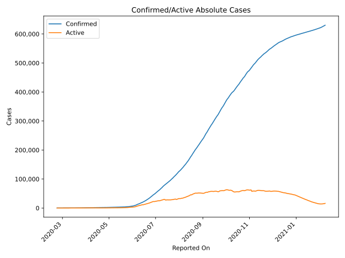
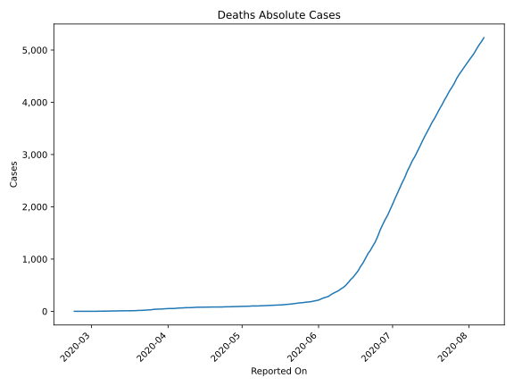
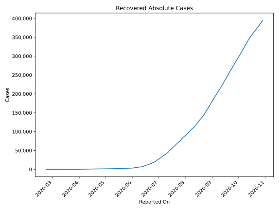
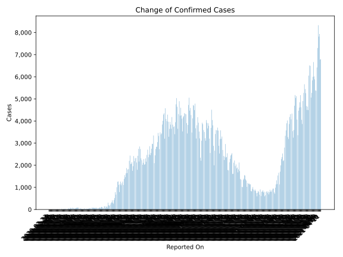
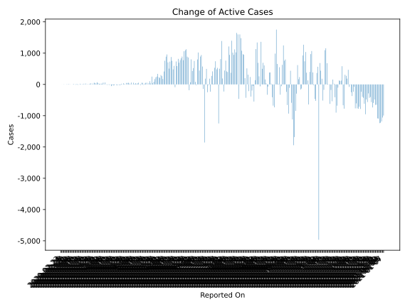
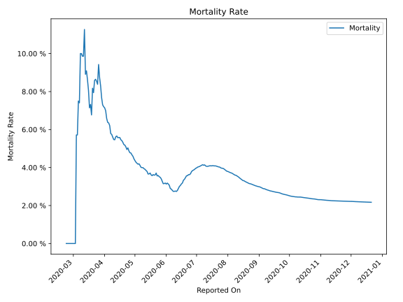

# Country Figures: Time Series for Iraq 

| Reported On | Confirmed | Deaths | Recovered | Active | Mortality | &Delta; Confirmed | &Delta; Deaths | &Delta; Active | % Active of Population |
|-------------|-----------|--------|-----------|--------|-----------|-------------------|----------------|----------------|------------------------|
| 2020-03-28 | 506 | 42 | 131 | 333 |  8.30 %  | 48 | 2 | 37 |  0.001 %  | 
| 2020-03-27 | 458 | 40 | 122 | 296 |  8.73 %  | 76 | 4 | 55 |  0.001 %  | 
| 2020-03-26 | 382 | 36 | 105 | 241 |  9.42 %  | 36 | 7 | 27 |  0.001 %  | 
| 2020-03-25 | 346 | 29 | 103 | 214 |  8.38 %  | 30 | 2 | 0 |  0.001 %  | 
| 2020-03-24 | 316 | 27 | 75 | 214 |  8.54 %  | 50 | 4 | 33 |  0.001 %  | 
| 2020-03-23 | 266 | 23 | 62 | 181 |  8.65 %  | 33 | 3 | 25 |  0.000 %  | 
| 2020-03-22 | 233 | 20 | 57 | 156 |  8.58 %  | 19 | 3 | 10 |  0.000 %  | 
| 2020-03-21 | 214 | 17 | 51 | 146 |  7.94 %  | 6 | 0 | 4 |  0.000 %  | 
| 2020-03-20 | 208 | 17 | 49 | 142 |  8.17 %  | 16 | 4 | 6 |  0.000 %  | 
| 2020-03-19 | 192 | 13 | 43 | 136 |  6.77 %  | 28 | 1 | 27 |  0.000 %  | 
| 2020-03-18 | 164 | 12 | 43 | 109 |  7.32 %  | 10 | 1 | -2 |  0.000 %  | 
| 2020-03-17 | 154 | 11 | 32 | 111 |  7.14 %  | 30 | 1 | 23 |  0.000 %  | 
| 2020-03-16 | 124 | 10 | 26 | 88 |  8.06 %  | 8 | 0 | 8 |  0.000 %  | 
| 2020-03-15 | 116 | 10 | 26 | 80 |  8.62 %  | 6 | 0 | 6 |  0.000 %  | 
| 2020-03-14 | 110 | 10 | 26 | 74 |  9.09 %  | 9 | 1 | 6 |  0.000 %  | 
| 2020-03-13 | 101 | 9 | 24 | 68 |  8.91 %  | 30 | 1 | 20 |  0.000 %  | 
| 2020-03-12 | 71 | 8 | 15 | 48 |  11.27 %  | 0 | 1 | -1 |  0.000 %  | 
| 2020-03-11 | 71 | 7 | 15 | 49 |  9.86 %  | 0 | 0 | -12 |  0.000 %  | 
| 2020-03-10 | 71 | 7 | 3 | 61 |  9.86 %  | 11 | 1 | 16 |  0.000 %  | 
| 2020-03-09 | 60 | 6 | 9 | 45 |  10.00 %  | 0 | 0 | -9 |  0.000 %  | 
| 2020-03-08 | 60 | 6 | 0 | 54 |  10.00 %  | 6 | 2 | 4 |  0.000 %  | 
| 2020-03-07 | 54 | 4 | 0 | 50 |  7.41 %  | 14 | 1 | 13 |  0.000 %  | 
| 2020-03-06 | 40 | 3 | 0 | 37 |  7.50 %  | 5 | 1 | 4 |  0.000 %  | 
| 2020-03-05 | 35 | 2 | 0 | 33 |  5.71 %  | 0 | 0 | 0 |  0.000 %  | 
| 2020-03-04 | 35 | 2 | 0 | 33 |  5.71 %  | 3 | 2 | 1 |  0.000 %  | 
| 2020-03-03 | 32 | 0 | 0 | 32 |  None  | 6 | 0 | 6 |  0.000 %  | 
| 2020-03-02 | 26 | 0 | 0 | 26 |  None  | 7 | 0 | 7 |  0.000 %  | 
| 2020-03-01 | 19 | 0 | 0 | 19 |  None  | 6 | 0 | 6 |  0.000 %  | 
| 2020-02-29 | 13 | 0 | 0 | 13 |  None  | 6 | 0 | 6 |  0.000 %  | 
| 2020-02-28 | 7 | 0 | 0 | 7 |  None  | 0 | 0 | 0 |  0.000 %  | 
| 2020-02-27 | 7 | 0 | 0 | 7 |  None  | 2 | 0 | 2 |  0.000 %  | 
| 2020-02-26 | 5 | 0 | 0 | 5 |  None  | 4 | 0 | 4 |  0.000 %  | 
| 2020-02-25 | 1 | 0 | 0 | 1 |  None  | 0 | 0 | 0 |  0.000 %  | 
| 2020-02-24 | 1 | 0 | 0 | 1 |  None  | 1 | 0 | 1 |  0.000 %  | 
| 2020-02-23 | 0 | 0 | 0 | 0 |  None  | None | None | None |  n/a  | 

