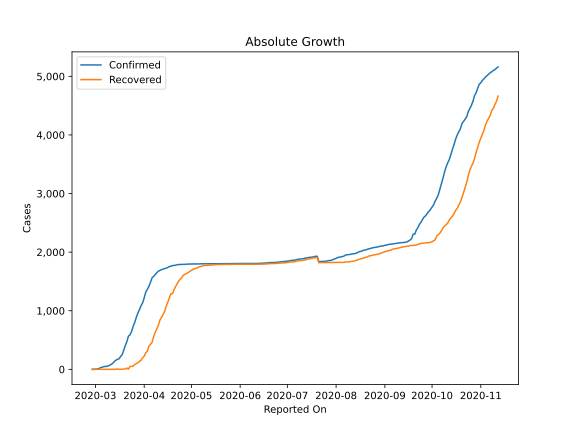
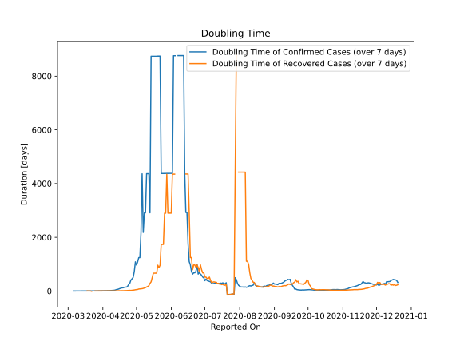

# Country Figures: Doubling Time of Infections for Iceland 

The doubling time below are calculated based on
* an exponential growth assumption
* for time difference of past seven (7) days.
The doubling time's unit is "days".

The first doubling time indicates the increase of confirmed (infected)
cases. There, the *higher* the number is, the better is to take control
of the disease.

The second doubling time indicates the increase of recovered (healed)
cases. There, the *lower* the number is, the better it is to take
control of the disease.

| Reported On | Confirmed | Doubling Time (Confirmed) | Recovered | Doubling Time (Recovered) |
|-------------|-----------|---------------------------|-----------|---------------------------|
| 2020-05-03 | 1799 |  1244.9 days  | 1717 |  74.3 days  | 
| 2020-05-02 | 1798 |  1088.4 days  | 1706 |  58.8 days  | 
| 2020-05-01 | 1798 |  967.2 days  | 1689 |  53.6 days  | 
| 2020-04-30 | 1797 |  1087.8 days  | 1670 |  48.2 days  | 
| 2020-04-29 | 1797 |  724.5 days  | 1656 |  39.3 days  | 
| 2020-04-28 | 1795 |  510.2 days  | 1636 |  34.1 days  | 
| 2020-04-27 | 1792 |  455.5 days  | 1624 |  27.9 days  | 
| 2020-04-26 | 1792 |  412.0 days  | 1608 |  22.4 days  | 
| 2020-04-25 | 1790 |  287.4 days  | 1570 |  25.1 days  | 
| 2020-04-24 | 1789 |  245.9 days  | 1542 |  21.4 days  | 
| 2020-04-23 | 1789 |  171.5 days  | 1509 |  17.9 days  | 
| 2020-04-22 | 1785 |  147.2 days  | 1462 |  16.2 days  | 
| 2020-04-21 | 1778 |  146.6 days  | 1417 |  13.8 days  | 
| 2020-04-20 | 1773 |  136.7 days  | 1362 |  13.2 days  | 
| 2020-04-19 | 1771 |  120.7 days  | 1291 |  13.3 days  | 
| 2020-04-18 | 1760 |  118.2 days  | 1291 |  11.7 days  | 
| 2020-04-17 | 1754 |  105.6 days  | 1224 |  10.3 days  | 
| 2020-04-16 | 1739 |  90.6 days  | 1144 |  9.9 days  | 
| 2020-04-15 | 1727 |  73.4 days  | 1077 |  9.5 days  | 
| 2020-04-14 | 1720 |  60.2 days  | 989 |  8.8 days  | 
| 2020-04-13 | 1711 |  53.6 days  | 933 |  7.2 days  | 
| 2020-04-12 | 1701 |  36.3 days  | 889 |  7.0 days  | 
| 2020-04-11 | 1689 |  28.0 days  | 841 |  6.8 days  | 
| 2020-04-10 | 1675 |  24.0 days  | 751 |  5.8 days  | 
| 2020-04-09 | 1648 |  22.1 days  | 688 |  5.8 days  | 
| 2020-04-08 | 1616 |  17.6 days  | 633 |  5.0 days  | 
| 2020-04-07 | 1586 |  14.8 days  | 559 |  5.0 days  | 
| 2020-04-06 | 1562 |  13.7 days  | 460 |  4.9 days  | 
| 2020-04-05 | 1486 |  13.2 days  | 428 |  4.5 days  | 
| 2020-04-04 | 1417 |  12.9 days  | 396 |  4.2 days  | 
| 2020-04-03 | 1364 |  11.7 days  | 309 |  4.5 days  | 
| 2020-04-02 | 1319 |  10.1 days  | 284 |  4.2 days  | 
| 2020-04-01 | 1220 |  10.0 days  | 225 |  3.8 days  | 
| 2020-03-31 | 1135 |  9.0 days  | 198 |  3.9 days  | 
| 2020-03-30 | 1086 |  8.3 days  | 157 |  4.7 days  | 
| 2020-03-29 | 1020 |  8.6 days  | 135 |  1.8 days  | 
| 2020-03-28 | 963 |  7.2 days  | 114 |  3.3 days  | 
| 2020-03-27 | 890 |  6.6 days  | 97 |  2.0 days  | 
| 2020-03-26 | 802 |  5.8 days  | 82 |  2.1 days  | 
| 2020-03-25 | 737 |  4.8 days  | 56 |  2.3 days  | 
| 2020-03-24 | 648 |  4.8 days  | 51 |  None  | 
| 2020-03-23 | 588 |  4.4 days  | 51 |  None  | 
| 2020-03-22 | 568 |  4.4 days  | 5 |  -10.0 days  | 
| 2020-03-21 | 473 |  4.7 days  | 22 |  1.9 days  | 
| 2020-03-20 | 409 |  4.7 days  | 5 |  3.3 days  | 
| 2020-03-19 | 330 |  4.5 days  | 5 |  3.3 days  | 
| 2020-03-18 | 250 |  4.8 days  | 5 |  3.3 days  | 
| 2020-03-17 | 220 |  4.5 days  | 0 |  None  | 
| 2020-03-16 | 180 |  4.6 days  | 0 |  None  | 
| 2020-03-15 | 171 |  4.3 days  | 8 |  None  | 
| 2020-03-14 | 156 |  4.6 days  | 1 |  None  | 
| 2020-03-13 | 134 |  4.6 days  | 1 |  None  | 
| 2020-03-12 | 103 |  4.7 days  | 1 |  None  | 
| 2020-03-11 | 85 |  4.4 days  | 1 |  None  | 
| 2020-03-10 | 69 |  3.0 days  | 1 |  None  | 
| 2020-03-09 | 58 |  2.5 days  | 0 |  None  | 
| 2020-03-08 | 50 |  2.1 days  | 0 |  None  | 
| 2020-03-07 | 50 |  1.6 days  | 0 |  None  | 
| 2020-03-06 | 43 |  1.6 days  | 0 |  None  | 
| 2020-03-05 | 34 |  None  | 0 |  None  | 
| 2020-03-04 | 26 |  None  | 0 |  None  | 
| 2020-03-03 | 11 |  None  | 0 |  None  | 
| 2020-03-02 | 6 |  None  | 0 |  None  | 
| 2020-03-01 | 3 |  None  | 0 |  None  | 
| 2020-02-29 | 1 |  None  | 0 |  None  | 
| 2020-02-28 | 1 |  None  | 0 |  None  | 

