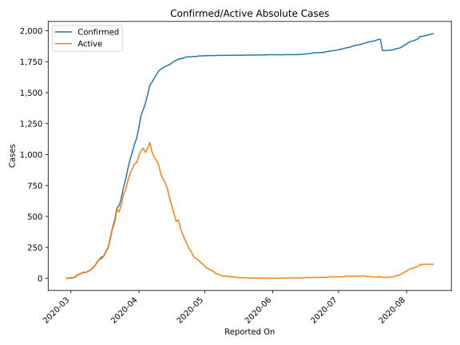
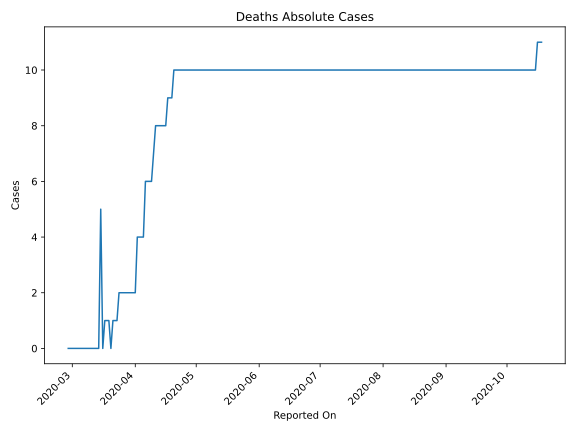
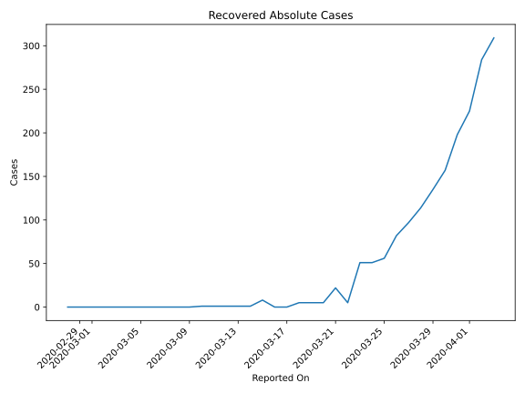
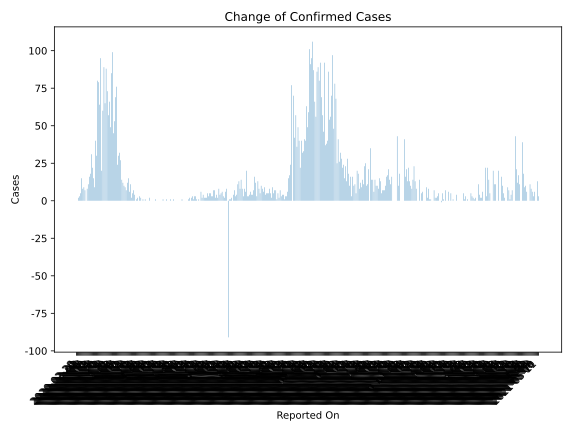
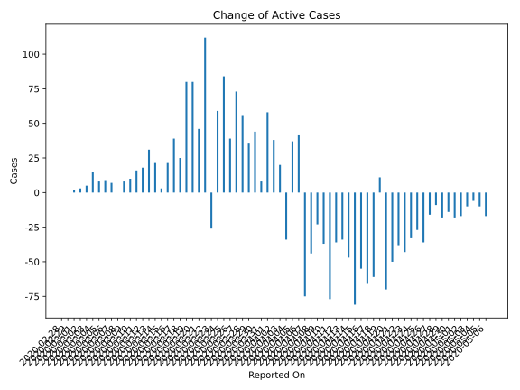
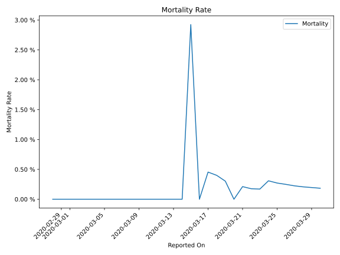

# Country Figures: Time Series for Iceland 

| Reported On | Confirmed | Deaths | Recovered | Active | Mortality | &Delta; Confirmed | &Delta; Deaths | &Delta; Active | % Active of Population |
|-------------|-----------|--------|-----------|--------|-----------|-------------------|----------------|----------------|------------------------|
| 2020-04-03 | 1364 | 4 | 309 | 1051 |  0.29 %  | 45 | 0 | 20 |  0.297 %  | 
| 2020-04-02 | 1319 | 4 | 284 | 1031 |  0.30 %  | 99 | 2 | 38 |  0.292 %  | 
| 2020-04-01 | 1220 | 2 | 225 | 993 |  0.16 %  | 85 | 0 | 58 |  0.281 %  | 
| 2020-03-31 | 1135 | 2 | 198 | 935 |  0.18 %  | 49 | 0 | 8 |  0.264 %  | 
| 2020-03-30 | 1086 | 2 | 157 | 927 |  0.18 %  | 66 | 0 | 44 |  0.262 %  | 
| 2020-03-29 | 1020 | 2 | 135 | 883 |  0.20 %  | 57 | 0 | 36 |  0.250 %  | 
| 2020-03-28 | 963 | 2 | 114 | 847 |  0.21 %  | 73 | 0 | 56 |  0.240 %  | 
| 2020-03-27 | 890 | 2 | 97 | 791 |  0.22 %  | 88 | 0 | 73 |  0.224 %  | 
| 2020-03-26 | 802 | 2 | 82 | 718 |  0.25 %  | 65 | 0 | 39 |  0.203 %  | 
| 2020-03-25 | 737 | 2 | 56 | 679 |  0.27 %  | 89 | 0 | 84 |  0.192 %  | 
| 2020-03-24 | 648 | 2 | 51 | 595 |  0.31 %  | 60 | 1 | 59 |  0.168 %  | 
| 2020-03-23 | 588 | 1 | 51 | 536 |  0.17 %  | 20 | 0 | -26 |  0.152 %  | 
| 2020-03-22 | 568 | 1 | 5 | 562 |  0.18 %  | 95 | 0 | 112 |  0.159 %  | 
| 2020-03-21 | 473 | 1 | 22 | 450 |  0.21 %  | 64 | 1 | 46 |  0.127 %  | 
| 2020-03-20 | 409 | 0 | 5 | 404 |  None  | 79 | -1 | 80 |  0.114 %  | 
| 2020-03-19 | 330 | 1 | 5 | 324 |  0.30 %  | 80 | 0 | 80 |  0.092 %  | 
| 2020-03-18 | 250 | 1 | 5 | 244 |  0.40 %  | 30 | 0 | 25 |  0.069 %  | 
| 2020-03-17 | 220 | 1 | 0 | 219 |  0.45 %  | 40 | 1 | 39 |  0.062 %  | 
| 2020-03-16 | 180 | 0 | 0 | 180 |  None  | 9 | -5 | 22 |  0.051 %  | 
| 2020-03-15 | 171 | 5 | 8 | 158 |  2.92 %  | 15 | 5 | 3 |  0.045 %  | 
| 2020-03-14 | 156 | 0 | 1 | 155 |  None  | 22 | 0 | 22 |  0.044 %  | 
| 2020-03-13 | 134 | 0 | 1 | 133 |  None  | 31 | 0 | 31 |  0.038 %  | 
| 2020-03-12 | 103 | 0 | 1 | 102 |  None  | 18 | 0 | 18 |  0.029 %  | 
| 2020-03-11 | 85 | 0 | 1 | 84 |  None  | 16 | 0 | 16 |  0.024 %  | 
| 2020-03-10 | 69 | 0 | 1 | 68 |  None  | 11 | 0 | 10 |  0.019 %  | 
| 2020-03-09 | 58 | 0 | 0 | 58 |  None  | 8 | 0 | 8 |  0.016 %  | 
| 2020-03-08 | 50 | 0 | 0 | 50 |  None  | 0 | 0 | 0 |  0.014 %  | 
| 2020-03-07 | 50 | 0 | 0 | 50 |  None  | 7 | 0 | 7 |  0.014 %  | 
| 2020-03-06 | 43 | 0 | 0 | 43 |  None  | 9 | 0 | 9 |  0.012 %  | 
| 2020-03-05 | 34 | 0 | 0 | 34 |  None  | 8 | 0 | 8 |  0.010 %  | 
| 2020-03-04 | 26 | 0 | 0 | 26 |  None  | 15 | 0 | 15 |  0.007 %  | 
| 2020-03-03 | 11 | 0 | 0 | 11 |  None  | 5 | 0 | 5 |  0.003 %  | 
| 2020-03-02 | 6 | 0 | 0 | 6 |  None  | 3 | 0 | 3 |  0.002 %  | 
| 2020-03-01 | 3 | 0 | 0 | 3 |  None  | 2 | 0 | 2 |  0.001 %  | 
| 2020-02-29 | 1 | 0 | 0 | 1 |  None  | 0 | 0 | 0 |  0.000 %  | 
| 2020-02-28 | 1 | 0 | 0 | 1 |  None  | None | None | None |  0.000 %  | 

