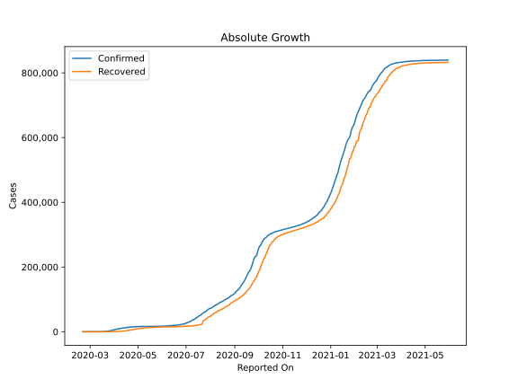
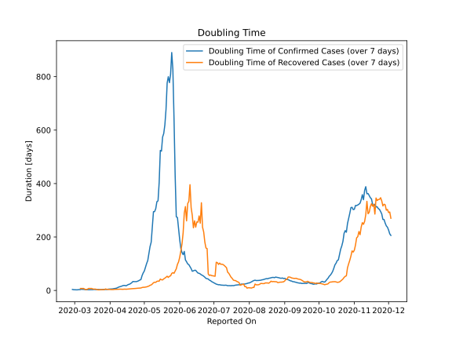

# Country Figures: Doubling Time of Infections for Israel 

The doubling time below are calculated based on
* an exponential growth assumption
* for time difference of past seven (7) days.
The doubling time's unit is "days".

The first doubling time indicates the increase of confirmed (infected)
cases. There, the *higher* the number is, the better is to take control
of the disease.

The second doubling time indicates the increase of recovered (healed)
cases. There, the *lower* the number is, the better it is to take
control of the disease.

| Reported On | Confirmed | Doubling Time (Confirmed) | Recovered | Doubling Time (Recovered) |
|-------------|-----------|---------------------------|-----------|---------------------------|
| 2020-05-08 | 16436 |  236.0 days  | 11229 |  24.1 days  | 
| 2020-05-07 | 16381 |  180.6 days  | 10873 |  20.6 days  | 
| 2020-05-06 | 16310 |  164.2 days  | 10637 |  19.3 days  | 
| 2020-05-05 | 16289 |  138.8 days  | 10465 |  16.5 days  | 
| 2020-05-04 | 16246 |  112.0 days  | 10064 |  14.8 days  | 
| 2020-05-03 | 16208 |  100.7 days  | 9749 |  13.4 days  | 
| 2020-05-02 | 16185 |  86.4 days  | 9593 |  12.5 days  | 
| 2020-05-01 | 16101 |  72.8 days  | 9156 |  11.8 days  | 
| 2020-04-30 | 15946 |  65.6 days  | 8561 |  11.8 days  | 
| 2020-04-29 | 15834 |  55.4 days  | 8233 |  11.0 days  | 
| 2020-04-28 | 15728 |  40.6 days  | 7746 |  9.3 days  | 
| 2020-04-27 | 15555 |  38.8 days  | 7200 |  8.8 days  | 
| 2020-04-26 | 15443 |  36.3 days  | 6731 |  8.7 days  | 
| 2020-04-25 | 15298 |  34.4 days  | 6435 |  8.1 days  | 
| 2020-04-24 | 15058 |  33.1 days  | 6003 |  7.8 days  | 
| 2020-04-23 | 14803 |  33.0 days  | 5611 |  7.4 days  | 
| 2020-04-22 | 14498 |  33.1 days  | 5215 |  7.2 days  | 
| 2020-04-21 | 13942 |  33.5 days  | 4507 |  7.1 days  | 
| 2020-04-20 | 13713 |  29.1 days  | 4049 |  6.6 days  | 
| 2020-04-19 | 13491 |  25.7 days  | 3754 |  6.1 days  | 
| 2020-04-18 | 13265 |  23.4 days  | 3456 |  5.5 days  | 
| 2020-04-17 | 12982 |  22.3 days  | 3126 |  5.3 days  | 
| 2020-04-16 | 12758 |  20.0 days  | 2818 |  5.1 days  | 
| 2020-04-15 | 12501 |  17.4 days  | 2563 |  4.5 days  | 
| 2020-04-14 | 12046 |  18.7 days  | 2195 |  5.0 days  | 
| 2020-04-13 | 11586 |  18.8 days  | 1855 |  4.5 days  | 
| 2020-04-12 | 11145 |  17.7 days  | 1627 |  4.3 days  | 
| 2020-04-11 | 10743 |  15.8 days  | 1341 |  4.6 days  | 
| 2020-04-10 | 10408 |  14.7 days  | 1183 |  4.8 days  | 
| 2020-04-09 | 9968 |  13.3 days  | 1011 |  4.8 days  | 
| 2020-04-08 | 9404 |  11.5 days  | 801 |  4.4 days  | 
| 2020-04-07 | 9248 |  9.2 days  | 770 |  4.3 days  | 
| 2020-04-06 | 8904 |  7.9 days  | 585 |  4.1 days  | 
| 2020-04-05 | 8430 |  7.4 days  | 477 |  4.1 days  | 
| 2020-04-04 | 7851 |  6.6 days  | 427 |  3.4 days  | 
| 2020-04-03 | 7428 |  5.8 days  | 403 |  3.3 days  | 
| 2020-04-02 | 6857 |  5.5 days  | 338 |  3.4 days  | 
| 2020-04-01 | 6092 |  5.5 days  | 241 |  3.7 days  | 
| 2020-03-31 | 5358 |  5.1 days  | 224 |  3.7 days  | 
| 2020-03-30 | 4695 |  4.4 days  | 161 |  3.9 days  | 
| 2020-03-29 | 4247 |  3.9 days  | 132 |  4.2 days  | 
| 2020-03-28 | 3619 |  3.8 days  | 89 |  5.7 days  | 
| 2020-03-27 | 3035 |  3.7 days  | 79 |  3.1 days  | 
| 2020-03-26 | 2693 |  3.9 days  | 68 |  3.0 days  | 
| 2020-03-25 | 2369 |  3.2 days  | 58 |  3.3 days  | 
| 2020-03-24 | 1930 |  3.1 days  | 53 |  3.4 days  | 
| 2020-03-23 | 1442 |  3.1 days  | 41 |  2.4 days  | 
| 2020-03-22 | 1071 |  3.7 days  | 37 |  2.5 days  | 
| 2020-03-21 | 883 |  3.5 days  | 36 |  2.5 days  | 
| 2020-03-20 | 705 |  3.6 days  | 14 |  4.2 days  | 
| 2020-03-19 | 677 |  3.3 days  | 11 |  5.1 days  | 
| 2020-03-18 | 433 |  3.9 days  | 11 |  5.1 days  | 
| 2020-03-17 | 337 |  3.1 days  | 11 |  5.1 days  | 
| 2020-03-16 | 255 |  2.9 days  | 4 |  7.3 days  | 
| 2020-03-15 | 251 |  2.9 days  | 4 |  7.3 days  | 
| 2020-03-14 | 193 |  2.5 days  | 4 |  7.3 days  | 
| 2020-03-13 | 161 |  2.7 days  | 4 |  7.3 days  | 
| 2020-03-12 | 131 |  2.6 days  | 4 |  3.8 days  | 
| 2020-03-11 | 109 |  2.8 days  | 4 |  3.8 days  | 
| 2020-03-10 | 58 |  3.4 days  | 4 |  3.8 days  | 
| 2020-03-09 | 39 |  3.9 days  | 2 |  7.3 days  | 
| 2020-03-08 | 39 |  3.9 days  | 2 |  7.3 days  | 
| 2020-03-07 | 21 |  4.8 days  | 2 |  7.3 days  | 
| 2020-03-06 | 21 |  3.3 days  | 2 |  7.3 days  | 
| 2020-03-05 | 16 |  3.2 days  | 1 |  None  | 
| 2020-03-04 | 15 |  2.7 days  | 1 |  None  | 
| 2020-03-03 | 12 |  2.3 days  | 1 |  None  | 
| 2020-03-02 | 10 |  2.4 days  | 1 |  None  | 
| 2020-03-01 | 10 |  2.4 days  | 1 |  None  | 
| 2020-02-29 | 7 |  2.8 days  | 1 |  None  | 
| 2020-02-28 | 4 |  3.8 days  | 1 |  None  | 
| 2020-02-27 | 3 |  None  | 1 |  None  | 
| 2020-02-26 | 2 |  None  | 0 |  None  | 
| 2020-02-25 | 1 |  None  | 0 |  None  | 
| 2020-02-24 | 1 |  None  | 0 |  None  | 
| 2020-02-23 | 1 |  None  | 0 |  None  | 
| 2020-02-22 | 1 |  None  | 0 |  None  | 
| 2020-02-21 | 1 |  None  | 0 |  None  | 

