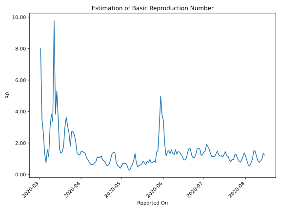

# Country Figures: Time Series for Basic Reproduction Number of Israel 

| Reported On | &Delta; Confirmed | Total &Delta; Confirmed First Interval | Total &Delta; Confirmed Second Interval | Estimated Basic Reproduction Number R0 | 
|-------------|-------------------|----------------------------------------|-----------------------------------------|---------------------------------------------------|
| 2020-05-06 | 21 |  188  |  546  |  0.34  | 
| 2020-05-05 | 43 |  300  |  503  |  0.60  | 
| 2020-05-04 | 38 |  374  |  536  |  0.70  | 
| 2020-05-03 | 23 |  457  |  670  |  0.68  | 
| 2020-05-02 | 84 |  546  |  752  |  0.73  | 
| 2020-05-01 | 155 |  503  |  945  |  0.53  | 
| 2020-04-30 | 112 |  536  |  1356  |  0.40  | 
| 2020-04-29 | 106 |  670  |  1345  |  0.50  | 
| 2020-04-28 | 173 |  752  |  1312  |  0.57  | 
| 2020-04-27 | 112 |  945  |  1233  |  0.77  | 
| 2020-04-26 | 145 |  1356  |  960  |  1.41  | 
| 2020-04-25 | 240 |  1345  |  955  |  1.41  | 
| 2020-04-24 | 255 |  1312  |  990  |  1.33  | 
| 2020-04-23 | 305 |  1233  |  1219  |  1.01  | 
| 2020-04-22 | 556 |  960  |  1396  |  0.69  | 
| 2020-04-21 | 229 |  955  |  1613  |  0.59  | 
| 2020-04-20 | 222 |  990  |  1758  |  0.56  | 
| 2020-04-19 | 226 |  1219  |  1638  |  0.74  | 
| 2020-04-18 | 283 |  1396  |  1618  |  0.86  | 
| 2020-04-17 | 224 |  1613  |  1741  |  0.93  | 
| 2020-04-16 | 257 |  1758  |  1495  |  1.18  | 
| 2020-04-15 | 455 |  1638  |  1504  |  1.09  | 
| 2020-04-14 | 460 |  1618  |  1538  |  1.05  | 
| 2020-04-13 | 441 |  1741  |  1553  |  1.12  | 
| 2020-04-12 | 402 |  1495  |  1820  |  0.82  | 
| 2020-04-11 | 335 |  1504  |  2047  |  0.73  | 
| 2020-04-10 | 440 |  1538  |  2338  |  0.66  | 
| 2020-04-09 | 564 |  1553  |  2493  |  0.62  | 
| 2020-04-08 | 156 |  1820  |  2733  |  0.67  | 
| 2020-04-07 | 344 |  2047  |  2610  |  0.78  | 
| 2020-04-06 | 474 |  2338  |  2473  |  0.95  | 
| 2020-04-05 | 579 |  2493  |  2323  |  1.07  | 
| 2020-04-04 | 423 |  2733  |  2002  |  1.37  | 
| 2020-04-03 | 571 |  2610  |  1878  |  1.39  | 
| 2020-04-02 | 765 |  2473  |  1689  |  1.46  | 
| 2020-04-01 | 734 |  2323  |  1593  |  1.46  | 
| 2020-03-31 | 663 |  2002  |  1622  |  1.23  | 
| 2020-03-30 | 448 |  1878  |  1486  |  1.26  | 
| 2020-03-29 | 628 |  1689  |  1225  |  1.38  | 
| 2020-03-28 | 584 |  1593  |  765  |  2.08  | 
| 2020-03-27 | 342 |  1622  |  638  |  2.54  | 
| 2020-03-26 | 324 |  1486  |  546  |  2.72  | 
| 2020-03-25 | 439 |  1225  |  450  |  2.72  | 
| 2020-03-24 | 488 |  765  |  426  |  1.80  | 
| 2020-03-23 | 371 |  638  |  240  |  2.66  | 
| 2020-03-22 | 188 |  546  |  176  |  3.10  | 
| 2020-03-21 | 178 |  450  |  124  |  3.63  | 
| 2020-03-20 | 28 |  426  |  142  |  3.00  | 
| 2020-03-19 | 244 |  240  |  135  |  1.78  | 
| 2020-03-18 | 96 |  176  |  122  |  1.44  | 
| 2020-03-17 | 82 |  124  |  92  |  1.35  | 
| 2020-03-16 | 4 |  142  |  88  |  1.61  | 
| 2020-03-15 | 58 |  135  |  37  |  3.65  | 
| 2020-03-14 | 32 |  122  |  23  |  5.30  | 
| 2020-03-13 | 30 |  92  |  24  |  3.83  | 
| 2020-03-12 | 22 |  88  |  9  |  9.78  | 
| 2020-03-11 | 51 |  37  |  11  |  3.36  | 
| 2020-03-10 | 19 |  23  |  6  |  3.83  | 
| 2020-03-09 | 0 |  24  |  8  |  3.00  | 
| 2020-03-08 | 18 |  9  |  8  |  1.12  | 
| 2020-03-07 | 0 |  11  |  7  |  1.57  | 
| 2020-03-06 | 5 |  6  |  8  |  0.75  | 
| 2020-03-05 | 1 |  8  |  6  |  1.33  | 
| 2020-03-04 | 3 |  8  |  3  |  2.67  | 
| 2020-03-03 | 2 |  7  |  2  |  3.50  | 
| 2020-03-02 | 0 |  8  |  1  |  8.00  | 
| 2020-03-01 | 3 |  6  |  None  |  None  | 
| 2020-02-29 | 3 |  3  |  None  |  None  | 
| 2020-02-28 | 1 |  2  |  None  |  None  | 
| 2020-02-27 | 1 |  1  |  None  |  None  | 
| 2020-02-26 | 1 |  None  |  None  |  None  | 
| 2020-02-25 | 0 |  None  |  None  |  None  | 
| 2020-02-24 | 0 |  None  |  None  |  None  | 
| 2020-02-23 | 0 |  None  |  None  |  None  | 
| 2020-02-22 | 0 |  None  |  None  |  None  | 
| 2020-02-21 | None |  None  |  None  |  None  | 

