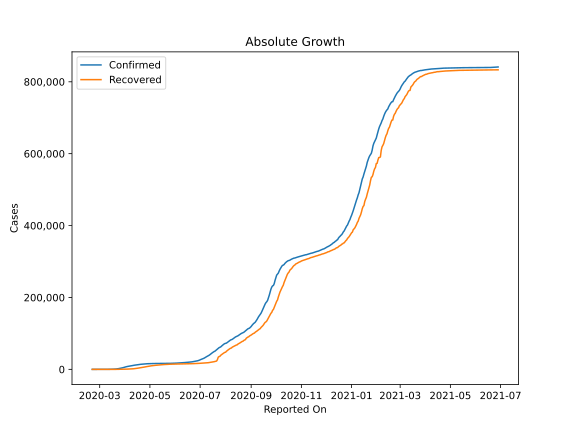
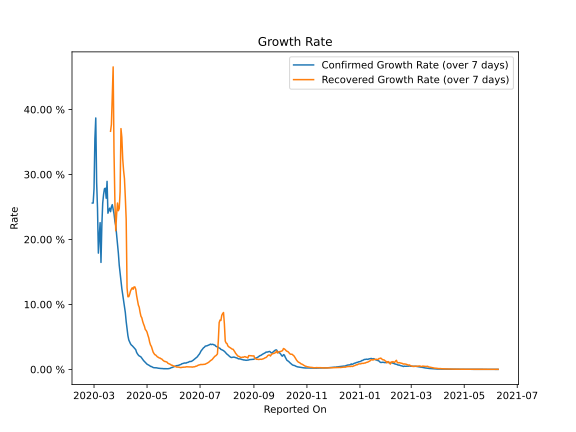

# Country Figures: Growth Rate for Israel 

The growth rates below are calculated based on
* an exponential growth assumption
* for time difference of past seven (7) days.
The growth rate is to be understood as on "growth per day".

The first growth rate indicates the increase of confirmed (infected) cases.

The second growth rate indicates the increase of recovered (healed) cases.

| Reported On | Confirmed | Growth Rate (Confirmed) | Recovered | Growth Rate (Recovered) |
|-------------|-----------|-------------------------|-----------|-------------------------|
| 2020-04-27 | 15555 |  1.80 %  | 7200 |  8.223 %  | 
| 2020-04-26 | 15443 |  1.93 %  | 6731 |  8.341 %  | 
| 2020-04-25 | 15298 |  2.04 %  | 6435 |  8.881 %  | 
| 2020-04-24 | 15058 |  2.12 %  | 6003 |  9.322 %  | 
| 2020-04-23 | 14803 |  2.12 %  | 5611 |  9.839 %  | 
| 2020-04-22 | 14498 |  2.12 %  | 5215 |  10.148 %  | 
| 2020-04-21 | 13942 |  2.09 %  | 4507 |  10.278 %  | 
| 2020-04-20 | 13713 |  2.41 %  | 4049 |  11.151 %  | 
| 2020-04-19 | 13491 |  2.73 %  | 3754 |  11.944 %  | 
| 2020-04-18 | 13265 |  3.01 %  | 3456 |  13.524 %  | 
| 2020-04-17 | 12982 |  3.16 %  | 3126 |  13.881 %  | 
| 2020-04-16 | 12758 |  3.53 %  | 2818 |  14.644 %  | 
| 2020-04-15 | 12501 |  4.07 %  | 2563 |  16.615 %  | 
| 2020-04-14 | 12046 |  3.78 %  | 2195 |  14.965 %  | 
| 2020-04-13 | 11586 |  3.76 %  | 1855 |  16.486 %  | 
| 2020-04-12 | 11145 |  3.99 %  | 1627 |  17.528 %  | 
| 2020-04-11 | 10743 |  4.48 %  | 1341 |  16.348 %  | 
| 2020-04-10 | 10408 |  4.82 %  | 1183 |  15.384 %  | 
| 2020-04-09 | 9968 |  5.34 %  | 1011 |  15.652 %  | 
| 2020-04-08 | 9404 |  6.20 %  | 801 |  17.158 %  | 
| 2020-04-07 | 9248 |  7.80 %  | 770 |  17.639 %  | 
| 2020-04-06 | 8904 |  9.14 %  | 585 |  18.432 %  | 
| 2020-04-05 | 8430 |  9.79 %  | 477 |  18.353 %  | 
| 2020-04-04 | 7851 |  11.06 %  | 427 |  22.402 %  | 
| 2020-04-03 | 7428 |  12.79 %  | 403 |  23.278 %  | 
| 2020-04-02 | 6857 |  13.35 %  | 338 |  22.908 %  | 
| 2020-04-01 | 6092 |  13.49 %  | 241 |  20.348 %  | 
| 2020-03-31 | 5358 |  14.59 %  | 224 |  20.591 %  | 
| 2020-03-30 | 4695 |  16.86 %  | 161 |  19.540 %  | 
| 2020-03-29 | 4247 |  19.68 %  | 132 |  18.170 %  | 
| 2020-03-28 | 3619 |  20.15 %  | 89 |  12.930 %  | 
| 2020-03-27 | 3035 |  20.85 %  | 79 |  24.720 %  | 
| 2020-03-26 | 2693 |  19.72 %  | 68 |  26.023 %  | 
| 2020-03-25 | 2369 |  24.28 %  | 58 |  23.751 %  | 
| 2020-03-24 | 1930 |  24.93 %  | 53 |  22.463 %  | 
| 2020-03-23 | 1442 |  24.75 %  | 41 |  33.247 %  | 
| 2020-03-22 | 1071 |  20.73 %  | 37 |  31.780 %  | 
| 2020-03-21 | 883 |  21.72 %  | 36 |  31.389 %  | 
| 2020-03-20 | 705 |  21.10 %  | 14 |  17.897 %  | 
| 2020-03-19 | 677 |  23.46 %  | 11 |  14.451 %  | 
| 2020-03-18 | 433 |  19.71 %  | 11 |  14.451 %  | 
| 2020-03-17 | 337 |  25.14 %  | 11 |  14.451 %  | 
| 2020-03-16 | 255 |  26.82 %  | 4 |  9.902 %  | 
| 2020-03-15 | 251 |  26.60 %  | 4 |  9.902 %  | 
| 2020-03-14 | 193 |  31.69 %  | 4 |  9.902 %  | 
| 2020-03-13 | 161 |  29.10 %  | 4 |  9.902 %  | 
| 2020-03-12 | 131 |  30.04 %  | 4 |  19.804 %  | 
| 2020-03-11 | 109 |  28.33 %  | 4 |  19.804 %  | 
| 2020-03-10 | 58 |  22.51 %  | 4 |  19.804 %  | 
| 2020-03-09 | 39 |  19.44 %  | 2 |  9.902 %  | 
| 2020-03-08 | 39 |  19.44 %  | 2 |  9.902 %  | 
| 2020-03-07 | 21 |  15.69 %  | 2 |  9.902 %  | 
| 2020-03-06 | 21 |  23.69 %  | 2 |  9.902 %  | 
| 2020-03-05 | 16 |  23.91 %  | 1 |  None  | 
| 2020-03-04 | 15 |  28.78 %  | 1 |  None  | 
| 2020-03-03 | 12 |  35.50 %  | 1 |  None  | 
| 2020-03-02 | 10 |  32.89 %  | 1 |  None  | 
| 2020-03-01 | 10 |  32.89 %  | 1 |  None  | 
| 2020-02-29 | 7 |  27.80 %  | 1 |  None  | 
| 2020-02-28 | 4 |  19.80 %  | 1 |  None  | 
| 2020-02-27 | 3 |  None  | 1 |  None  | 
| 2020-02-26 | 2 |  None  | 0 |  None  | 
| 2020-02-25 | 1 |  None  | 0 |  None  | 
| 2020-02-24 | 1 |  None  | 0 |  None  | 
| 2020-02-23 | 1 |  None  | 0 |  None  | 
| 2020-02-22 | 1 |  None  | 0 |  None  | 
| 2020-02-21 | 1 |  None  | 0 |  None  | 

